# Master Consolidated System Design

> **Note:** This document contains the concatenated contents of all individual documentation files for the F&B AI Platform. It is the single source of truth that contains EVERYTHING.

<!-- BEGIN INDEX.md -->
# Document: INDEX.md

# F&B AI Platform — Documentation Index

> **B2B F&B Commerce Network** | Web-Only Architecture | Last updated: February 2026

---

## 🎯 Quick Navigation

### 🚀 Start Here (Executives & PMs)
1. **[Consolidated System Design](CONSOLIDATED-SYSTEM-DESIGN.md)** ⭐ **START HERE** — Sole source of truth for platform architecture
2. **[User Journeys](user-journeys.md)** — Restaurant, Supplier, and Sales Rep journey maps (before/after)
3. **[System Specification](system-specification.md)** — Platform strategy, tech stack, personas, product modules

### 🏗️ Architecture (Engineers)
1. **[Architecture & Flows](architecture-and-flows.md)** — System architecture diagram, multi-agent workflow, ReAct pattern, core data flows
2. **[Agent Reference](agent-reference.md)** — Complete catalog of 9 AI agents with tool calls, guardrails, state machines
3. **[Complete Architecture Diagrams](complete-architecture-visual.md)** — Comprehensive visual overview of entire system
4. **[MedusaJS Architecture](medusajs-architecture.md)** — Backend framework & custom modules
5. **[Agentic Architecture](agentic-architecture.md)** — Multi-agent design patterns
6. **[Data Model](data-model.md)** — Database schema, Pydantic models, state machines
7. **[Deployment & Infrastructure](deployment-infrastructure.md)** — Cloud setup, security, DR

### 🔄 Implementation (Developers)
1. **[Detailed Flows](detailed-flows.md)** — Step-by-step: SKU normalization, smart cart, negotiation, invoice matching, flash deals, collections, attribution
2. **[Implementation Guide](IMPLEMENTATION-GUIDE.md)** — 7-step procurement journey, implementation roadmap

---

## 📊 Architecture Overview

### Frontend Layer (Web & Mobile)
- **Restaurant Web Dashboard** (Next.js + Shadcn/UI) — Smart Cart, Price Comparison, Invoice Matching, Kitchen Copilot
- **Supplier Web Portal** (Next.js + Shadcn/UI) — Sales Command Center, Agent Control, Catalog Management, Flash Deals
- **Sales Rep Territory Portal** (Next.js) — Territory Map, Attribution, Commission Tracker, Agent Takeover
- **Storekeeper Mobile App** (React Native + Expo) — GRN Scanner, Prep List, Stock Count

### Communication Channels
| Channel | Technology | Purpose |
|:---|:---|:---|
| Real-time Dashboard | WebSocket (Socket.io) | Live quotes, order status, negotiation badges |
| Mobile Push | Firebase Cloud Messaging | GRN alerts, flash deals, order confirmations |
| Email | Transactional (Resend) | Invoice delivery, payment reminders, reports |

> ⚠️ **No WhatsApp, Telegram, or SMS integration.** All user interactions are web-based or push notifications.

### AI Agent Mesh (LangGraph)

| Agent | Role | Model | Output Channel |
|:---|:---|:---|:---|
| **Planner** | Orchestrates multi-step tasks | GPT-4o | Internal (routes to sub-agents) |
| **Purchasing** | Generates AI Smart Carts | GPT-4o-mini | Dashboard notification badge |
| **Sales** | Autonomous negotiation & deals | GPT-4o | Dashboard + push notification |
| **Compliance** | 3-way invoice matching | GPT-4o-mini | Dashboard alert (green/red) |
| **Catalog** | SKU normalization & matching | GPT-4o-mini + ada-002 | Supplier Portal upload results |
| **Inventory** | Stock monitoring & reorder triggers | GPT-4o-mini | Internal (feeds Purchasing Agent) |
| **Kitchen Copilot** | Prep list generation | GPT-4o-mini | Mobile App checklist |
| **Collections** | Payment follow-up escalation | GPT-4o-mini | Dashboard + email |
| **Sourcing** | Supplier comparison & ranking | GPT-4o-mini | Internal (feeds Purchasing Agent) |

### Core Commerce (MedusaJS 2.0)
- Product & Pricing modules
- Order & Fulfillment workflows
- Cart with AI-suggested items
- Customer groups & spending limits
- GRN (Goods Received Notes)
- Invoice matching (3-way)

### Data Layer
- **PostgreSQL (Supabase)** — All relational data with Row-Level Security
- **Weaviate** — SKU embeddings (1536-dim) for semantic product matching
- **Redis (Upstash)** — Event bus, caching, rate limiting

### External Integrations
- **POS:** Foodics API (OAuth 2.0, webhooks)
- **E-Invoicing:** UAE FTA Phase 2 (UBL 2.1 XML + PDF)
- **Push:** Firebase Cloud Messaging
- **OCR:** AWS Textract (invoice & document parsing)
- **Payments:** Telr (gateway, refunds, settlement)

---

## 🔄 Core Workflows

### Workflow 1: Restaurant Low Stock → AI Cart → Approval → PO

```
Low Stock Triggered (POS Webhook / Cron)
    ↓
Inventory Agent: Fetch current levels, par, lead times
    ↓
Catalog Agent: Normalize SKU names, search equivalents
    ↓
Sourcing Agent: Compare suppliers, rank by price + quality
    ↓
Purchasing Agent: Draft cart with quantities & reasoning
    ↓
Pydantic Validation: Ensure data integrity
    ↓
Dashboard Notification: "Cart Ready" badge
    ↓
Manager Approval: Reviews on Web Dashboard (can edit/reject)
    ↓
PO Created: Sent to Supplier Portal
    ↓
GRN Scheduled: Mobile App reminder set for delivery
```

> 📖 See: **[Detailed Flows — Smart Cart Generation](detailed-flows.md#2-smart-cart-generation-flow)**

### Workflow 2: Supplier Autonomous Sales Agent

```
Trigger Event:
  - Quote request from restaurant dashboard
  - Predictive order signal (POS depletion)
  - Flash deal opportunity (distressed inventory)
    ↓
Agent Perception: Intent classification, menu parsing
    ↓
Decision Engine: Price authority check, margin calculation
    ↓
Offer Generation:
  - Quote: <3 second response, within guardrails
  - Flash deal: Menu-matched, scarcity-driven
    ↓
Dashboard Notification: Offer pushed to Restaurant Dashboard
    ↓
Auto-Confirm PO: Reserve stock, generate E-Invoice
    ↓
Attribution: Revenue credited to territory owner (Sales Rep)
    ↓
Upsell Check: Bundle recommendations (protect margin)
```

> 📖 See: **[Detailed Flows — Quote & Negotiation](detailed-flows.md#3-quote--negotiation-flow)**

### Workflow 3: Invoice Reconciliation (3-Way Match)

```
Invoice Uploaded (PDF via Dashboard) + GRN Submitted (Mobile App)
    ↓
Compliance Agent: Compare PO vs GRN vs Invoice line items
    ↓
Match Result:
  ├─ ✅ All match → Auto-approve payment
  └─ ⚠️ Variance → Exception alert on Dashboard
    ↓
Resolution: Manager reviews in Sideover (approve/dispute)
    ↓
Audit Log: All steps recorded, immutable
```

> 📖 See: **[Detailed Flows — 3-Way Invoice Matching](detailed-flows.md#4-3-way-invoice-matching-flow)**

---

## 📚 Document Map

```
docs/
├── CONSOLIDATED-SYSTEM-DESIGN.md   ⭐ SOURCE OF TRUTH
│   └── Executive summary, user journeys, architecture, agent specs
├── user-journeys.md                👤 USER JOURNEYS
│   └── Restaurant, Supplier, Sales Rep journeys (before/after)
├── architecture-and-flows.md       🏗️ ARCHITECTURE
│   └── System diagram, multi-agent workflow, data flows
├── system-specification.md         📋 SPECIFICATION
│   └── Strategy, tech stack, personas, modules, security
├── agent-reference.md              🤖 AGENT REFERENCE
│   └── All 9 agents with tools, triggers, guardrails
├── detailed-flows.md               📝 IMPLEMENTATION FLOWS
│   └── Step-by-step: SKU normalization, cart, negotiation, matching
├── IMPLEMENTATION-GUIDE.md         🚀 ROADMAP
│   └── 7-step procurement journey, implementation phases
├── complete-architecture-visual.md 📊 VISUAL OVERVIEW
│   └── System layers, agents, integrations
├── medusajs-architecture.md        🏗️ BACKEND
│   └── MedusaJS 2.0, custom modules
├── agentic-architecture.md         🤖 AI PATTERNS
│   └── Multi-agent design, ReAct patterns
├── data-model.md                   💾 DATA MODEL
│   └── ER diagram, Pydantic schemas
└── deployment-infrastructure.md    ☁️ DEVOPS
    └── Cloud setup, security, DR
```

---

**Last Updated**: February 2026
**Platform Version**: 2.0 (Web-Only)
**Status**: Production-Ready Architecture


<!-- END INDEX.md -->

---

<!-- BEGIN system-specification.md -->
# Document: system-specification.md

# System Specification (Web-Only)

> **Authority:** Aligned with the Stakeholder Document and B2B Commerce Network positioning.
> **Constraint:** Strictly Web Dashboard + Mobile App. No WhatsApp API.

---

## Table of Contents

1. [Platform Strategy](#1-platform-strategy)
2. [Technology Stack](#2-technology-stack)
3. [User Personas & Interfaces](#3-user-personas--interfaces)
4. [Core Product Modules](#4-core-product-modules)
5. [Data Architecture](#5-data-architecture)
6. [Security & Compliance](#6-security--compliance)

---

## 1. Platform Strategy

### 1.1 Supplier-First Philosophy

The platform prioritizes **supplier value creation** over restaurant convenience. This is a deliberate strategic inversion:

| Traditional Platforms | Our Platform |
|:---|:---|
| Suppliers upload catalogs, wait for orders | Supplier's AI agent proactively sells |
| Price wars via comparison shopping | Basket-aware negotiation protects margins |
| Manual invoicing and collections | Auto e-invoicing + smart payment follow-up |
| No visibility into buyer behavior | Real-time demand intelligence from POS data |
| Sales reps handle everything manually | AI handles 80%+ of routine transactions |

### 1.2 Three-Sided Marketplace

```
 ┌─────────────┐   ┌─────────────┐   ┌─────────────┐
 │ RESTAURANTS │   │  SUPPLIERS  │   │  SALES REPS │
 │             │   │             │   │             │
 │ Buy smarter │   │ Sell more   │   │ Earn more   │
 │ AI carts    │   │ AI agents   │   │ Attribution │
 │ 98% faster  │   │ 3x reach    │   │ Transparent │
 └──────┬──────┘   └──────┬──────┘   └──────┬──────┘
        │                 │                 │
        └────────────┬────┴─────────────────┘
                     │
              ┌──────┴──────┐
              │  PLATFORM   │
              │  MedusaJS   │
              │  + AI Mesh  │
              │  + Web UI   │
              └─────────────┘
```

### 1.3 Web-Only Constraint

All user interactions happen through:

| Channel | Target User | Technology |
|:---|:---|:---|
| **Restaurant Web Dashboard** | Procurement Manager / Head Chef | Next.js + Shadcn/UI |
| **Supplier Web Portal** | Sales Rep / Owner-Operator | Next.js + Shadcn/UI |
| **Mobile App** | Storekeeper / Kitchen Staff | React Native |
| **Push Notifications** | All users | Firebase Cloud Messaging |
| **Email** | Finance / Admin | Transactional emails (Resend) |

> ⚠️ **No WhatsApp, no Telegram, no SMS.** All messaging is in-app notifications and email.

---

## 2. Technology Stack

### 2.1 Core Stack

| Layer | Technology | Purpose |
|:---|:---|:---|
| **Frontend** | Next.js 14 (App Router) | SSR, React Server Components |
| **UI Library** | Shadcn/UI + Tailwind CSS | Component library |
| **Mobile** | React Native (Expo) | Storekeeper/Kitchen mobile app |
| **Backend/Commerce** | MedusaJS 2.0 | Headless commerce engine |
| **AI Orchestration** | LangGraph (TypeScript) | Multi-agent state machine |
| **LLM** | GPT-4o (primary), GPT-4o-mini (tasks) | Agent reasoning |
| **Vector Database** | Weaviate | SKU normalization, semantic search |
| **Primary Database** | PostgreSQL (Supabase) | All relational data |
| **Cache / Events** | Redis (Upstash) | Pub/Sub, caching, rate limiting |
| **Auth** | Clerk | Authentication + RBAC |
| **Push Notifications** | Firebase Cloud Messaging | Real-time mobile alerts |
| **E-Invoicing** | Custom + FTA API | UAE Phase 2 compliance |
| **Hosting** | Vercel (Frontend) + Railway (Backend) | Deployment |

### 2.2 AI Agent Stack

```
 ┌────────────────────────────────────────────────────┐
 │                  LANGGRAPH RUNTIME                  │
 │                                                    │
 │   ┌────────────┐  ┌────────────┐  ┌────────────┐  │
 │   │ GPT-4o     │  │ ada-002    │  │ GPT-4o-mini│  │
 │   │ Reasoning  │  │ Embeddings │  │ Classify   │  │
 │   └────────────┘  └────────────┘  └────────────┘  │
 │                                                    │
 │   ┌──────────────────────────────────────────────┐ │
 │   │            TOOL REGISTRY                     │ │
 │   │  get_stock() | normalize_sku() | build_cart()│ │
 │   │  compare_quotes() | draft_quote() | ...      │ │
 │   └──────────────────────────────────────────────┘ │
 │                                                    │
 │   ┌──────────────────────────────────────────────┐ │
 │   │            GUARDRAILS                        │ │
 │   │  Pydantic validation | Budget limits |        │ │
 │   │  Margin floors | Human-approval thresholds    │ │
 │   └──────────────────────────────────────────────┘ │
 └────────────────────────────────────────────────────┘
```

---

## 3. User Personas & Interfaces

### 3.1 Restaurant Procurement Manager (Head Chef)

| Module | Web Dashboard Feature |
|:---|:---|
| **Smart Cart** | AI-generated daily reorder cart with "Why this?" explanations |
| **Price Comparison** | Normalized SKU comparison across suppliers (live pricing) |
| **GRN** | Digital goods receiving via mobile app (photo evidence, weight check) |
| **Invoice Matching** | 3-way match dashboard (PO ↔ GRN ↔ Invoice) with exception sideover |
| **Kitchen Copilot** | AI prep list based on forecast + inventory + expiry dates |
| **Analytics** | Food cost %, spend by category, price trend charts |

### 3.2 Supplier Sales Manager

| Module | Supplier Portal Feature |
|:---|:---|
| **Sales Command Center** | Live feed of AI-closed deals, pending quotes, territory revenue |
| **AI Agent Control** | View agent activity, set guardrails (min margin, max discount), takeover |
| **Catalog Management** | Drag-and-drop CSV/PDF upload → auto-normalized by Catalog Agent |
| **Flash Deals** | Create targeted distressed inventory campaigns (AI-matched to menus) |
| **Invoicing** | Auto-generated FTA-compliant e-invoices (XML + PDF) |
| **Collections** | Smart payment dashboard with automated reminder escalation |

### 3.3 Sales Rep

| Module | Sales Portal Feature |
|:---|:---|
| **Territory Map** | Geographic view of accounts (active, at-risk, churning) |
| **Attribution** | Transparent credit for AI-closed vs direct deals |
| **Commission Tracker** | Live earnings breakdown (direct 6%, AI-attributed 2%, flash deals 4%) |
| **Takeover** | One-click agent takeover for high-value negotiations |
| **Prospect List** | AI-generated leads based on supplier's product match to restaurant menus |

### 3.4 Storekeeper / Kitchen Staff

| Module | Mobile App Feature |
|:---|:---|
| **GRN Scanner** | Tap-to-confirm deliveries with photo capture and weight entry |
| **Prep List** | Kitchen prep checklist from Kitchen Copilot agent |
| **Stock Count** | Quick inventory count with barcode/manual input |
| **Alerts** | Push notifications for deliveries, discrepancies, expiry warnings |

---

## 4. Core Product Modules

### 4.1 Module Map

| Module | Owner Agent | Key Capabilities |
|:---|:---|:---|
| **Smart Cart** | Purchasing Agent | POS-driven forecast → draft cart → one-click approve |
| **Catalog Normalization** | Catalog Agent | CSV/PDF upload → SKU embedding → vector matching |
| **Autonomous Sales** | Sales Agent | Quote generation, basket-aware negotiation, upsell |
| **Compliance** | Compliance Agent | PO ↔ GRN ↔ Invoice 3-way match, FTA e-invoicing |
| **Collections** | Collections Agent | Payment reminders, escalation, DSO tracking |
| **Kitchen Copilot** | Kitchen Agent | Prep list generation, waste reduction, expiry alerts |
| **Flash Deals** | Sales Agent | Distressed inventory → targeted offers → one-click accept |
| **Attribution** | Attribution Engine | Revenue credit to territories, commission calculation |

### 4.2 Product Bundles (Pricing)

| Tier | Target | Price | Includes |
|:---|:---|:---|:---|
| **Starter** | Individual restaurants | Free | Smart Cart, basic GRN, 2 suppliers |
| **Pro** | Growing businesses | AED 499/mo per outlet | All modules, AI negotiation, unlimited suppliers |
| **Enterprise** | Chains & distributors | Custom | Multi-outlet, custom integrations, SLA guarantees |

---

## 5. Data Architecture

### 5.1 Core Entity Model

```
 ┌──────────────┐     ┌──────────────┐     ┌──────────────┐
 │  Restaurant  │────►│   Order      │◄────│  Supplier    │
 │              │     │              │     │              │
 │  name        │     │  status      │     │  name        │
 │  outlets[]   │     │  items[]     │     │  catalog[]   │
 │  POS_config  │     │  total       │     │  guardrails  │
 └──────────────┘     └──────┬───────┘     └──────────────┘
                             │
              ┌──────────────┼──────────────┐
              ▼              ▼              ▼
     ┌──────────────┐ ┌──────────────┐ ┌──────────────┐
     │  GRN         │ │  Invoice     │ │  Payment     │
     │              │ │              │ │              │
     │  items[]     │ │  e-invoice   │ │  status      │
     │  photos[]    │ │  FTA XML     │ │  due_date    │
     │  discrepancy │ │  match_status│ │  amount      │
     └──────────────┘ └──────────────┘ └──────────────┘
```

### 5.2 Vector Search Schema (Weaviate)

| Class | Properties | Use Case |
|:---|:---|:---|
| `NormalizedSKU` | name, brand, origin, unit, weight, grade, pack_size, embedding | Cross-supplier SKU matching |
| `MenuIngredient` | dish_name, ingredient, quantity, recipe_id | Menu-to-ingredient mapping for upsell |
| `SupplierCatalogItem` | supplier_id, raw_name, normalized_sku_ref, price, MOQ | Supplier catalog items |

---

## 6. Security & Compliance

### 6.1 Authentication & Authorization

| Concern | Implementation |
|:---|:---|
| **Auth Provider** | Clerk (JWT + RBAC) |
| **Roles** | `restaurant_admin`, `restaurant_staff`, `supplier_admin`, `supplier_rep`, `sales_rep`, `platform_admin` |
| **Row-Level Security** | Supabase RLS — users only see their own organization's data |
| **API Keys** | Per-tenant API keys for POS webhooks |

### 6.2 UAE Compliance

| Requirement | Implementation |
|:---|:---|
| **E-Invoicing (FTA Phase 2)** | Auto-generated XML (UBL 2.1) + human-readable PDF |
| **Data Residency** | PostgreSQL hosted in UAE region (Supabase) |
| **VAT** | 5% VAT auto-calculated on all transactions |
| **Audit Trail** | Every agent decision logged with timestamp, rationale, confidence score |


<!-- END system-specification.md -->

---

<!-- BEGIN architecture-and-flows.md -->
# Document: architecture-and-flows.md

# System Architecture & Flows (Web-Only)

> **Authority:** Aligned with the Stakeholder Document and B2B Commerce Network positioning.
> **Interface:** Web Dashboard + Mobile App only. No WhatsApp API.

---

## Table of Contents

1. [High-Level System Architecture](#1-high-level-system-architecture)
2. [Multi-Agent Workflow](#2-multi-agent-workflow)
3. [ReAct Loop Pattern](#3-react-loop-pattern)
4. [Core Data Flows](#4-core-data-flows)
5. [Marketplace Flow](#5-marketplace-flow)

---

## 1. High-Level System Architecture

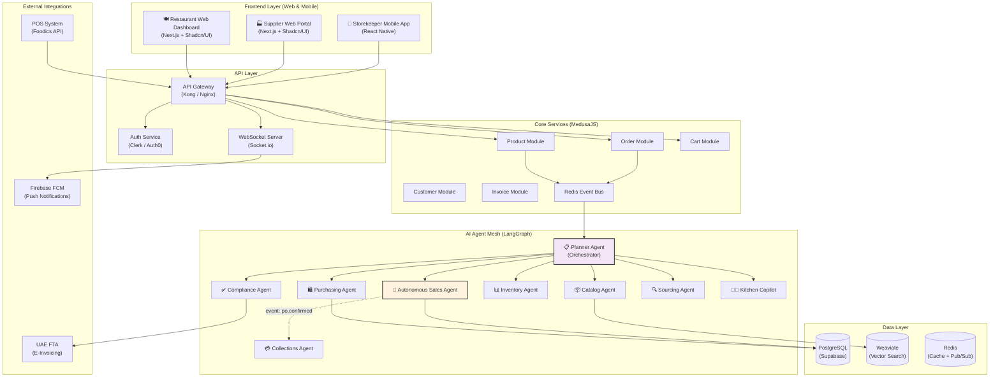

### Architecture Principles

| Principle | Implementation |
|:---|:---|
| **API-First** | All agent interactions via REST/WebSocket APIs — no chat-based channels |
| **Event-Driven** | Redis EventBus powers async communication between services and agents |
| **Real-Time** | Socket.io delivers live dashboard updates (quotes, order status, negotiations) |
| **Mobile Push** | Firebase FCM for GRN alerts, flash deal notifications, order confirmations |
| **Offline-First** | React Native mobile app supports offline GRN with sync-on-reconnect |

---

## 2. Multi-Agent Workflow (End-to-End Procurement)

```
User Request via Web Dashboard (e.g., "Generate cart for next 3 days")
         │
         ▼
    ┌─────────────────────────────────┐
    │  Planner Agent (ReAct)          │
    │  - Break down task into steps   │
    │  - Define success criteria      │
    └──────────┬──────────────────────┘
               │
               ├─ Step 1: Fetch current inventory & lead times
               │           │
               │           ▼
               │      ┌──────────────────┐
               │      │ Inventory Agent  │
               │      │ Calls:           │
               │      │ - get_stock()    │
               │      │ - get_lead_times │
               │      │ Result: {items with│
               │      │  par_levels,      │
               │      │  current_stock,   │
               │      │  run_rate}        │
               │      └──────────────────┘
               │
               ├─ Step 2: Normalize & match SKUs
               │           │
               │           ▼
               │      ┌──────────────────┐
               │      │ Catalog Agent    │
               │      │ Calls:           │
               │      │ - normalize_sku()│
               │      │ - find_equiv()   │
               │      │ Result: {norm_sku,│
               │      │  equiv_items}    │
               │      └──────────────────┘
               │
               ├─ Step 3: Compare suppliers & prices
               │           │
               │           ▼
               │      ┌──────────────────┐
               │      │ Sourcing Agent   │
               │      │ Calls:           │
               │      │ - compare_quotes │
               │      │ - check_history  │
               │      │ - apply_target   │
               │      │   _price_logic() │
               │      │ Result: {ranked  │
               │      │  suppliers, best │
               │      │  price per SKU}  │
               │      └──────────────────┘
               │
               ├─ Step 4: Build optimized cart
               │           │
               │           ▼
               │      ┌──────────────────┐
               │      │ Purchasing Agent │
               │      │ Calls:           │
               │      │ - build_cart()   │
               │      │ - check_MOQ()    │
               │      │ - optimize_      │
               │      │   delivery()     │
               │      │ Result: {draft   │
               │      │  cart, grouped   │
               │      │  by supplier}    │
               │      └──────────────────┘
               │
               ├─ Step 5: Validate with guardrails
               │           │
               │           ▼
               │      ┌──────────────────┐
               │      │ Pydantic Schemas │
               │      │ Validate:        │
               │      │ - qty > 0        │
               │      │ - supplier ok    │
               │      │ - reasons clear  │
               │      │ - budget within  │
               │      │   limits         │
               │      └──────────────────┘
               │
               ▼
    ┌─────────────────────────────────┐
    │  EMIT TO DASHBOARD              │
    │  - Push "Draft Cart Ready"      │
    │    notification badge           │
    │  - Chef reviews on Web UI       │
    │                                 │
    │           │                     │
    │           ▼                     │
    │  Manager Approval (Web UI)      │
    │  ✓ Approve → PO Created        │
    │  ✗ Reject  → Return for edit   │
    └─────────────────────────────────┘
```

---

## 3. ReAct Loop Pattern

All agents follow the **ReAct** (Reason + Act + Observe + Update) pattern:

```
┌────────────────────────────────────────────────────────┐
│  Agent receives task: "Find cheapest apples supplier"  │
└────────────────────────────────────────────────────────┘
                          │
                          ▼
          ┌───────────────────────────────┐
          │  REASON                       │
          │  - I need apple suppliers     │
          │  - Must consider: price,      │
          │    quality, delivery time     │
          │  - Check existing equivalents │
          └───────────────┬───────────────┘
                          │
                          ▼
          ┌───────────────────────────────┐
          │  ACT                          │
          │  - Tool: query_suppliers(     │
          │      category="apples")      │
          │  - Tool: get_price_history(   │
          │      sku="apple_*")          │
          │  - Tool: check_delivery_     │
          │      windows()               │
          └───────────────┬───────────────┘
                          │
                          ▼
          ┌───────────────────────────────┐
          │  OBSERVE                      │
          │  - Results from tools:        │
          │    Supplier A: $5.2/kg        │
          │    Supplier B: $4.8/kg (1d)   │
          │    Supplier C: $6.0/kg        │
          └───────────────┬───────────────┘
                          │
                          ▼
          ┌───────────────────────────────┐
          │  UPDATE                       │
          │  - Best price: Supplier B     │
          │  - But: 1-day lead time       │
          │  - Need by tomorrow? YES      │
          │  - Recommendation: Supplier B │
          │    (cheapest + meets deadline)│
          └───────────────┬───────────────┘
                          │
                          ▼
          ┌───────────────────────────────┐
          │  LOOP?                        │
          │  - Need refinement? NO        │
          │  - Return final suggestion    │
          └───────────────────────────────┘
```

---

## 4. Core Data Flows

### 4.1 POS → Normalization → AI Cart

```
┌──────────────────────┐
│   POS System         │
│  (e.g., Foodics)     │
│                      │          ┌──────────────────────────────────────┐
│  Webhook triggers:   │         │  CONSUMPTION ENGINE                  │
│  - sale.completed    │────────►│                                      │
│  - menu.updated      │         │  1. Map product_id → recipe BOM      │
│  - stock.adjusted    │         │  2. Calculate raw ingredient usage    │
│                      │         │  3. Update run-rate & par-level       │
└──────────────────────┘         │  4. Predict next reorder date         │
                                 └────────────────┬─────────────────────┘
                                                  │
                                                  ▼
                                 ┌──────────────────────────────────────┐
                                 │  AI CART GENERATOR                    │
                                 │                                      │
                                 │  For each ingredient:                │
                                 │   IF current_stock < par_level:     │
                                 │     qty = par_level - current_stock  │
                                 │     find best supplier (price,       │
                                 │       history, quality, delivery)    │
                                 │     add to draft cart                 │
                                 │                                      │
                                 │  Emit: "cart.draft_ready" event      │
                                 │  → Dashboard notification badge      │
                                 └──────────────────────────────────────┘
```

### 4.2 Supplier Catalog Upload → SKU Normalization

```
 CATALOG INGESTION PIPELINE
 ═══════════════════════════════════════════════════

 INPUT (Web Upload)              PROCESSING                    OUTPUT
 ──────────────                  ──────────                    ──────
 ┌──────────────┐
 │ Supplier CSV │─────┐
 └──────────────┘     │
 ┌──────────────┐     │    ┌──────────────────────┐    ┌─────────────────┐
 │ PDF Catalog  │─────┼───►│ PARSER ROUTER        │───►│ NORMALIZER      │
 └──────────────┘     │    │                      │    │ (LangGraph)     │
 ┌──────────────┐     │    │ CSV → Column mapper  │    │                 │
 │ ERP Export   │─────┘    │ PDF → AWS Textract   │    │ Step 1: Clean   │
 └──────────────┘          │                      │    │  - Remove noise │
                           └──────────────────────┘    │  - Fix encoding │
                                                       │  - Standardize  │
                                                       │    units        │
                                                       │                 │
                                                       │ Step 2: Extract │
                                                       │  - Product name │
                                                       │  - Brand/Origin │
                                                       │  - Unit/Weight  │
                                                       │  - Pack size    │
                                                       │                 │
                                                       │ Step 3: Embed   │
                                                       │  → OpenAI ada-2 │
                                                       │  → 1536-dim vec │
                                                       └────────┬────────┘
                                                                │
                                                                ▼
                                                       ┌─────────────────┐
                                                       │ WEAVIATE         │
                                                       │ Vector Search    │
                                                       │                 │
                                                       │ cosine > 0.92   │
                                                       │  → AUTO-MATCH   │
                                                       │ 0.80 < cos ≤    │
                                                       │ 0.92 → REVIEW   │
                                                       │ cos ≤ 0.80      │
                                                       │  → NEW SKU      │
                                                       └─────────────────┘
```

### 4.3 Order → GRN → Invoice Match (3-Way)

```
 3-WAY MATCHING FLOW
 ═══════════════════════════════════════════════════

                    ┌──────────────┐
                    │ Purchase     │
                    │ Order (PO)   │
                    │              │
                    │ Items:       │
                    │ - Flour 50kg │
                    │ - Oil 3 tin  │
                    │ Total: AED510│
                    └──────┬───────┘
                           │
              ┌────────────┴────────────────┐
              │                             │
              ▼                             ▼
    ┌──────────────┐              ┌──────────────┐
    │  GRN         │              │  Invoice     │
    │  (Mobile App)│              │  (PDF Upload)│
    │              │              │              │
    │  Received:   │              │  Billed:     │
    │  - Flour     │              │  - Flour     │
    │    48kg ⚠️   │              │    50kg      │
    │  - Oil 3 tin │              │  - Oil 3 tin │
    │  Photo: ✓    │              │  Total:      │
    └──────┬───────┘              │    AED 510   │
           │                      └──────┬───────┘
           │                             │
           └──────────┬──────────────────┘
                      │
                      ▼
           ┌──────────────────────┐
           │ COMPLIANCE AGENT     │
           │                      │
           │ Match Result:        │
           │ ┌──────────────────┐ │
           │ │ Flour: VARIANCE  │ │
           │ │ PO: 50kg         │ │
           │ │ GRN: 48kg        │ │
           │ │ Invoice: 50kg    │ │
           │ │ → Exception flag │ │
           │ └──────────────────┘ │
           │ ┌──────────────────┐ │
           │ │ Oil: MATCHED ✓   │ │
           │ └──────────────────┘ │
           │                      │
           │ Action:              │
           │ → Dashboard Alert    │
           │ → Sideover for       │
           │   manual resolution  │
           └──────────────────────┘
```

---

## 5. Marketplace Flow

### 5.1 Three-Sided Network Architecture

```
 MARKETPLACE NETWORK
 ═══════════════════════════════════════════════════

 ┌─────────────────┐      ┌─────────────────┐
 │   RESTAURANTS   │      │    SUPPLIERS     │
 │                 │      │                  │
 │  ┌───────────┐  │ API  │  ┌────────────┐ │
 │  │ Web       │◄─┼──────┼─►│ Web Portal │ │
 │  │ Dashboard │  │      │  │            │ │
 │  └───────────┘  │      │  └────────────┘ │
 │                 │      │                  │
 │  Browse catalog │      │  List products   │
 │  AI smart cart  │      │  Set guardrails  │
 │  Approve POs    │      │  Monitor AI agent│
 └────────┬────────┘      └────────┬─────────┘
          │                        │
          │    ┌───────────────┐   │
          │    │  AI AGENT     │   │
          │    │  MESH         │   │
          └───►│               │◄──┘
               │  Negotiate    │
               │  Match        │
               │  Attribute    │
               │  Invoice      │
               └───────┬───────┘
                       │
          ┌────────────┴────────────┐
          │      SALES REPS         │
          │                         │
          │  ┌───────────────────┐  │
          │  │ Territory Portal  │  │
          │  │ - Attribution     │  │
          │  │ - Commission      │  │
          │  │ - Takeover ctrl   │  │
          │  └───────────────────┘  │
          └─────────────────────────┘
```

### 5.2 Marketplace Transaction Flow

| Stage | Actor | Action | Platform Component |
|:---|:---|:---|:---|
| **List** | Supplier | Uploads catalog via CSV/PDF on Portal | Catalog Normalization Agent |
| **Outreach** | AI Agent | Matches products to restaurant menus | Purchasing Agent + Vector Search |
| **Quote** | AI Agent | Generates binding quote within margins | Autonomous Sales Agent |
| **Convert** | Restaurant | Approves quote on Dashboard | Order Module (MedusaJS) |
| **Repeat** | AI Agent | Learns patterns → auto-reorder carts | Purchasing Agent + Cron |
| **Upsell** | AI Agent | Spots cross-sell from menu analysis | Sales Agent + Menu Intelligence |
| **Commission** | System | Attributes revenue to rep's territory | Attribution Engine |
| **Settle** | System | Auto-generates FTA e-invoice + smart collections | Compliance Agent + Collections Agent |


<!-- END architecture-and-flows.md -->

---

<!-- BEGIN architecture-diagrams.md -->
# Document: architecture-diagrams.md

# Architecture Diagrams (Visual)

These diagrams summarize the current codebase and planned platform architecture. They are intended for presentations and onboarding.

---

## 1) MVP Runtime Flow (Current Repo)

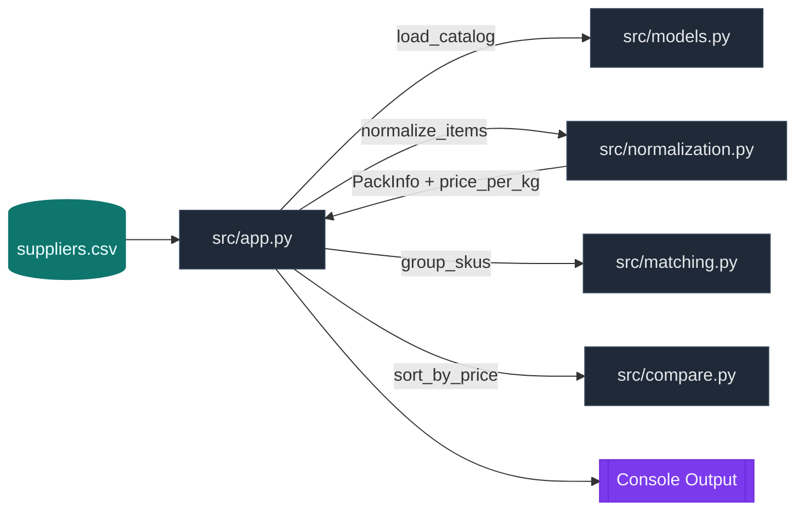

---

## 2) Catalog Normalization Pipeline

```mermaid
flowchart LR
  A[Raw Supplier SKU]:::input --> B[parse_pack()]:::fn
  B --> C[pack_to_kg()]:::fn
  A --> D[normalize_name()]:::fn
  C --> E[price_per_kg]:::data
  D --> F[normalized_name]:::data
  E & F --> G[NormalizedSKU]:::output

  classDef input fill:#0ea5e9,stroke:#0284c7,color:#f0f9ff;
  classDef fn fill:#111827,stroke:#374151,color:#e5e7eb;
  classDef data fill:#14b8a6,stroke:#0f766e,color:#ecfeff;
  classDef output fill:#a855f7,stroke:#7e22ce,color:#f5f3ff;
```

---

## 3) SKU Matching (Fuzzy Grouping)

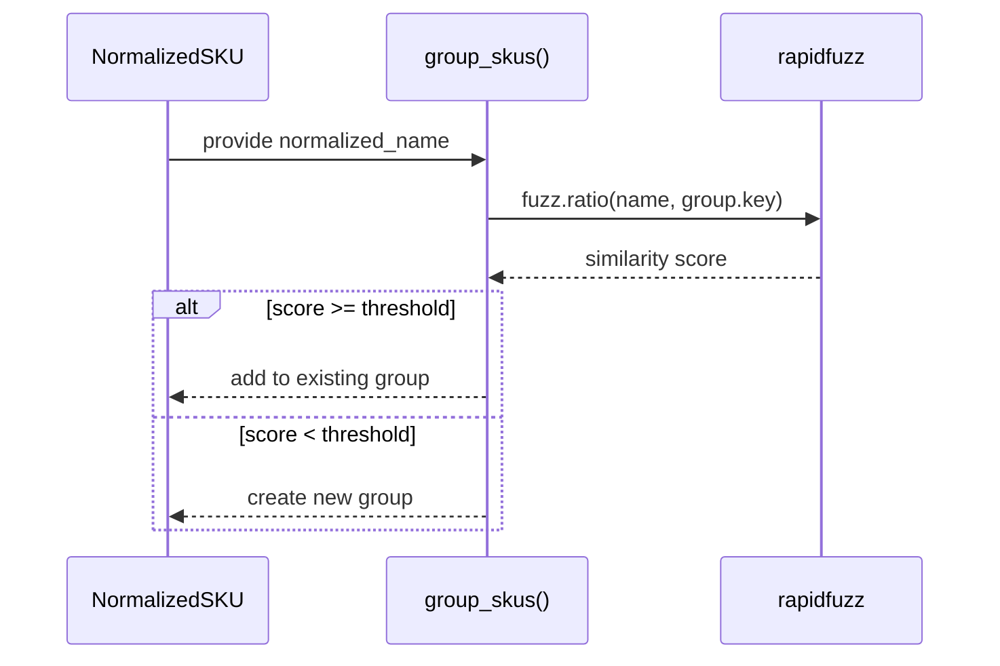

---

## 4) Multi-Agent Platform Architecture (Target)

```mermaid
flowchart TB
  subgraph Frontend[Frontend Layer]
    R[Restaurant App]:::ui
    S[Supplier Portal]:::ui
    A[Admin Dashboard]:::ui
  end

  subgraph Gateway[API Gateway & Auth]
    G[Auth, RBAC, Validation]:::core
  end

  subgraph Core[Commerce & Orchestration]
    M[MedusaJS Core]:::core
    L[LangGraph Multi‑Agent]:::ai
    E[Event Bus (Redis/BullMQ)]:::core
  end

  subgraph Agents[Agent Mesh]
    P[Planner]:::ai
    C[Catalog]:::ai
    So[Sourcing]:::ai
    Pu[Purchasing]:::ai
    Co[Compliance]:::ai
    I[Inventory]:::ai
    K[Kitchen Copilot]:::ai
    Sa[Autonomous Sales]:::ai
  end

  subgraph Data[Data & Storage]
    PG[(PostgreSQL)]:::data
    V[(Vector DB)]:::data
    S3[(Object Storage)]:::data
  end

  R --> G
  S --> G
  A --> G
  G --> M
  M <--> E
  M <--> L
  L --> Agents
  Agents --> PG
  Agents --> V
  Agents --> S3

  classDef ui fill:#0ea5e9,stroke:#0284c7,color:#f0f9ff;
  classDef core fill:#1f2937,stroke:#334155,color:#e5e7eb;
  classDef ai fill:#7c3aed,stroke:#6d28d9,color:#f5f3ff;
  classDef data fill:#14b8a6,stroke:#0f766e,color:#ecfeff;
```

---

## 5) Procurement Decision Flow (ReAct + Approval)

```mermaid
flowchart TD
  U[Manager Request: "Build 3‑day cart"]:::input --> P[Planner Agent]:::ai
  P --> I[Inventory Agent: fetch_inventory]:::ai
  P --> C[Catalog Agent: normalize + parse]:::ai
  P --> S[Sourcing Agent: compare_quotes]:::ai
  P --> Pu[Purchasing Agent: draft cart]:::ai
  Pu --> V[Pydantic Validation]:::core
  V --> A{Approval?}:::decision
  A -->|Approve| PO[Create PO + Audit Log]:::output
  A -->|Edit/Reject| R[Return to Planner]:::input

  classDef input fill:#0ea5e9,stroke:#0284c7,color:#f0f9ff;
  classDef ai fill:#7c3aed,stroke:#6d28d9,color:#f5f3ff;
  classDef core fill:#1f2937,stroke:#334155,color:#e5e7eb;
  classDef decision fill:#f59e0b,stroke:#b45309,color:#fffbeb;
  classDef output fill:#10b981,stroke:#047857,color:#ecfdf5;
```

---

## 6) Invoice Matching (2‑Way / 3‑Way)

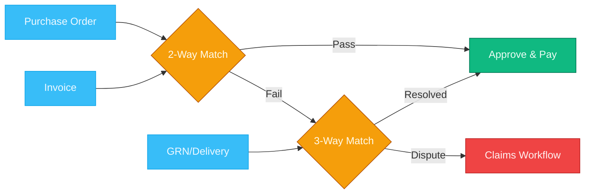


<!-- END architecture-diagrams.md -->

---

<!-- BEGIN complete-architecture-visual.md -->
# Document: complete-architecture-visual.md

# F&B AI Purchasing & Sales Platform — Complete Architecture Diagrams

> **Version 2.0** | February 2026 | Comprehensive system architecture with all layers, agents, integrations, and data flows.

---

## Table of Contents

1. [System-Wide Architecture](#1-system-wide-architecture)
2. [Restaurant AI Agent Mesh](#2-restaurant-ai-agent-mesh)
3. [Supplier Autonomous Sales Agent](#3-supplier-autonomous-sales-agent)
4. [External Integrations & APIs](#4-external-integrations--apis)
5. [Agent-to-Agent Communication Flow](#5-agent-to-agent-communication-flow)
6. [Data Flow: E-Invoicing & Compliance](#6-data-flow-e-invoicing--compliance)
7. [Real-time Event-Driven Architecture](#7-real-time-event-driven-architecture)
8. [Dashboard & Observability](#8-dashboard--observability)

---

## 1. System-Wide Architecture

### 1.1 Complete Layered Platform

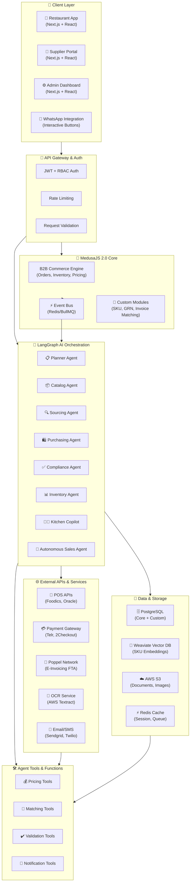

### 1.2 Communication Flow Overview

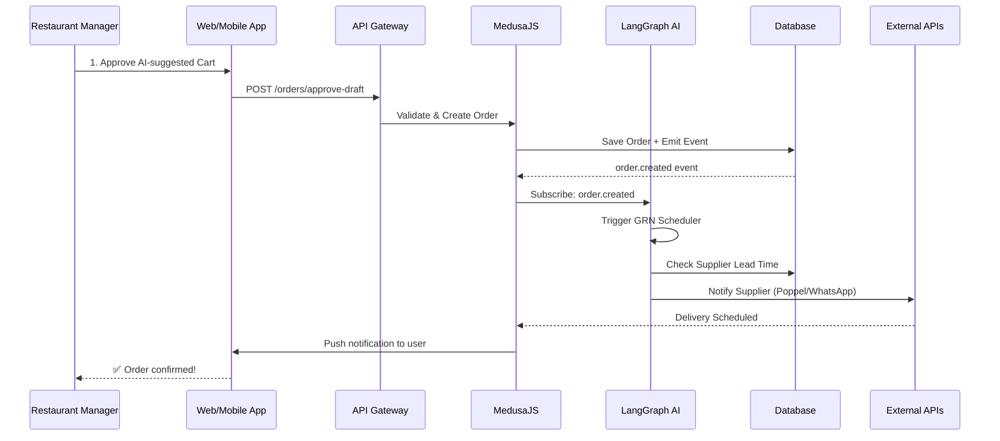

---

## 2. Restaurant AI Agent Mesh

### 2.1 Multi-Agent Orchestration (Restaurant Side)

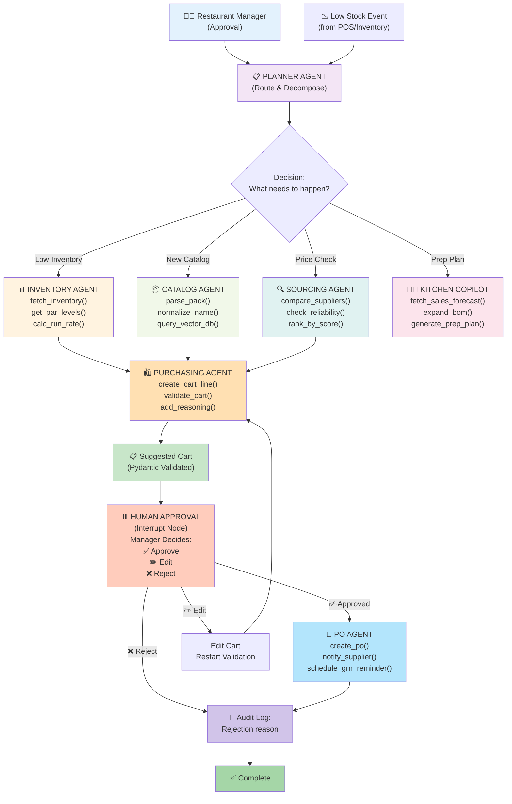

### 2.2 Purchasing Agent Decision Tree

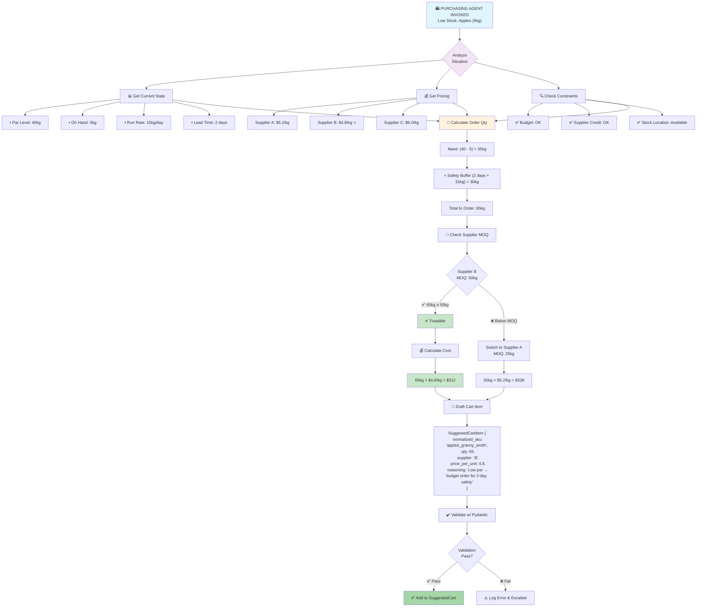

---

## 3. Supplier Autonomous Sales Agent

### 3.1 Sales Agent: The Instant-Close Engine

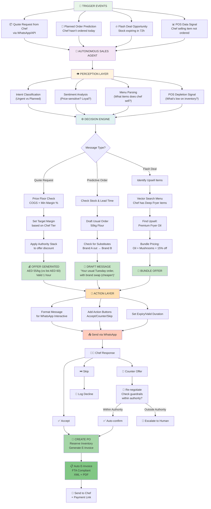

### 3.2 Basket-Aware Upsell Logic

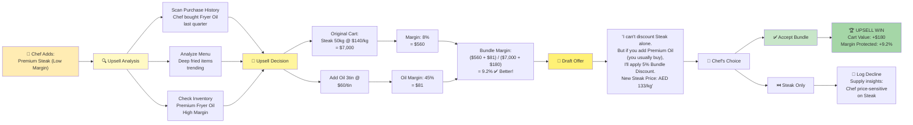

---

## 4. External Integrations & APIs

### 4.1 Complete API Ecosystem

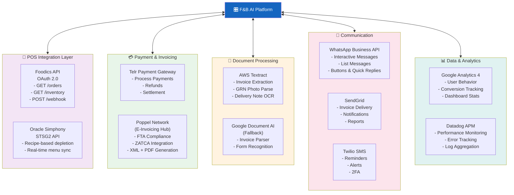

### 4.2 POS Data Synchronization

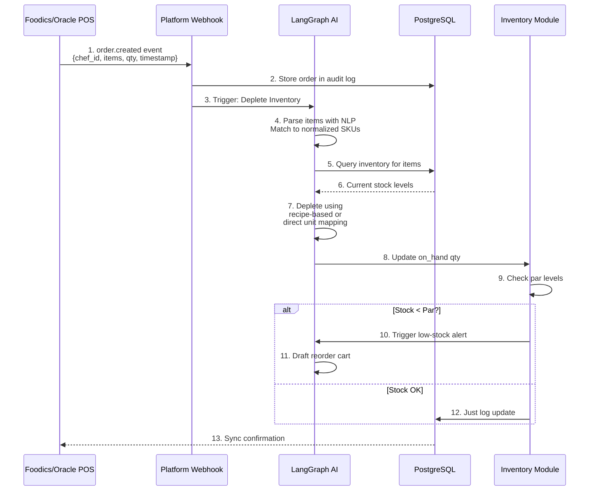

### 4.3 E-Invoicing Flow (Poppel Network)

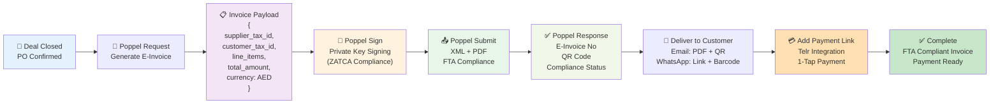

---

## 5. Agent-to-Agent Communication Flow

### 5.1 Procurement Agent ↔ Autonomous Sales Agent

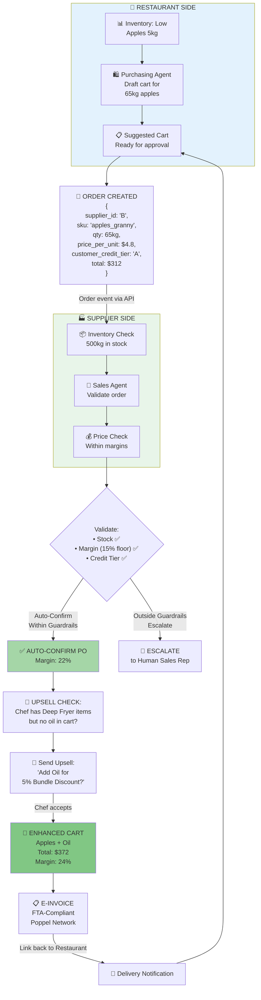

### 5.2 Cross-Agent Message Queue (Event-Driven)

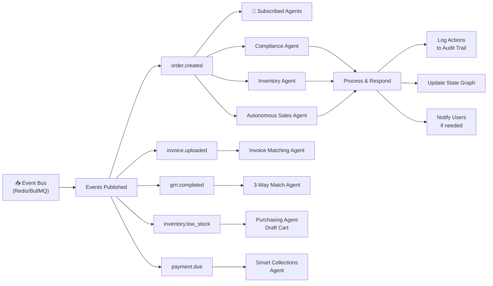

---

## 6. Data Flow: E-Invoicing & Compliance

### 6.1 Invoice Lifecycle (2-Way / 3-Way Match)

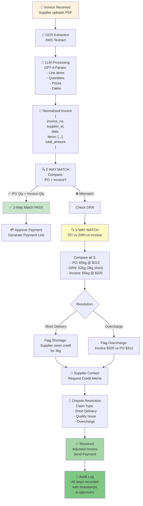

### 6.2 Audit Trail & Compliance

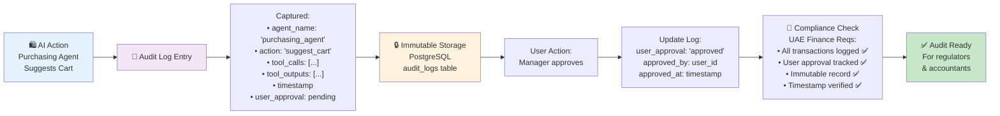

---

## 7. Real-time Event-Driven Architecture

### 7.1 Event Flow Diagram

```mermaid
graph TB
    subgraph Sources["📤 Event Sources"]
        S1["POS: order.created"]
        S2["Medusa: inventory.adjusted"]
        S3["External: payment.received"]
        S4["AI: grn.completed"]
        S5["UI: user.approved_cart"]
    end
    
    Sources --> EB["⚡ EVENT BUS<br/>(Redis Streams)"]
    
    EB --> Consumers["🔔 Consumers/Subscribers"]
    
    Consumers --> C1["Inventory Agent:<br/>listen: inventory.adjusted<br/>action: check_par_levels"]
    Consumers --> C2["Compliance Agent:<br/>listen: invoice.uploaded<br/>action: two_way_match"]
    Consumers --> C3["Sales Agent:<br/>listen: order.created<br/>action: confirm_and_upsell"]
    Consumers --> C4["Collections Agent:<br/>listen: invoice.confirmed<br/>action: schedule_payment_reminder"]
    Consumers --> C5["Analytics:<br/>listen: ALL events<br/>action: update_dashboard"]
    
    C1 --> Tasks["⚙️ Task Processing"]
    C2 --> Tasks
    C3 --> Tasks
    C4 --> Tasks
    C5 --> Tasks
    
    Tasks --> Outcome["📝 Outcomes"]
    
    Outcome --> O1["New orders entered"]
    Outcome --> O2["Alerts triggered"]
    Outcome --> O3["Upsells offered"]
    Outcome --> O4["Payments scheduled"]
    Outcome --> O5["Dashboards updated"]
    
    style EB fill:#1565c0,color:#fff
    style Sources fill:#f3e5f5
    style Consumers fill:#fff3e0
    style Tasks fill:#e8f5e9
    style Outcome fill:#c8e6c9
```

### 7.2 Real-Time Inventory Monitoring

```mermaid
graph LR
    A["⏰ Cron Job<br/>Every 5 minutes"] --> B["📊 Fetch Inventory<br/>from DB"]
    
    B --> C["🔍 Compare<br/>qty_on_hand<br/>vs par_level"]
    
    C --> D{Any items<br/>below<br/>par?}
    
    D -->|"Yes"| E["🚨 TRIGGER<br/>LOW STOCK EVENT"]
    D -->|"No"| F["✅ All OK<br/>Log checkpoint"]
    
    E --> G["🛍️ Purchasing Agent<br/>Draft Reorder Cart"]
    
    G --> H["📧 Notify Manager<br/>Push notification<br/>Dashboard alert"]
    
    H --> I["⏸️ WAIT for<br/>Manager Approval"]
    
    I --> J{Manager<br/>Action?}
    
    J -->|"✅ Approve"| K["📄 Create PO<br/>Send to Supplier"]
    J -->|"✏️ Edit"| L["Modify & Resubmit"]
    J -->|"❌ Reject"| M["📝 Log Rejection<br/>Manual order later"]
    
    K --> N["✅ Complete"]
    L --> K
    M --> N
    
    style E fill:#ff6b6b
    style G fill:#f3e5f5
    style I fill:#ffd93d
    style N fill:#c8e6c9
```

---

## 8. Dashboard & Observability

### 8.1 Restaurant Manager Dashboard

```mermaid
graph TB
    subgraph Widgets["📊 Dashboard Widgets"]
        W1["🎯 AI Cart Status<br/>- Draft pending: 1<br/>- Approved today: 3<br/>- Next: Auto-gen in 2h"]
        
        W2["📦 Inventory Health<br/>- On par: 23/30 items<br/>- Low stock: 5 items<br/>- Expiring soon: 2 items"]
        
        W3["💰 Food Cost This Month<br/>- Target: ≤30%<br/>- Current: 28.5% ✅<br/>- Savings vs manual: +$1,200"]
        
        W4["📄 Invoice Status<br/>- Matched: 12/13<br/>- 1 exception (waiting GRN)"]
        
        W5["🚨 Alerts<br/>- Apples low (5kg)<br/>- Payment due tomorrow<br/>- GRN pending review"]
        
        W6["📈 AI Performance<br/>- Time saved: 23.5 hrs/mo<br/>- Price accuracy: 99.2%<br/>- Upsell rate: 12%"]
    end
    
    subgraph Actions["⚙️ Quick Actions"]
        A1["✅ Approve AI Cart"]
        A2["✏️ Edit Cart Items"]
        A3["📧 Email Invoice"]
        A4["📞 Contact Supplier"]
    end
    
    Widgets --> Dashboard["🎛️ Restaurant Dashboard<br/>(Next.js)"]
    Dashboard --> Actions
    
    style Dashboard fill:#1565c0,color:#fff
    style Widgets fill:#f3e5f5
    style Actions fill:#fff3e0
```

### 8.2 Supplier Performance Dashboard

```mermaid
graph TB
    subgraph Metrics["📊 KPIs Tracked"]
        M1["💹 Revenue This Week<br/>AED 45,200<br/>↑ 12% vs last week"]
        
        M2["🎯 AI Agent Performance<br/>- Response time: 2.1s avg<br/>- Win rate: 35%<br/>- Upsell conversion: 18%"]
        
        M3["🔥 Flash Deal Results<br/>- Items liquidated: 120kg<br/>- Write-off saved: AED 3,200<br/>- Time to sell: 4.2h avg"]
        
        M4["💳 Collections Status<br/>- DSO: 22 days (↓ from 45)<br/>- Overdue: AED 2,500<br/>- Escalation alerts: 3"]
        
        M5["📦 Order Accuracy<br/>- Delivery on-time: 98%<br/>- Full delivery: 99.2%<br/>- Invoice match: 100%"]
        
        M6["🤖 AI vs Human Reps<br/>- AI revenue: AED 45k<br/>- Top rep revenue: AED 28k<br/>- AI efficiency: 2.2x"]
    end
    
    subgraph Controls["⚙️ Guardrails Config"]
        C1["💰 Min Margin %: 15%"]
        C2["🎯 Max Discount Auth: 20%"]
        C3["💼 Credit Exposure Limit<br/>AED 500k"]
        C4["🔥 Flash Deal Budget:<br/>AED 10k/week"]
    end
    
    Metrics --> Dashboard["🎛️ Supplier Dashboard<br/>(Next.js)"]
    Dashboard --> Controls
    
    style Dashboard fill:#1565c0,color:#fff
    style Metrics fill:#e8f5e9
    style Controls fill:#fff3e0
```

### 8.3 Admin Monitoring Dashboard

```mermaid
graph TB
    subgraph Health["🏥 System Health"]
        H1["✅ API Response Time: 142ms"]
        H2["✅ DB Connection Pool: 45/50"]
        H3["✅ LangGraph Agents: All Running"]
        H4["✅ Event Queue Lag: 0.2s"]
        H5["⚠️ OCR Queue: 12 pending"]
    end
    
    subgraph Compliance["🔐 Compliance Audit"]
        CP1["✅ Audit Log Entries: 45,231"]
        CP2["✅ E-Invoices Generated: 892"]
        CP3["✅ FTA Compliance: 100%"]
        CP4["✅ PII Encryption: Enabled"]
    end
    
    subgraph Usage["📊 Platform Usage"]
        U1["Users Active Today: 324"]
        U2["Orders Processed: 1,247"]
        U3["Agents Executed: 3,892"]
        U4["API Calls: 128,456"]
    end
    
    subgraph Errors["⚠️ Error Tracking"]
        E1["Failed OCRs: 2<br/>(Retrying)"]
        E2["Invalid Catalogs: 1<br/>(Pending review)"]
        E3["Payment Errors: 0"]
    end
    
    Health --> AdminDash["⚙️ Admin Console<br/>(Datadog/New Relic)"]
    Compliance --> AdminDash
    Usage --> AdminDash
    Errors --> AdminDash
    
    style AdminDash fill:#1565c0,color:#fff
    style Health fill:#e8f5e9
    style Compliance fill:#a5d6a7
    style Usage fill:#fff3e0
    style Errors fill:#ffccbc
```

---

## Summary: Complete Data Flow Schematic

```mermaid
graph LR
    subgraph Restaurants["🏪 RESTAURANTS"]
        R1["POS System"]
        R2["Manager App"]
    end
    
    subgraph Suppliers["🏭 SUPPLIERS"]
        S1["ERP System"]
        S2["Supplier Portal"]
    end
    
    subgraph Platform["🎛️ F&B AI PLATFORM"]
        API["API Gateway"]
        Medusa["MedusaJS"]
        Agents["LangGraph Agents"]
        DB["PostgreSQL"]
        Vector["Weaviate"]
        Cache["Redis"]
    end
    
    subgraph External["🌐 EXTERNAL SERVICES"]
        POS["POS APIs"]
        Payment["Payment GW"]
        Poppel["Poppel E-Invoice"]
        OCR["OCR Service"]
        WhatsApp["WhatsApp API"]
    end
    
    Restaurants --> API
    Suppliers --> API
    API --> Medusa
    Medusa --> Agents
    Agents --> DB
    Agents --> Vector
    Agents --> Cache
    Medusa --> External
    Agents --> External
    
    style Restaurants fill:#e3f2fd
    style Suppliers fill:#e8f5e9
    style Platform fill:#1565c0,color:#fff
    style External fill:#fff3e0
```


<!-- END complete-architecture-visual.md -->

---

<!-- BEGIN medusajs-architecture.md -->
# Document: medusajs-architecture.md

# MedusaJS 2.0 + LangGraph Architecture

## System Overview

```
┌───────────────────────────────────────────────────────────────────┐
│                    F&B AI Purchasing Agent                        │
│                   (MedusaJS 2.0 + LangGraph)                      │
└───────────────────────────────────────────────────────────────────┘

┌─────────────────────────────────────────────────────────────────────┐
│                         Frontend Layer                              │
├─────────────────────────────────────────────────────────────────────┤
│  Restaurant App      │  Supplier Portal    │  Admin Dashboard      │
│  (Next.js/React)     │  (Next.js/React)    │  (Next.js/React)      │
│                      │                      │                       │
│  - Browse catalog    │  - Manage products  │  - Supplier approval  │
│  - AI suggested cart │  - View orders      │  - Analytics          │
│  - Approve orders    │  - Update pricing   │  - SKU normalization  │
│  - Inventory view    │  - Dispatch tracking│  - Dispute resolution │
└──────────────┬───────────────┬─────────────────────┬───────────────┘
               │               │                     │
               │               │                     │
               ▼               ▼                     ▼
┌─────────────────────────────────────────────────────────────────────┐
│                      API Gateway Layer                              │
│                   (REST + GraphQL + WebSocket)                      │
└─────────────────────────────────────────────────────────────────────┘
               │
               ▼
┌─────────────────────────────────────────────────────────────────────┐
│                     MedusaJS 2.0 Core                               │
├─────────────────────────────────────────────────────────────────────┤
│                                                                     │
│  ┌─────────────────────────────────────────────────────────────┐   │
│  │                    Commerce Modules                         │   │
│  ├─────────────────────────────────────────────────────────────┤   │
│  │  • B2B Sales Channels      • Order Management              │   │
│  │  • Company/Employee Accts  • Cart & Checkout               │   │
│  │  • Spending Limits         • Payment Processing            │   │
│  │  • RFQ Workflows          • Fulfillment                   │   │
│  │  • Inventory Management    • Returns & Claims              │   │
│  └─────────────────────────────────────────────────────────────┘   │
│                                                                     │
│  ┌─────────────────────────────────────────────────────────────┐   │
│  │              Custom Modules (AI Purchase Manager)           │   │
│  ├─────────────────────────────────────────────────────────────┤   │
│  │  • SKU Normalization Module                                │   │
│  │  • AI Suggested Cart Module                                │   │
│  │  • GRN (Goods Received) Module                             │   │
│  │  • Invoice Matching Module (2-way/3-way)                   │   │
│  │  • Waste & Variance Module                                 │   │
│  │  • Forecasting Module                                      │   │
│  └─────────────────────────────────────────────────────────────┘   │
│                                                                     │
│  ┌─────────────────────────────────────────────────────────────┐   │
│  │                Event Bus (Event-Driven)                     │   │
│  ├─────────────────────────────────────────────────────────────┤   │
│  │  Events:                                                    │   │
│  │  - order.placed          - inventory.low_stock             │   │
│  │  - grn.completed         - invoice.uploaded                │   │
│  │  - cart.suggested        - payment.completed               │   │
│  │  - supplier.catalog_updated                                │   │
│  └─────────────────────────────────────────────────────────────┘   │
└────────────────────────────┬────────────────────────────────────────┘
                             │
                             │ Event Subscribers
                             │
        ┌────────────────────┼────────────────────┐
        │                    │                    │
        ▼                    ▼                    ▼
┌────────────────┐  ┌────────────────┐  ┌────────────────┐
│   LangGraph    │  │  Vector DB     │  │  External      │
│   AI Agents    │  │  (Weaviate)    │  │  Services      │
│                │  │                │  │                │
│ - Procurement  │  │ - SKU          │  │ - POS APIs     │
│ - Sourcing     │  │   embeddings   │  │ - OCR (AWS     │
│ - Compliance   │  │ - Supplier     │  │   Textract)    │
│ - Inventory    │  │   metadata     │  │ - Payment      │
│ - Kitchen      │  │ - Semantic     │  │   Gateway      │
│   Copilot      │  │   search       │  │                │
└────────────────┘  └────────────────┘  └────────────────┘
        │                    │                    │
        └────────────────────┼────────────────────┘
                             │
                             ▼
┌─────────────────────────────────────────────────────────────────────┐
│                     Data & Persistence Layer                        │
├─────────────────────────────────────────────────────────────────────┤
│  PostgreSQL (Medusa Core + Custom Tables)                          │
│  - Companies, Employees, Orders, Products                           │
│  - SKU Normalization, GRN, Invoices, Audit Logs                   │
│                                                                     │
│  Redis (Session, Cache, Queue)                                      │
│  - User sessions, Cart cache, Job queue (BullMQ)                   │
│                                                                     │
│  S3/Object Storage                                                  │
│  - Product images, Invoice PDFs, GRN photos, Audit documents       │
└─────────────────────────────────────────────────────────────────────┘
```

---

## MedusaJS 2.0 B2B Architecture

### Core B2B Features (Out-of-the-Box)

```
┌─────────────────────────────────────────────────────────────┐
│                    MedusaJS B2B Starter                     │
├─────────────────────────────────────────────────────────────┤
│                                                             │
│  Company Accounts                                           │
│  ├─ Company profile (name, tax ID, billing address)        │
│  ├─ Employee sub-accounts with roles                       │
│  ├─ Spending limits per employee/department                │
│  └─ Approval workflows (cart → manager → PO)               │
│                                                             │
│  Request for Quote (RFQ)                                    │
│  ├─ Create RFQ with multiple items                         │
│  ├─ Send to multiple suppliers                             │
│  ├─ Receive & compare quotes                               │
│  └─ Convert quote → order                                  │
│                                                             │
│  Custom Pricing                                             │
│  ├─ Price lists per company                                │
│  ├─ Volume discounts                                       │
│  ├─ Contract pricing                                       │
│  └─ Currency support (AED, USD, etc.)                      │
│                                                             │
│  Payment Terms                                              │
│  ├─ Net 30, Net 60 terms                                   │
│  ├─ Credit limits                                          │
│  ├─ Invoice generation                                     │
│  └─ Payment tracking                                       │
└─────────────────────────────────────────────────────────────┘
```

### Custom Module Integration Points

MedusaJS allows you to inject custom logic at key lifecycle points:

```
┌──────────────────────────────────────────────────────────────┐
│           MedusaJS Custom Module Injection Points            │
├──────────────────────────────────────────────────────────────┤
│                                                              │
│  1. Subscriber Pattern (Event-Driven)                        │
│     ┌─────────────────────────────────────────────────┐     │
│     │  order.placed event                             │     │
│     │         ↓                                       │     │
│     │  Custom Subscriber listens                      │     │
│     │         ↓                                       │     │
│     │  Trigger LangGraph Agent                        │     │
│     │         ↓                                       │     │
│     │  AI validates order → update status             │     │
│     └─────────────────────────────────────────────────┘     │
│                                                              │
│  2. API Routes (Custom Endpoints)                            │
│     ┌─────────────────────────────────────────────────┐     │
│     │  POST /admin/sku-normalize                      │     │
│     │  POST /store/ai-cart-suggest                    │     │
│     │  POST /admin/invoice-match                      │     │
│     │  GET  /store/waste-insights                     │     │
│     └─────────────────────────────────────────────────┘     │
│                                                              │
│  3. Middleware (Request/Response Interception)               │
│     ┌─────────────────────────────────────────────────┐     │
│     │  Inject AI pricing recommendations              │     │
│     │  Add explainability metadata to cart           │     │
│     │  Log all financial actions to audit trail      │     │
│     └─────────────────────────────────────────────────┘     │
│                                                              │
│  4. Services (Business Logic Layer)                          │
│     ┌─────────────────────────────────────────────────┐     │
│     │  class SkuNormalizationService {                │     │
│     │    async normalize(catalog) { ... }            │     │
│     │  }                                              │     │
│     │  class AiSuggestedCartService {                 │     │
│     │    async generate(branch, parLevels) { ... }   │     │
│     │  }                                              │     │
│     └─────────────────────────────────────────────────┘     │
│                                                              │
│  5. Workflows (Multi-Step Transactions)                      │
│     ┌─────────────────────────────────────────────────┐     │
│     │  createOrderWithGrnWorkflow:                    │     │
│     │    step1: validate cart                         │     │
│     │    step2: create order                          │     │
│     │    step3: reserve inventory                     │     │
│     │    step4: notify supplier                       │     │
│     │    step5: schedule GRN reminder                 │     │
│     └─────────────────────────────────────────────────┘     │
└──────────────────────────────────────────────────────────────┘
```

---

## LangGraph Agentic Workflows

LangGraph enables **stateful, multi-step AI reasoning** with tool-calling and human-in-the-loop approval.

### LangGraph Architecture

```
┌─────────────────────────────────────────────────────────────┐
│                    LangGraph State Graph                    │
├─────────────────────────────────────────────────────────────┤
│                                                             │
│  State: {                                                   │
│    branch_id: "branch-001",                                 │
│    low_stock_items: [...],                                  │
│    suggested_cart: null,                                    │
│    approval_status: "pending",                              │
│    tool_logs: []                                            │
│  }                                                          │
│                                                             │
│  ┌───────────────────────────────────────────────────┐     │
│  │  Node: ProcurementAgent                           │     │
│  │  - Input: low_stock_items                         │     │
│  │  - Action: Call inventory API                     │     │
│  │  - Output: {items, par_levels, run_rates}        │     │
│  └───────────────┬───────────────────────────────────┘     │
│                  │                                          │
│                  ▼                                          │
│  ┌───────────────────────────────────────────────────┐     │
│  │  Node: SkuNormalizationAgent                      │     │
│  │  - Input: raw SKU names                           │     │
│  │  - Action: Query vector DB for equivalents        │     │
│  │  - Output: normalized_skus                        │     │
│  └───────────────┬───────────────────────────────────┘     │
│                  │                                          │
│                  ▼                                          │
│  ┌───────────────────────────────────────────────────┐     │
│  │  Node: SourcingAgent                              │     │
│  │  - Input: normalized_skus                         │     │
│  │  - Action: Compare supplier prices                │     │
│  │  - Output: {supplier, price_per_kg, lead_time}   │     │
│  └───────────────┬───────────────────────────────────┘     │
│                  │                                          │
│                  ▼                                          │
│  ┌───────────────────────────────────────────────────┐     │
│  │  Node: CartDraftAgent                             │     │
│  │  - Input: sourcing recommendations                │     │
│  │  - Action: Calculate quantities                   │     │
│  │  - Output: suggested_cart (Pydantic validated)    │     │
│  └───────────────┬───────────────────────────────────┘     │
│                  │                                          │
│                  ▼                                          │
│  ┌───────────────────────────────────────────────────┐     │
│  │  Node: HumanApproval (Interrupt)                  │     │
│  │  - State: approval_status = "pending"             │     │
│  │  - Wait for manager input                         │     │
│  │  - If approved: proceed to PO creation            │     │
│  │  - If rejected: log & exit                        │     │
│  └───────────────┬───────────────────────────────────┘     │
│                  │                                          │
│                  ▼                                          │
│  ┌───────────────────────────────────────────────────┐     │
│  │  Node: CreatePOAgent                              │     │
│  │  - Input: approved cart                           │     │
│  │  - Action: Call Medusa API to create order        │     │
│  │  - Output: PO number, status                      │     │
│  └───────────────────────────────────────────────────┘     │
│                                                             │
└─────────────────────────────────────────────────────────────┘
```

### LangGraph Event Flow

```
Low Stock Event (from Medusa)
         │
         ▼
┌─────────────────────────────────┐
│  inventory.low_stock event      │
│  {                              │
│    branch_id: "branch-001",     │
│    items: [                     │
│      {sku: "apples", qty: 5kg}  │
│    ]                            │
│  }                              │
└──────────────┬──────────────────┘
               │
               ▼
┌───────────────────────────────────────┐
│  LangGraph Workflow: AutoReorder      │
│                                       │
│  Initialize State Graph               │
└───────────────┬───────────────────────┘
                │
                ▼
    ┌───────────────────────────┐
    │  Node: ProcurementAgent   │
    │  Tools:                   │
    │  - fetch_inventory()      │
    │  - get_par_levels()       │
    │  - calc_run_rate()        │
    └───────────┬───────────────┘
                │ Result: need 75kg
                ▼
    ┌───────────────────────────┐
    │  Node: SkuNormalizationAgt│
    │  Tools:                   │
    │  - query_vector_db()      │
    │  - parse_pack()           │
    │  - normalize_name()       │
    └───────────┬───────────────┘
                │ Result: "apples_granny_smith"
                ▼
    ┌───────────────────────────┐
    │  Node: SourcingAgent      │
    │  Tools:                   │
    │  - compare_suppliers()    │
    │  - check_lead_time()      │
    │  - rank_by_price()        │
    └───────────┬───────────────┘
                │ Result: Supplier B, $4.8/kg
                ▼
    ┌───────────────────────────┐
    │  Node: CartDraftAgent     │
    │  Tools:                   │
    │  - create_cart_line()     │
    │  - validate_schema()      │
    │  - add_reasoning()        │
    └───────────┬───────────────┘
                │ Result: SuggestedCart
                ▼
    ┌───────────────────────────────────┐
    │  Node: HumanApproval (INTERRUPT)  │
    │  - Send notification to manager   │
    │  - State saved to DB              │
    │  - Wait for user action           │
    └───────────┬───────────────────────┘
                │
                ├─ ✓ Approved
                │  │
                │  ▼
                │  ┌────────────────────────┐
                │  │ Node: CreatePOAgent    │
                │  │ - Call Medusa API      │
                │  │ - Create order         │
                │  │ - Notify supplier      │
                │  └────────────────────────┘
                │
                └─ ✗ Rejected
                   │
                   ▼
                   ┌────────────────────────┐
                   │ Log rejection reason   │
                   │ Mark state as complete │
                   └────────────────────────┘
```

---

## Data Acquisition Layer

### POS Integration Architecture

```
┌──────────────────────────────────────────────────────────────┐
│                    POS Integration Layer                     │
├──────────────────────────────────────────────────────────────┤
│                                                              │
│  ┌────────────────────────────────────────────────────────┐ │
│  │         Foodics API Connector                          │ │
│  ├────────────────────────────────────────────────────────┤ │
│  │  OAuth 2.0 Authentication                              │ │
│  │  Endpoints:                                            │ │
│  │  - GET /v5/orders (daily sales)                        │ │
│  │  - GET /v5/inventory (stock levels)                    │ │
│  │  - GET /v5/products (item master)                      │ │
│  │                                                         │ │
│  │  Data Mapping:                                         │ │
│  │  Foodics Product ID → Internal Normalized SKU          │ │
│  │                                                         │ │
│  │  Webhook Support:                                      │ │
│  │  - order.created → depletes inventory                  │ │
│  │  - inventory.adjusted → sync stock                     │ │
│  └────────────────────────────────────────────────────────┘ │
│                                                              │
│  ┌────────────────────────────────────────────────────────┐ │
│  │       Oracle Simphony Connector                        │ │
│  ├────────────────────────────────────────────────────────┤ │
│  │  STSG2 REST API                                        │ │
│  │  Endpoints:                                            │ │
│  │  - GET /transactions (POS sales)                       │ │
│  │  - GET /menuItems (menu with recipes)                  │ │
│  │  - GET /inventory (stock depletion)                    │ │
│  │                                                         │ │
│  │  Recipe-Based Depletion:                               │ │
│  │  Order "Chicken Burger" → deplete:                     │ │
│  │    - 150g chicken breast                               │ │
│  │    - 1 bun                                             │ │
│  │    - 20g lettuce, etc.                                 │ │
│  └────────────────────────────────────────────────────────┘ │
│                                                              │
│  ┌────────────────────────────────────────────────────────┐ │
│  │         Generic POS Adapter (Fallback)                 │ │
│  ├────────────────────────────────────────────────────────┤ │
│  │  CSV/Excel Upload:                                     │ │
│  │  - Daily sales report upload                           │ │
│  │  - Manual SKU mapping                                  │ │
│  │  - Scheduled ETL jobs                                  │ │
│  └────────────────────────────────────────────────────────┘ │
└──────────────────────────────────────────────────────────────┘
```

### Invoice OCR Pipeline

```
┌──────────────────────────────────────────────────────────────┐
│                     Invoice OCR Pipeline                     │
├──────────────────────────────────────────────────────────────┤
│                                                              │
│  Step 1: Upload                                              │
│  ┌────────────────────────────────────────────────────────┐ │
│  │  Supplier uploads PDF/image via app                    │ │
│  │         ↓                                              │ │
│  │  Store in S3: invoices/{supplier_id}/{invoice_no}.pdf │ │
│  └────────────────────────────────────────────────────────┘ │
│                                                              │
│  Step 2: OCR Extraction                                      │
│  ┌────────────────────────────────────────────────────────┐ │
│  │  Trigger: invoice.uploaded event                       │ │
│  │         ↓                                              │ │
│  │  AWS Textract (AnalyzeExpense API)                     │ │
│  │  OR                                                     │ │
│  │  Google Document AI (Invoice Parser)                   │ │
│  │         ↓                                              │ │
│  │  Extracted:                                            │ │
│  │  {                                                      │ │
│  │    invoice_no: "INV-12345",                            │ │
│  │    date: "2026-02-04",                                 │ │
│  │    supplier: "Global Foods",                           │ │
│  │    line_items: [                                       │ │
│  │      {desc: "Apples Granny Smith",                     │ │
│  │       qty: "50kg", price: "$240"},                     │ │
│  │      ...                                               │ │
│  │    ],                                                   │ │
│  │    total: "$1,250"                                     │ │
│  │  }                                                      │ │
│  └────────────────────────────────────────────────────────┘ │
│                                                              │
│  Step 3: AI Validation & Normalization                       │
│  ┌────────────────────────────────────────────────────────┐ │
│  │  LangGraph Agent: InvoiceValidationAgent              │ │
│  │  - Parse line items with LLM                           │ │
│  │  - Map to Normalized SKUs                              │ │
│  │  - Extract pack info (50kg → 50 × 1kg)                 │ │
│  │  - Calculate price per kg                              │ │
│  └────────────────────────────────────────────────────────┘ │
│                                                              │
│  Step 4: 2-Way / 3-Way Match                                 │
│  ┌────────────────────────────────────────────────────────┐ │
│  │  Compare:                                              │ │
│  │  - PO line items                                       │ │
│  │  - GRN received quantities                             │ │
│  │  - Invoice billed quantities                           │ │
│  │         ↓                                              │ │
│  │  Flag exceptions:                                      │ │
│  │  - Short delivery (GRN < Invoice)                      │ │
│  │  - Overcharge (Invoice price > PO price)               │ │
│  │  - Missing items                                       │ │
│  └────────────────────────────────────────────────────────┘ │
└──────────────────────────────────────────────────────────────┘
```

---

## SKU Normalization Engine (The Moat)

### Vector DB Architecture (Weaviate)

```
┌──────────────────────────────────────────────────────────────┐
│                Weaviate Vector Database Schema               │
├──────────────────────────────────────────────────────────────┤
│                                                              │
│  Collection: NormalizedSKU                                   │
│  ┌────────────────────────────────────────────────────────┐ │
│  │  {                                                      │ │
│  │    id: "uuid",                                         │ │
│  │    name: "Apples Granny Smith",                        │ │
│  │    category: "Fresh Produce",                          │ │
│  │    attributes: {                                       │ │
│  │      grade: "A",                                       │ │
│  │      origin: "UAE",                                    │ │
│  │      organic: false                                    │ │
│  │    },                                                   │ │
│  │    unit: "kilogram",                                   │ │
│  │    aliases: ["Green Apples", "Pommes Granny Smith"],  │ │
│  │    embedding: [0.123, 0.456, ...],  ← OpenAI Ada-002  │ │
│  │    equiv_group: "apples_granny_smith_001"              │ │
│  │  }                                                      │ │
│  └────────────────────────────────────────────────────────┘ │
│                                                              │
│  Collection: SupplierCatalog                                 │
│  ┌────────────────────────────────────────────────────────┐ │
│  │  {                                                      │ │
│  │    id: "uuid",                                         │ │
│  │    supplier_id: "supplier-001",                        │ │
│  │    sku: "GFD-001",                                     │ │
│  │    name: "Fresh Apples Granny Smith",                  │ │
│  │    pack: "10 x 1kg",                                   │ │
│  │    unit_price: 38.00,                                  │ │
│  │    currency: "USD",                                    │ │
│  │    normalized_sku_id: "uuid",  ← Link to NormalizedSKU│ │
│  │    embedding: [0.120, 0.452, ...],                     │ │
│  │    last_updated: "2026-02-04"                          │ │
│  │  }                                                      │ │
│  └────────────────────────────────────────────────────────┘ │
└──────────────────────────────────────────────────────────────┘
```

### Normalization Workflow

```
New Supplier Catalog Upload
         │
         ▼
┌────────────────────────────────┐
│  Admin uploads CSV/Excel       │
│  Columns:                      │
│  - SKU, Name, Pack, Price      │
└────────────┬───────────────────┘
             │
             ▼
┌─────────────────────────────────────────────────────┐
│  LangGraph Agent: CatalogNormalizationAgent         │
│                                                      │
│  For each row:                                       │
│  Step 1: Generate embedding                          │
│    - Input: "Fresh Apples Granny Smith 10x1kg"      │
│    - Call: OpenAI embeddings API                    │
│    - Output: [0.123, 0.456, ...]                    │
│                                                      │
│  Step 2: Similarity search in Weaviate              │
│    - Query vector DB with embedding                 │
│    - Return top 3 matches with cosine similarity    │
│    - Threshold: > 0.85 = "same product"             │
│                                                      │
│  Step 3: LLM attribute extraction                    │
│    - Prompt:                                         │
│      "Extract: weight, grade, origin, organic       │
│       from 'Fresh Apples Granny Smith 10x1kg'"      │
│    - Output: {weight: 10kg, grade: null, ...}      │
│                                                      │
│  Step 4: Pack parsing                                │
│    - Input: "10 x 1kg"                              │
│    - Parse: {count: 10, size: 1, unit: "kg"}       │
│    - Total weight: 10kg                             │
│                                                      │
│  Step 5: Price normalization                         │
│    - unit_price / total_weight = price_per_kg       │
│    - $38 / 10kg = $3.80/kg                          │
│                                                      │
│  Step 6: Link or create Normalized SKU              │
│    - If match found: link supplier SKU              │
│    - If no match: create new Normalized SKU         │
│    - Update Weaviate                                 │
└─────────────────────────────────────────────────────┘
         │
         ▼
┌────────────────────────────────┐
│  Admin Review Screen           │
│  - Show suggested matches      │
│  - Allow manual override       │
│  - Approve normalization       │
└────────────────────────────────┘
```

---

## Deployment Roadmap (Step-by-Step)

### Phase 0: Foundation (Weeks 1-2)

```
┌─────────────────────────────────────────────────────────┐
│  Infrastructure Setup                                   │
├─────────────────────────────────────────────────────────┤
│  ✓ Provision AWS/GCP infrastructure                     │
│  ✓ Set up PostgreSQL (RDS or managed)                   │
│  ✓ Set up Redis (ElastiCache)                           │
│  ✓ Set up S3 buckets (invoices, images, backups)        │
│  ✓ Install Weaviate (managed or self-hosted)            │
│  ✓ Set up CI/CD pipeline (GitHub Actions)               │
└─────────────────────────────────────────────────────────┘

┌─────────────────────────────────────────────────────────┐
│  MedusaJS 2.0 Installation                              │
├─────────────────────────────────────────────────────────┤
│  ✓ Initialize Medusa project                            │
│  ✓ Install B2B plugin                                   │
│  ✓ Configure PostgreSQL connection                      │
│  ✓ Run migrations                                       │
│  ✓ Seed initial data (regions, currencies)              │
│  ✓ Deploy admin dashboard                               │
└─────────────────────────────────────────────────────────┘
```

### Phase 1: SKU Normalization Module (Weeks 3-4)

```
┌─────────────────────────────────────────────────────────┐
│  Build Normalization Engine                             │
├─────────────────────────────────────────────────────────┤
│  ✓ Create custom Medusa module: SkuNormalizationService│
│  ✓ Integrate Weaviate client                            │
│  ✓ Build CSV upload endpoint                            │
│  ✓ Implement embedding generation (OpenAI)              │
│  ✓ Build similarity search logic                        │
│  ✓ Implement pack parser & unit converter               │
│  ✓ Create admin UI for review & approval                │
│  ✓ Test with 1,000 real supplier SKUs                   │
└─────────────────────────────────────────────────────────┘

Acceptance:
- Upload 3 supplier catalogs (300+ SKUs each)
- Achieve 90%+ auto-match accuracy
- Manual review reduces duplicates by 80%
```

### Phase 2: POS Integration (Weeks 5-6)

```
┌─────────────────────────────────────────────────────────┐
│  Foodics Integration (Primary)                          │
├─────────────────────────────────────────────────────────┤
│  ✓ Register OAuth app with Foodics                      │
│  ✓ Build auth flow (3-legged OAuth)                     │
│  ✓ Create FoodicsConnector service                      │
│  ✓ Implement daily sales sync (cron job)                │
│  ✓ Map Foodics product IDs → Normalized SKUs            │
│  ✓ Calculate theoretical inventory depletion            │
│  ✓ Set up webhook listeners (order.created)             │
│  ✓ Pilot with 1 restaurant (1 week)                     │
└─────────────────────────────────────────────────────────┘

Acceptance:
- Real-time depletion within 5 minutes of sale
- 95%+ SKU mapping accuracy
- Low stock alerts trigger within 1 hour
```

### Phase 3: LangGraph AI Agents (Weeks 7-9)

```
┌─────────────────────────────────────────────────────────┐
│  Kitchen Copilot Agent (MVP)                            │
├─────────────────────────────────────────────────────────┤
│  ✓ Install LangGraph + LangChain                        │
│  ✓ Build state graph: PrepPlanAgent                     │
│  ✓ Tools:                                               │
│    - fetch_sales_forecast()                             │
│    - get_current_inventory()                            │
│    - get_recipes()                                      │
│  ✓ Generate daily prep list:                            │
│    "Based on forecast 120 orders, prep:                 │
│     - 18kg chicken breast                               │
│     - 50 burger buns                                    │
│     - 3kg lettuce"                                      │
│  ✓ Deploy as Medusa subscriber                          │
│  ✓ Pilot with 1 chef (2 weeks)                          │
└─────────────────────────────────────────────────────────┘

Acceptance:
- Prep list generated by 6am daily
- Chef feedback: 80%+ accuracy
- Reduces prep waste by 15%
```

### Phase 4: AI Suggested Cart (Weeks 10-12)

```
┌─────────────────────────────────────────────────────────┐
│  Autopilot Purchasing Agent                             │
├─────────────────────────────────────────────────────────┤
│  ✓ Build LangGraph workflow: AutoReorderWorkflow        │
│  ✓ Nodes:                                               │
│    - ProcurementAgent                                   │
│    - SkuNormalizationAgent                              │
│    - SourcingAgent                                      │
│    - CartDraftAgent                                     │
│    - HumanApproval (interrupt)                          │
│    - CreatePOAgent                                      │
│  ✓ Trigger: inventory.low_stock event                   │
│  ✓ Build approval UI in restaurant app                  │
│  ✓ Implement explainability (why this qty/supplier)     │
│  ✓ Capture manager edits as feedback                    │
│  ✓ Pilot with 3 branches (4 weeks)                      │
└─────────────────────────────────────────────────────────┘

Acceptance:
- 70%+ of AI carts approved without edits
- 30% reduction in ordering time
- Measurable cost savings (5-10% lower $/kg)
```

### Phase 5: Invoice OCR & Matching (Weeks 13-15)

```
┌─────────────────────────────────────────────────────────┐
│  OCR Pipeline + Invoice Matching                        │
├─────────────────────────────────────────────────────────┤
│  ✓ Set up AWS Textract (or Google Document AI)          │
│  ✓ Build invoice upload endpoint                        │
│  ✓ Implement OCR extraction logic                       │
│  ✓ Build InvoiceValidationAgent (LangGraph)             │
│  ✓ Implement 2-way match (PO vs Invoice)                │
│  ✓ Implement 3-way match (PO vs GRN vs Invoice)         │
│  ✓ Build exception handling UI                          │
│  ✓ Pilot with 100 invoices                              │
└─────────────────────────────────────────────────────────┘

Acceptance:
- OCR accuracy > 90% for structured invoices
- 2-way match reduces approval time by 60%
- 3-way match catches 95%+ of discrepancies
```

### Phase 6: Scale & Optimize (Weeks 16-20)

```
┌─────────────────────────────────────────────────────────┐
│  Production Optimization                                 │
├─────────────────────────────────────────────────────────┤
│  ✓ Add Oracle Simphony connector                        │
│  ✓ Implement waste & variance tracking                  │
│  ✓ Build forecasting models (time series)               │
│  ✓ Add payment/credit integrations                      │
│  ✓ Launch overseas supplier portal                      │
│  ✓ Scale to 50 restaurants                              │
│  ✓ Onboard 200 suppliers                                │
│  ✓ Process 10,000 orders/month                          │
└─────────────────────────────────────────────────────────┘
```

---

## Tech Stack Summary

| Layer | Technology |
|-------|-----------|
| **Commerce Core** | MedusaJS 2.0 (Node.js, TypeScript) |
| **Database** | PostgreSQL 15+ |
| **Cache/Queue** | Redis, BullMQ |
| **Vector DB** | Weaviate (or Pinecone) |
| **AI Orchestration** | LangGraph + LangChain |
| **LLM** | OpenAI GPT-4 (or Claude) |
| **Embeddings** | OpenAI Ada-002 |
| **OCR** | AWS Textract or Google Document AI |
| **POS Connectors** | Foodics API, Oracle Simphony STSG2 |
| **Frontend** | Next.js 14+ (React, TypeScript) |
| **Storage** | AWS S3 (or GCP Cloud Storage) |
| **Hosting** | AWS ECS/EKS or GCP Cloud Run |
| **CI/CD** | GitHub Actions |
| **Monitoring** | Datadog or New Relic |

---

## Key Benefits of This Architecture

✅ **Modular**: Medusa's plugin system keeps AI logic decoupled from core commerce  
✅ **Event-Driven**: Low stock triggers AI without polling  
✅ **Stateful AI**: LangGraph maintains context across multi-step workflows  
✅ **Human-in-the-Loop**: Manager approval is a first-class citizen  
✅ **Explainable**: Every AI decision includes reasoning  
✅ **Scalable**: PostgreSQL + Redis + Weaviate handle 1M+ SKUs  
✅ **UAE-Optimized**: Multi-currency, Arabic support, local POS integrations  
✅ **B2B Native**: Company accounts, RFQs, credit terms out-of-the-box


<!-- END medusajs-architecture.md -->

---

<!-- BEGIN agentic-architecture.md -->
# Document: agentic-architecture.md

# Multi-Agentic Solution (Reasoning + Function Calling + ReAct)

## Goals
- Enable a multi-agent workflow that reasons over procurement tasks, calls tools/APIs, and records actions.
- Support retrieval (Vector DB) for catalog, vendor, and policy knowledge.
- Integrate POS data for consumption, depletion, and forecasting.
- Enforce safety and data validation with guardrails and schemas.

## Recommended Stack (modular)
- Orchestration: LangChain **or** CrewAI
- Agent framework (optional): AutoGPT (for long-running goal loops)
- Vector DB: Pinecone **or** Weaviate
- Guardrails: NVIDIA NeMo Guardrails **or** Pydantic-based validation
- API layer: FastAPI
- Storage: Postgres (transactions, audit logs) + Vector DB (embeddings)

## Agent Roles
1) **Reasoning Agent (Planner)**
   - Breaks down tasks into steps and decides which tools to call.
   - Produces a plan and success criteria.

2) **Catalog/Normalization Agent**
   - Normalizes SKU names, units, and pack sizes.
   - Calls parsers and unit conversion tools.

3) **Sourcing/Comparison Agent**
   - Compares suppliers on normalized price, lead time, MOQ, reliability.
   - Produces ranked options and justifications.

4) **Autopilot Purchasing Agent**
   - Generates suggested carts based on par levels, lead time, and run-rate.
   - Requires approval workflow.

5) **Compliance & Finance Agent**
   - Runs 2-way/3-way matches (PO vs GRN vs Invoice).
   - Flags exceptions, ensures audit logs.

6) **POS/Inventory Agent**
   - Ingests POS depletion and inventory adjustments.
   - Generates low-stock alerts and reorder triggers.

## ReAct Pattern (Reason + Act)
Each agent follows a structured loop:
1) **Reason**: analyze current state + objective.
2) **Act**: call tools (DB, POS API, catalog parser, vector search).
3) **Observe**: inspect results.
4) **Update**: refine plan or finalize action.

## Function Calling (tooling)
Key tools to expose:
- `parse_pack(pack_text)` -> PackInfo
- `normalize_name(name)` -> normalized string
- `convert_to_kg(pack_info)` -> kg
- `compare_quotes(items)` -> sorted options
- `generate_po(draft)` -> PO
- `record_grn(receipt)` -> GRN
- `match_invoice(po, grn, invoice)` -> match result
- `fetch_pos_sales(range)` -> sales summary
- `fetch_inventory()` -> stock snapshot
- `save_audit_log(entry)`

## Retrieval (Vector DB)
**Index data**:
- Supplier catalogs
- Price lists
- Policies (approvals, substitution rules)
- Product specs and substitutions

**Common queries**:
- “Find equivalent SKUs for X”
- “Approved substitutes for Y”
- “Recent pricing trends for Z”

## POS Integrations (API)
Minimum data required:
- Item sales by day (SKU, qty)
- Inventory adjustments
- Locations/branches

Approach:
- Start with one POS (e.g., Foodics or Oracle Micros) and implement a connector.
- Normalize POS item IDs to internal Normalized SKU mapping.

## Guardrails
- **NeMo Guardrails** for policy constraints and safe responses.
- **Pydantic** for strict schema validation of tool inputs/outputs.

## Phased Delivery (aligned with PRD)
- Phase 1: Catalog normalization + quote comparison
- Phase 2: GRN + invoice matching + audit logs
- Phase 3: Inventory + low stock
- Phase 4: AI suggested cart + approvals

## Acceptance Criteria (technical)
- All AI actions are logged with inputs, tool calls, and outputs.
- Human approval required for PO creation.
- SKU normalization achieves comparable $/kg across suppliers.


<!-- END agentic-architecture.md -->

---

<!-- BEGIN agent-reference.md -->
# Document: agent-reference.md

# AI Agent Reference (Web-Only)

> **Authority:** Aligned with the Stakeholder Document and B2B Commerce Network positioning.
> **Interface:** All agent interactions surface through Web Dashboard, Supplier Portal, or Mobile App.

---

## Table of Contents

1. [Agent Mesh Overview](#1-agent-mesh-overview)
2. [Planner Agent (Orchestrator)](#2-planner-agent-orchestrator)
3. [Purchasing Agent](#3-purchasing-agent)
4. [Autonomous Sales Agent](#4-autonomous-sales-agent)
5. [Compliance Agent](#5-compliance-agent)
6. [Catalog Normalization Agent](#6-catalog-normalization-agent)
7. [Kitchen Copilot Agent](#7-kitchen-copilot-agent)
8. [Collections Agent](#8-collections-agent)
9. [Inventory Agent](#9-inventory-agent)
10. [Sourcing Agent](#10-sourcing-agent)
11. [Guardrails & Governance](#11-guardrails--governance)

---

## 1. Agent Mesh Overview

```
 AI AGENT MESH (LangGraph)
 ═══════════════════════════════════════════════════

              ┌───────────────────────┐
              │  PLANNER AGENT        │
              │  (Orchestrator)       │
              │  Model: GPT-4o       │
              │  Pattern: ReAct loop  │
              └───────────┬───────────┘
                          │
        ┌─────────────────┼─────────────────┐
        │                 │                 │
        ▼                 ▼                 ▼
 ┌──────────────┐ ┌──────────────┐ ┌──────────────┐
 │ Purchasing   │ │ Sales        │ │ Compliance   │
 │ Agent        │ │ Agent        │ │ Agent        │
 │              │ │              │ │              │
 │ GPT-4o-mini  │ │ GPT-4o       │ │ GPT-4o-mini  │
 └──────────────┘ └──────────────┘ └──────────────┘
        │                 │                 │
        ▼                 ▼                 ▼
 ┌──────────────┐ ┌──────────────┐ ┌──────────────┐
 │ Catalog      │ │ Kitchen      │ │ Collections  │
 │ Agent        │ │ Copilot      │ │ Agent        │
 │              │ │              │ │              │
 │ GPT-4o-mini  │ │ GPT-4o-mini  │ │ GPT-4o-mini  │
 │ + ada-002    │ │              │ │              │
 └──────────────┘ └──────────────┘ └──────────────┘
        │
        ▼
 ┌──────────────┐ ┌──────────────┐
 │ Inventory    │ │ Sourcing     │
 │ Agent        │ │ Agent        │
 │              │ │              │
 │ GPT-4o-mini  │ │ GPT-4o-mini  │
 └──────────────┘ └──────────────┘
```

### Agent Communication

| Method | Use Case |
|:---|:---|
| **Redis EventBus** | Async event-driven communication (`po.confirmed`, `cart.draft_ready`) |
| **Direct Tool Call** | Planner invokes sub-agents via LangGraph state machine |
| **Shared State** | LangGraph `AgentState` object passed between nodes |

---

## 2. Planner Agent (Orchestrator)

| Property | Value |
|:---|:---|
| **Model** | GPT-4o |
| **Pattern** | ReAct (Reason → Act → Observe → Update) |
| **Trigger** | User request via Web Dashboard or scheduled cron |
| **Output** | Delivers result to Web Dashboard via WebSocket |

### Tool Calls

| Tool | Description |
|:---|:---|
| `decompose_task(request)` | Break user request into sub-steps |
| `delegate_to_agent(agent, task)` | Route sub-task to specialist agent |
| `validate_output(schema, result)` | Pydantic validation on agent output |
| `emit_to_dashboard(event, payload)` | Push result to user's Web Dashboard |

---

## 3. Purchasing Agent

| Property | Value |
|:---|:---|
| **Model** | GPT-4o-mini |
| **Trigger** | POS webhook (`sale.completed`), cron schedule, manual request |
| **Output** | Draft cart → Web Dashboard notification badge |

### Tool Calls

| Tool | Description |
|:---|:---|
| `get_stock(restaurant_id)` | Fetch current inventory levels |
| `get_consumption_rate(sku, days)` | Calculate run-rate from POS data |
| `calculate_par_level(sku)` | Determine reorder threshold |
| `build_cart(items, suppliers)` | Generate optimized cart grouped by supplier |
| `check_MOQ(supplier_id, sku, qty)` | Verify minimum order quantity |
| `optimize_delivery(cart)` | Consolidate deliveries, check lead times |
| `push_draft_cart(restaurant_id, cart)` | Push to Web Dashboard as "Cart Ready" |

### State Machine

```
 PURCHASING AGENT STATE MACHINE
 ═══════════════════════════════════════

 ┌─────────┐    ┌─────────┐    ┌─────────┐    ┌─────────┐
 │ ANALYZE │───►│ SOURCE  │───►│  BUILD  │───►│  EMIT   │
 │         │    │         │    │         │    │         │
 │ POS data│    │ Compare │    │ Draft   │    │ Push to │
 │ Stock   │    │ prices  │    │ cart    │    │ Web UI  │
 │ Run-rate│    │ History │    │ Group   │    │ Badge   │
 └─────────┘    └─────────┘    └─────────┘    └─────────┘
```

---

## 4. Autonomous Sales Agent

| Property | Value |
|:---|:---|
| **Model** | GPT-4o (complex negotiation requires strong reasoning) |
| **Trigger** | Incoming quote request, flash deal creation, upsell opportunity |
| **Output** | Binding quote → Restaurant Dashboard + Supplier Portal notification |

### Tool Calls

| Tool | Description |
|:---|:---|
| `validate_authority(supplier_config, order_value)` | Can agent approve this deal? |
| `check_stock(sku, qty)` | Verify inventory availability |
| `calculate_margin(cost, price)` | Meets margin floor? |
| `apply_discount_authority(customer_tier, discount_pct)` | Within discount limits? |
| `draft_binding_quote(items, prices, validity)` | Create offer with expiry |
| `analyze_menu_for_upsell(chef_id, cart)` | Find cross-sell opportunities |
| `create_po_auto_confirm(quote)` | Convert to order (within guardrails) |
| `push_notification(user_id, payload)` | Dashboard notification + FCM push |

### Negotiation Guardrails

```
 NEGOTIATION DECISION TREE
 ═══════════════════════════════════════

 Quote Request Received
        │
        ▼
 ┌──────────────┐     NO      ┌──────────────┐
 │ Margin ≥     │────────────►│ ESCALATE to  │
 │ Floor (15%)? │             │ Sales Rep    │
 └──────┬───────┘             │ (Web Alert)  │
        │ YES                 └──────────────┘
        ▼
 ┌──────────────┐     NO      ┌──────────────┐
 │ Order ≤      │────────────►│ ESCALATE to  │
 │ Auto-Approve │             │ Sales Rep    │
 │ Limit?       │             │ (Web Alert)  │
 └──────┬───────┘             └──────────────┘
        │ YES
        ▼
 ┌──────────────┐     NO      ┌──────────────┐
 │ Customer     │────────────►│ ADJUST       │
 │ in Good      │             │ Terms        │
 │ Standing?    │             │ (Prepay)     │
 └──────┬───────┘             └──────────────┘
        │ YES
        ▼
 ┌──────────────┐
 │ AUTO-CLOSE   │
 │ Generate PO  │
 │ Send Invoice │
 │ Notify Rep   │
 └──────────────┘
```

### Takeover Protocol

When a Sales Rep clicks "Takeover" on the Supplier Portal:

1. AI Agent **pauses** the current negotiation
2. Full context transferred to Rep (conversation history, margin data, customer profile)
3. Rep handles the negotiation manually via Portal
4. Rep can click "Resume AI" to hand back control
5. Attribution: Deal credited to Rep at direct-sale commission rate (6%)

---

## 5. Compliance Agent

| Property | Value |
|:---|:---|
| **Model** | GPT-4o-mini |
| **Trigger** | `po.confirmed`, `grn.created`, `invoice.uploaded` events |
| **Output** | Match status → Web Dashboard (Green = matched, Red = exception) |

### Tool Calls

| Tool | Description |
|:---|:---|
| `match_po_grn(po_id, grn_id)` | Compare PO line items to GRN actuals |
| `match_grn_invoice(grn_id, invoice_id)` | Compare GRN to invoice amounts |
| `flag_variance(match_result, threshold)` | If variance > threshold%, flag as exception |
| `generate_einvoice(order_id)` | Create FTA-compliant XML (UBL 2.1) + PDF |
| `send_dashboard_alert(user_id, exception)` | Push exception to Web Dashboard sideover |

---

## 6. Catalog Normalization Agent

| Property | Value |
|:---|:---|
| **Model** | GPT-4o-mini + ada-002 (embeddings) |
| **Trigger** | Supplier uploads catalog via Web Portal (CSV/PDF drag-and-drop) |
| **Output** | Normalized SKUs in Weaviate → Supplier sees mapping confirmation in Portal |

### Tool Calls

| Tool | Description |
|:---|:---|
| `parse_catalog(file, format)` | Extract raw product data from uploaded file |
| `clean_text(raw_item)` | Remove noise, fix encoding, standardize units |
| `extract_attributes(cleaned)` | GPT-4 extracts: name, brand, origin, unit, weight, grade, pack_size |
| `generate_embedding(attributes)` | ada-002 produces 1536-dim vector |
| `search_similar(embedding, threshold)` | Weaviate cosine search: >0.92=match, 0.80-0.92=review, <0.80=new |
| `create_sku(attributes, embedding)` | Insert new normalized SKU |
| `link_supplier_item(supplier_id, sku_id)` | Map supplier's raw item to normalized SKU |

---

## 7. Kitchen Copilot Agent

| Property | Value |
|:---|:---|
| **Model** | GPT-4o-mini |
| **Trigger** | Daily cron (pre-service), POS data update |
| **Output** | Prep list → Mobile App notification |

### Tool Calls

| Tool | Description |
|:---|:---|
| `get_forecast(restaurant_id, date)` | Predict covers and menu mix for the day |
| `get_expiring_stock(restaurant_id, days)` | Items expiring within N days |
| `generate_prep_list(forecast, stock, expiry)` | AI-optimized prep list prioritizing near-expiry |
| `push_to_mobile(staff_id, prep_list)` | Push prep list to Mobile App |

---

## 8. Collections Agent

| Property | Value |
|:---|:---|
| **Model** | GPT-4o-mini |
| **Trigger** | `invoice.created` event, payment due date cron |
| **Output** | Payment reminders via dashboard notification + email escalation |

### Tool Calls

| Tool | Description |
|:---|:---|
| `check_payment_status(invoice_id)` | Is payment received/pending/overdue? |
| `calculate_dso(customer_id)` | Days Sales Outstanding per account |
| `send_reminder(customer_id, level)` | Level 1=gentle, 2=firm, 3=escalate to rep |
| `flag_at_risk(customer_id)` | Mark account as at-risk in rep's territory dashboard |

### Escalation Ladder

| Day | Action | Channel |
|:---|:---|:---|
| Due date | Gentle reminder | Dashboard notification + Email |
| +3 days | Firm reminder | Dashboard notification + Email |
| +7 days | Escalate to Sales Rep | Dashboard alert + Push notification |
| +14 days | Flag account as at-risk | Territory dashboard + Manager report |

---

## 9. Inventory Agent

| Property | Value |
|:---|:---|
| **Model** | GPT-4o-mini |
| **Trigger** | POS webhook, GRN event, stock count submission |
| **Output** | Updated stock levels → Smart Cart input |

### Tool Calls

| Tool | Description |
|:---|:---|
| `get_stock(location_id)` | Current inventory by location |
| `get_lead_times(supplier_ids)` | Delivery lead times per supplier |
| `calculate_reorder_point(sku, run_rate, lead_time)` | When to trigger reorder |
| `update_stock(location_id, sku, delta)` | Adjust stock after GRN or consumption |

---

## 10. Sourcing Agent

| Property | Value |
|:---|:---|
| **Model** | GPT-4o-mini |
| **Trigger** | Cart build request from Purchasing Agent |
| **Output** | Ranked suppliers per SKU with price, lead time, quality score |

### Tool Calls

| Tool | Description |
|:---|:---|
| `query_suppliers(sku, location)` | Find all suppliers offering this SKU |
| `get_price_history(supplier_id, sku, days)` | Historical pricing trends |
| `check_delivery_windows(supplier_id)` | Next available delivery slot |
| `score_supplier(supplier_id, sku)` | Composite score: price + lead time + quality + reliability |
| `apply_target_price_logic(sku, quotes)` | Calculate target price from market data |

---

## 11. Guardrails & Governance

### 11.1 Agent Guardrails

| Guardrail | Enforcement | Set By |
|:---|:---|:---|
| **Minimum Margin** | Agent rejects deals below floor (default 15%) | Supplier Admin |
| **Maximum Discount** | Agent cannot offer > X% off list price | Supplier Admin |
| **Auto-Approve Limit** | Deals above threshold require human approval | Supplier Admin |
| **Budget Limit** | Restaurant cart cannot exceed daily/weekly budget | Restaurant Admin |
| **Upsell Cap** | Max 2 upsell items per transaction | Platform default |

### 11.2 Governance

| Concern | Implementation |
|:---|:---|
| **Audit Trail** | Every agent decision logged: timestamp, rationale, confidence score, tools used |
| **Human Override** | Any user can override AI decision from Web Dashboard with reason |
| **Transparency** | Agent provides "Why this?" explanations for every recommendation |
| **Confidence Threshold** | If agent confidence < 70%, escalate to human |
| **Rate Limiting** | Max 100 agent actions per minute per tenant |


<!-- END agent-reference.md -->

---

<!-- BEGIN data-model.md -->
# Document: data-model.md

# Database Schema & Data Model

## Entity Relationship Diagram

```
┌─────────────────┐
│    Suppliers    │
├─────────────────┤
│ id (PK)         │
│ name            │
│ country         │
│ lead_time_days  │
│ moq             │
│ payment_terms   │
│ rating          │
│ created_at      │
└────────┬────────┘
         │ 1:N
         │
    ┌────┴──────────────────┬──────────────────────┐
    │                       │                      │
    ▼                       ▼                      ▼
┌──────────────┐  ┌───────────────┐   ┌─────────────────┐
│  Catalogs    │  │ Quote History │   │  Orders (PO)    │
├──────────────┤  ├───────────────┤   ├─────────────────┤
│ id (PK)      │  │ id (PK)       │   │ id (PK)         │
│ supplier_id  │  │ supplier_id   │   │ po_number       │
│ name         │  │ sku_id        │   │ supplier_id     │
│ sku          │  │ price         │   │ status          │
│ pack         │  │ date          │   │ total_amount    │
│ unit_price   │  │               │   │ created_by      │
│ currency     │  └───────────────┘   │ created_at      │
│ updated_at   │                      │ delivery_date   │
└──────────────┘                      └────────┬────────┘
                                                │ 1:N
                                                │
                                      ┌─────────┴─────────┐
                                      │                   │
                                      ▼                   ▼
                            ┌───────────────────┐  ┌──────────────┐
                            │  PO Line Items    │  │ GRN (Receipts)
                            ├───────────────────┤  ├──────────────┤
                            │ id (PK)           │  │ id (PK)      │
                            │ po_id (FK)        │  │ po_id (FK)   │
                            │ sku_id (FK)       │  │ po_item_id   │
                            │ qty               │  │ qty_received │
                            │ unit              │  │ unit         │
                            │ price_unit        │  │ quality_notes│
                            │ line_total        │  │ photos       │
                            └───────────────────┘  │ signed_by    │
                                                   │ received_at  │
                                                   └──────┬───────┘
                                                          │ 1:N
                                                          │
                                            ┌─────────────┴──────────────┐
                                            │                            │
                                            ▼                            ▼
                                    ┌──────────────┐        ┌──────────────────┐
                                    │  Invoices    │        │  Claims/Disputes │
                                    ├──────────────┤        ├──────────────────┤
                                    │ id (PK)      │        │ id (PK)          │
                                    │ supplier_id  │        │ grn_id (FK)      │
                                    │ po_id (FK)   │        │ claim_type       │
                                    │ invoice_no   │        │ reason           │
                                    │ total_amount │        │ status           │
                                    │ match_status │        │ resolution       │
                                    │ uploaded_at  │        │ created_at       │
                                    │ paid_at      │        └──────────────────┘
                                    └──────────────┘

┌─────────────────┐
│ Normalized SKUs │
├─────────────────┤
│ id (PK)         │
│ supplier_id     │
│ sku             │
│ name            │
│ normalized_name │
│ pack_info       │ {count, size, unit}
│ price_per_kg    │
│ equiv_group_id  │ ← links to equivalents
│ created_at      │
└─────────────────┘

┌──────────────────┐
│  Inventory       │
├──────────────────┤
│ id (PK)          │
│ normalized_sku_id│
│ location         │
│ qty_on_hand      │
│ par_level        │
│ unit             │
│ last_check       │
│ expiry_batch     │
└──────────────────┘

┌──────────────────┐
│  Audit Logs      │
├──────────────────┤
│ id (PK)          │
│ agent_name       │
│ action           │
│ tool_name        │
│ tool_input       │
│ tool_output      │
│ status           │
│ error (opt)      │
│ user_approval    │
│ created_at       │
└──────────────────┘
```

---

## Core Data Models (Pydantic + SQL)

### Supplier
```
Supplier {
  id: UUID (Primary Key)
  name: str
  country: str
  lead_time_days: int
  moq: float (minimum order qty)
  payment_terms: str ("net 30", "prepay", etc.)
  rating: float (0-5, from historical reliability)
  is_active: bool
  created_at: datetime
  updated_at: datetime
}
```

### Catalog / SKU
```
CatalogSKU {
  id: UUID (Primary Key)
  supplier_id: UUID (Foreign Key)
  sku: str (supplier's SKU code)
  name: str (supplier's product name)
  pack: str ("10 x 1kg", "5lb", "12/500g")
  unit_price: float (supplier's price)
  currency: str ("USD", "AED", etc.)
  created_at: datetime
  updated_at: datetime
}
```

### Normalized SKU
```
NormalizedSKU {
  id: UUID (Primary Key)
  catalog_sku_id: UUID (Foreign Key)
  normalized_name: str (parsed & cleaned)
  pack_info: JSON {
    count: int
    size: float
    unit: str ("kilogram", "gram", "pound", "ounce")
  }
  total_weight_kg: float
  price_per_kg: float
  equiv_group_id: UUID (for "apples == pommes")
  created_at: datetime
}
```

### Purchase Order (PO)
```
PurchaseOrder {
  id: UUID (Primary Key)
  po_number: str (unique, auto-incremented)
  supplier_id: UUID (Foreign Key)
  status: str ("draft", "approved", "sent", "confirmed", "delivered", "invoiced", "paid")
  branch_id: UUID (which restaurant branch)
  created_by: UUID (user who created/approved)
  created_at: datetime
  delivery_date: date (promised delivery)
  total_amount: float (in supplier's currency)
  currency: str
  approved_at: datetime (when manager approved)
  line_items: List[POLineItem]
}

POLineItem {
  id: UUID (Primary Key)
  po_id: UUID (Foreign Key)
  normalized_sku_id: UUID (Foreign Key)
  qty: float
  unit: str ("kg", "lb", "unit")
  price_per_unit: float
  line_total: float
}
```

### GRN (Goods Received Note)
```
GRN {
  id: UUID (Primary Key)
  po_id: UUID (Foreign Key)
  received_by: str (receiver name)
  received_at: datetime
  status: str ("accepted", "partial", "rejected", "disputed")
  notes: str
  photos: List[str] (URLs to proof images)
  signature: str (base64 or URL)
  line_items: List[GRNLineItem]
}

GRNLineItem {
  id: UUID (Primary Key)
  grn_id: UUID (Foreign Key)
  po_item_id: UUID (Foreign Key)
  qty_received: float
  unit: str
  quality_notes: str ("damaged", "expired", "correct", etc.)
  substitution: bool (was substitution accepted?)
}
```

### Invoice
```
Invoice {
  id: UUID (Primary Key)
  supplier_id: UUID (Foreign Key)
  po_id: UUID (Foreign Key)
  grn_id: UUID (Foreign Key, optional)
  invoice_number: str (supplier's invoice no)
  invoice_date: date
  total_amount: float
  currency: str
  uploaded_at: datetime
  ocr_extracted: bool (was OCR successful?)
  match_status: str ("unmatched", "2way_match", "3way_match", "exception")
  exception_reason: str (if status="exception")
  line_items: List[InvoiceLineItem]
  approval_by: UUID (finance person)
  approved_at: datetime
}

InvoiceLineItem {
  id: UUID (Primary Key)
  invoice_id: UUID (Foreign Key)
  description: str (invoice line)
  qty_billed: float
  unit_price: float
  line_total: float
}
```

### Inventory
```
InventorySnapshot {
  id: UUID (Primary Key)
  normalized_sku_id: UUID (Foreign Key)
  branch_id: UUID (location)
  location_type: str ("dry", "chiller", "freezer")
  qty_on_hand: float
  unit: str
  par_level: float (target qty)
  reorder_point: float (trigger qty)
  expiry_date: date (oldest batch)
  batch_number: str
  last_checked: datetime
  updated_at: datetime
}
```

### Audit Log (All Agent Actions)
```
AuditLog {
  id: UUID (Primary Key)
  timestamp: datetime
  agent_name: str ("catalog_agent", "purchasing_agent", etc.)
  action: str ("suggest_cart", "compare_quotes", "match_invoice", etc.)
  tool_name: str (which tool was called)
  tool_input: JSON (what was passed)
  tool_output: JSON (what came back)
  error: str (if any)
  user_action: str ("approved", "edited", "rejected", etc.)
  created_by: UUID (user who took action)
  notes: str
}
```

### Suggested Cart (in-memory during draft)
```
SuggestedCart {
  id: UUID (Primary Key, optional for draft)
  branch_id: UUID
  created_by_agent: str ("purchasing_agent")
  status: str ("draft", "pending_approval", "approved", "rejected")
  items: List[SuggestedCartItem]
  reasoning: JSON (explainability)
  created_at: datetime
  expires_at: datetime (cart is stale after 24h)
}

SuggestedCartItem {
  id: UUID
  normalized_sku_id: UUID
  qty: float
  unit: str
  supplier_id: UUID
  suggested_price_per_unit: float
  reasoning: str (why this qty & supplier?)
  can_substitute: bool
  substitutes: List[UUID] (alternative SKU IDs)
}
```

---

## State Transitions

### PO Lifecycle
```
draft → approved (manager signs off)
     ↓
   sent (transmitted to supplier)
     ↓
 confirmed (supplier confirms)
     ↓
 dispatched (in transit)
     ↓
delivered (GRN recorded)
     ↓
invoiced (invoice received & matched)
     ↓
paid (payment processed)
```

### Invoice Reconciliation States
```
unmatched → 2way_match (PO=Invoice qty/price)
         ↓
      accepted → paid
         
         OR
         
      exception (mismatch) → 3way_match (check GRN)
                          ↓
                      resolved (claim settled)
                      ↓
                      credited/adjusted/paid
```

### Low Stock Trigger → AI Cart → Approval → PO
```
Inventory.qty < par → Alert → AI Draft Cart
                           ↓
                     Manager Reviews
                           ↓
                     ✓ Approve → PO Created
                     ✗ Edit    → Modify & Resubmit
                     ✗ Reject  → Manual later
```


<!-- END data-model.md -->

---

<!-- BEGIN user-journeys.md -->
# Document: user-journeys.md

# F&B AI Platform — User Journeys (Web-Only)

> **Authority:** Aligned with the Stakeholder Document (AI_Purchase_Manager_with_appendix.docx) and the B2B Commerce Network positioning.
> **Interface:** Strictly Web Dashboard (Restaurant/Supplier) and Mobile App (Kitchen/Storekeeper). No WhatsApp.

---

## Table of Contents

1. [Restaurant Procurement Manager Journey](#1-restaurant-procurement-manager-journey)
2. [Supplier Sales Manager Journey](#2-supplier-sales-manager-journey)
3. [Sales Rep Journey](#3-sales-rep-journey)
4. [Supplier Dispatcher / Logistics Journey](#4-supplier-dispatcher--logistics-journey)
5. [Marketplace Transaction Lifecycle](#5-marketplace-transaction-lifecycle)
6. [Agent-to-Agent Autonomous Flow](#6-agent-to-agent-autonomous-flow)

---

# 1. Restaurant Procurement Manager Journey

## 1.1 Persona Snapshot

| Attribute | Detail |
|:---|:---|
| **Role** | Ops Manager / Head Chef (often the same person in SME restaurants) |
| **Daily Pain** | Juggling 5-8 supplier calls/emails, manual stock counts, price guessing |
| **Success Metric** | Food cost ≤ 30%, zero stockouts during service |
| **Tech Comfort** | Web-literate, basic Excel, POS-literate |

## 1.2 Current State (Before Platform)

```
 DAY IN THE LIFE — Restaurant Procurement Manager (No Platform)
 ═══════════════════════════════════════════════════════════════

 06:00  ┌─────────────────────────────────────────┐
 OPEN   │  MORNING PREP                           │
        │  Chef arrives → checks POS overnight    │
        │  sales → mental inventory estimate       │
        │                                         │
        │  ┌─ PAIN ──────────────────────────────┐│
        │  │ No real-time inventory visibility.   ││
        │  │ Relies on memory + walk-in check.    ││
        │  └──────────────────────────────────────┘│
        └─────────────────────────────────────────┘
                         │
                         ▼
 07:00  ┌─────────────────────────────────────────┐
 ORDER  │  ORDERING WINDOW                        │
        │  Chef calls / emails suppliers → types  │
        │  order to 3 suppliers → waits for       │
        │  confirmation by phone or email          │
        │                                         │
        │  ┌─ PAIN ──────────────────────────────┐│
        │  │ No price comparison. No history.     ││
        │  │ Supplier may not reply for hours.    ││
        │  │ Duplicate items across suppliers.    ││
        │  └──────────────────────────────────────┘│
        └─────────────────────────────────────────┘
                         │
                         ▼
 09:00  ┌─────────────────────────────────────────┐
 RECEIVE│  GOODS RECEIVING                        │
        │  Delivery arrives → storekeeper checks  │
        │  quantities against delivery note (DN)  │
        │  → signs paper DN → puts stock away      │
        │                                         │
        │  ┌─ PAIN ──────────────────────────────┐│
        │  │ No weight verification. No photo     ││
        │  │ evidence. Short deliveries go        ││
        │  │ unnoticed until month-end.           ││
        │  └──────────────────────────────────────┘│
        └─────────────────────────────────────────┘
                         │
                         ▼
 14:00  ┌─────────────────────────────────────────┐
 PREP   │  AFTERNOON PREP                         │
        │  Chef preps for dinner service →        │
        │  discovers missing items → emergency    │
        │  call to supplier or sends runner to    │
        │  retail market                           │
        │                                         │
        │  ┌─ PAIN ──────────────────────────────┐│
        │  │ Emergency purchases at retail price  ││
        │  │ inflate food cost by 5-15%.          ││
        │  └──────────────────────────────────────┘│
        └─────────────────────────────────────────┘
                         │
                         ▼
 22:00  ┌─────────────────────────────────────────┐
 CLOSE  │  END-OF-DAY                             │
        │  No reconciliation. Invoices pile up.   │
        │  Finance team chases paper at month-end.│
        │                                         │
        │  ┌─ PAIN ──────────────────────────────┐│
        │  │ Invoice ≠ DN ≠ PO mismatches found  ││
        │  │ weeks later. Margin leakage silent.  ││
        │  └──────────────────────────────────────┘│
        └─────────────────────────────────────────┘
```

## 1.3 Web Platform-Transformed Journey

```
 DAY IN THE LIFE — WITH WEB PLATFORM
 ═══════════════════════════════════════════════════

 06:00  ┌─────────────────────────────────────────┐
 OPEN   │  AI CART READY (Web Dashboard)          │
        │  System analyzed overnight POS data →   │
        │  depleted inventory → generated AI      │
        │  suggested reorder cart with best prices │
        │                                         │
        │  ┌─ VALUE ─────────────────────────────┐│
        │  │ Chef opens web dashboard → sees     ││
        │  │ pre-built cart → one-click approve  ││
        │  │ → done. Time: 30 sec vs 45 min.    ││
        │  └──────────────────────────────────────┘│
        └─────────────────────────────────────────┘
                         │
                         ▼
 09:00  ┌─────────────────────────────────────────┐
 RECEIVE│  SMART GRN (Mobile App)                 │
        │  Storekeeper opens mobile app → views   │
        │  expected deliveries → taps to confirm  │
        │  or flag discrepancy → photo evidence   │
        │  auto-captured by camera                 │
        │                                         │
        │  ┌─ VALUE ─────────────────────────────┐│
        │  │ 3-way match (PO ↔ GRN ↔ Invoice)   ││
        │  │ happens automatically. Discrepancy   ││
        │  │ flagged in real-time on dashboard.   ││
        │  └──────────────────────────────────────┘│
        └─────────────────────────────────────────┘
                         │
                         ▼
 14:00  ┌─────────────────────────────────────────┐
 PREP   │  KITCHEN COPILOT (Web Dashboard)        │
        │  AI-generated prep list based on        │
        │  tonight's forecast + current inventory │
        │  + expiry dates. No surprises.          │
        │                                         │
        │  ┌─ VALUE ─────────────────────────────┐│
        │  │ Zero emergency runs. Waste reduced  ││
        │  │ by prioritizing near-expiry stock   ││
        │  │ in today's prep.                    ││
        │  └──────────────────────────────────────┘│
        └─────────────────────────────────────────┘
                         │
                         ▼
 22:00  ┌─────────────────────────────────────────┐
 CLOSE  │  AUTO-RECONCILIATION (Web Dashboard)    │
        │  All invoices matched. Payment          │
        │  scheduled. Food cost dashboard updated │
        │  in real-time.                          │
        │                                         │
        │  ┌─ VALUE ─────────────────────────────┐│
        │  │ Finance sees live P&L per outlet.   ││
        │  │ No month-end fire drills.           ││
        │  └──────────────────────────────────────┘│
        └─────────────────────────────────────────┘
```

## 1.4 Restaurant Step-by-Step Flow

| Step | User Action (Web/Mobile) | AI Action | Output |
|:---|:---|:---|:---|
| 1. **Login** | Chef opens React Web Dashboard | — | Home view with Smart Cart widget |
| 2. **Cart Review** | Click "Review Cart" sidebar | AI explains "Why this?" on hover (e.g., "Par 40kg, current 5kg, run-rate 15kg/day") | Items grouped by supplier |
| 3. **Modify & Approve** | Adjust quantities via +/- steppers, click "Approve Orders" | System splits into POs per supplier, triggers RFQ if needed | Purchase Orders created |
| 4. **GRN** | Storekeeper uses Mobile App → "Incoming Deliveries" | Scans items/ticks checkboxes, enters actuals if discrepancy | GRN linked to PO, dashboard updated |
| 5. **Invoice Match** | Finance views "Invoices" tab | AI highlights Matched (Green) vs Exception (Red) | 3-Way match (PO ↔ GRN ↔ Invoice) |
| 6. **Resolution** | Click exception to open detailed Sideover | — | Manual approve or dispute |

## 1.5 Key Touchpoint Metrics

| Touchpoint | Before Platform | With Platform | Improvement |
|:---|:---|:---|:---|
| Order Creation | 45 min/day | 30 sec (AI cart approval) | **98% time saved** |
| Price Comparison | Not done | Automatic (normalized SKUs) | **∞ → real-time** |
| GRN Accuracy | ~70% (manual) | ~99% (digital + photo) | **+29pp** |
| Invoice Reconciliation | 5 days/month | Real-time auto-match | **5 days → 0** |
| Emergency Purchases | 3-4x/week | Near-zero (predictive) | **~95% reduction** |

---

# 2. Supplier Sales Manager Journey

## 2.1 Persona Snapshot

| Attribute | Detail |
|:---|:---|
| **Role** | Sales Rep / Owner-Operator managing 50-200 restaurant accounts |
| **Daily Pain** | Chasing orders, manual quote creation, distressed stock write-offs |
| **Success Metric** | Revenue growth, customer retention, margin preservation |
| **Tech Comfort** | Web/mobile-literate, reluctant ERP user |

## 2.2 Current State (Before Platform)

```
 DAY IN THE LIFE — Supplier Sales Manager (No Platform)
 ═══════════════════════════════════════════════════════

 07:00  ┌─────────────────────────────────────────┐
 START  │  MORNING REVIEW                         │
        │  Sales rep checks email/phone for       │
        │  overnight orders → manually enters     │
        │  into ERP/Excel → builds delivery       │
        │  schedule                                │
        │                                         │
        │  ┌─ PAIN ──────────────────────────────┐│
        │  │ Orders scattered across channels.   ││
        │  │ Missed orders = lost revenue.        ││
        │  │ Manual entry = errors + delays.      ││
        │  └──────────────────────────────────────┘│
        └─────────────────────────────────────────┘
                         │
                         ▼
 09:00  ┌─────────────────────────────────────────┐
 QUOTE  │  QUOTE REQUESTS                         │
        │  Chef asks "what's the price for 50kg   │
        │  salmon?" → Rep checks cost sheet →     │
        │  calculates margin → emails reply        │
        │                                         │
        │  ┌─ PAIN ──────────────────────────────┐│
        │  │ 2-4 hour response time typical.     ││
        │  │ Chef buys from whoever replies      ││
        │  │ first. Lost deal.                    ││
        │  └──────────────────────────────────────┘│
        └─────────────────────────────────────────┘
                         │
                         ▼
 12:00  ┌─────────────────────────────────────────┐
 DISTRESS│ DISTRESSED INVENTORY                   │
        │  Warehouse flags 200kg mushrooms        │
        │  expiring in 72h → Rep mass-emails      │
        │  customer list → "fire sale please!"    │
        │                                         │
        │  ┌─ PAIN ──────────────────────────────┐│
        │  │ Untargeted blast. Low conversion.   ││
        │  │ Looks desperate. Brand damage.       ││
        │  │ 30-40% write-off rate.              ││
        │  └──────────────────────────────────────┘│
        └─────────────────────────────────────────┘
                         │
                         ▼
 16:00  ┌─────────────────────────────────────────┐
 COLLECT│  COLLECTIONS & INVOICING                │
        │  Rep calls overdue accounts → manually  │
        │  creates invoices → no visibility on    │
        │  payment status                          │
        │                                         │
        │  ┌─ PAIN ──────────────────────────────┐│
        │  │ Avg DSO: 45-60 days.                ││
        │  │ Manual invoicing = compliance risk.  ││
        │  │ No automated reminders.             ││
        │  └──────────────────────────────────────┘│
        └─────────────────────────────────────────┘
```

## 2.3 Web Platform-Transformed Journey

```
 DAY IN THE LIFE — SUPPLIER WITH WEB PLATFORM
 ═══════════════════════════════════════════════════

 07:00  ┌─────────────────────────────────────────┐
 START  │  ORDERS PRE-LOADED (Supplier Portal)    │
        │  AI Cart orders from restaurants auto-  │
        │  converted to POs in supplier dashboard │
        │  → delivery schedule auto-generated      │
        │                                         │
        │  ┌─ VALUE ─────────────────────────────┐│
        │  │ Zero manual entry. Zero missed      ││
        │  │ orders. 150 restaurants serviced     ││
        │  │ by AI vs 50 by human rep.           ││
        │  └──────────────────────────────────────┘│
        └─────────────────────────────────────────┘
                         │
                         ▼
 09:00  ┌─────────────────────────────────────────┐
 QUOTE  │  INSTANT-CLOSE AI AGENT (Web Portal)    │
        │  Chef requests quote → AI Agent         │
        │  responds in <3 seconds with binding    │
        │  offer within margin guardrails →        │
        │  Rep sees "Negotiation Active" badge     │
        │                                         │
        │  ┌─ VALUE ─────────────────────────────┐│
        │  │ Win rate: 35% (vs 15% human).       ││
        │  │ Basket-aware negotiation upsells.   ││
        │  │ Rep freed for relationship work.     ││
        │  └──────────────────────────────────────┘│
        └─────────────────────────────────────────┘
                         │
                         ▼
 12:00  ┌─────────────────────────────────────────┐
 DISTRESS│ TARGETED FLASH DEALS (Dashboard)       │
        │  AI identifies 20 chefs with relevant   │
        │  menu items → sends push notification   │
        │  + dashboard alert → one-click accept    │
        │                                         │
        │  ┌─ VALUE ─────────────────────────────┐│
        │  │ Conversion: 25-40% (vs 5% blast).  ││
        │  │ Write-off reduced from 30% to 5%.   ││
        │  │ Brand protected — looks premium.    ││
        │  └──────────────────────────────────────┘│
        └─────────────────────────────────────────┘
                         │
                         ▼
 16:00  ┌─────────────────────────────────────────┐
 COLLECT│  AUTO-INVOICING & SMART COLLECTIONS     │
        │  E-invoice generated at deal close →    │
        │  FTA-compliant XML+PDF → automated      │
        │  payment reminders with escalation      │
        │                                         │
        │  ┌─ VALUE ─────────────────────────────┐│
        │  │ DSO: 45 days → 20 days.             ││
        │  │ 100% e-invoicing compliance.        ││
        │  │ Collections on autopilot.           ││
        │  └──────────────────────────────────────┘│
        └─────────────────────────────────────────┘
```

## 2.4 Supplier Step-by-Step Flow

| Step | User Action (Web Portal) | AI Action | Output |
|:---|:---|:---|:---|
| 1. **Login** | Sales Rep opens Supplier Web Portal | — | Sales Command Center with live feed |
| 2. **Orders** | View "Incoming Orders" panel | Auto-converted POs from restaurant AI carts | Delivery schedule auto-generated |
| 3. **Negotiation** | Monitor "Negotiation Active" badge, optionally Takeover | AI Agent calculates margin, offers discount within guardrails | Binding quote sent to restaurant |
| 4. **Flash Deals** | Click "Distressed Inventory" → "Create Flash Deal" | AI matches items to relevant restaurants' menus | Push notifications + dashboard alerts sent |
| 5. **Invoicing** | View "Invoices" tab | Auto-generated FTA-compliant e-invoices (XML+PDF) | E-invoice sent to restaurant |
| 6. **Collections** | Monitor "Payments" dashboard | Automated reminders with escalation ladder | DSO tracking per account |

## 2.5 Key Touchpoint Metrics

| Touchpoint | Before Platform | With Platform | Improvement |
|:---|:---|:---|:---|
| Quote Response | 2-4 hours | <3 seconds (AI Agent) | **~99% faster** |
| Deal Win Rate | 15% (manual) | 35% (AI-assisted) | **+133%** |
| Distressed Inventory Write-off | 30-40% | ~5% (targeted Flash Deals) | **~85% reduction** |
| Days Sales Outstanding (DSO) | 45-60 days | ~20 days | **~60% improvement** |
| Manual Order Entry | 2 hours/day | Zero (auto-PO) | **100% eliminated** |

---

# 3. Sales Rep Journey

> **New persona** from the Stakeholder Document — Sales reps get attribution, territory mapping, and commission tracking.

## 3.1 Persona Snapshot

| Attribute | Detail |
|:---|:---|
| **Role** | Field Sales Representative managing a territory of 30-80 restaurant accounts |
| **Daily Pain** | No visibility into AI-closed deals, manual commission tracking, territory conflicts |
| **Success Metric** | Revenue per territory, new account acquisition, commission accuracy |
| **Tech Comfort** | Mobile-first, dashboard-literate |

## 3.2 Web Platform Journey

```
 DAY IN THE LIFE — Sales Rep WITH WEB PLATFORM
 ═══════════════════════════════════════════════════

 08:00  ┌─────────────────────────────────────────┐
 START  │  TERRITORY DASHBOARD (Web Portal)       │
        │  Rep logs in → sees territory map       │
        │  with account health (active, at-risk,  │
        │  churning) → AI Agent activity feed:    │
        │  "2 deals closed overnight in your      │
        │   territory (AED 3,200 total)"          │
        │                                         │
        │  ┌─ VALUE ─────────────────────────────┐│
        │  │ Full visibility into AI-closed      ││
        │  │ deals. Credit attributed properly.  ││
        │  └──────────────────────────────────────┘│
        └─────────────────────────────────────────┘
                         │
                         ▼
 10:00  ┌─────────────────────────────────────────┐
 MANAGE │  TAKEOVER & NEGOTIATION CONTROL         │
        │  AI agent negotiating a bulk deal →      │
        │  Rep sees "Negotiation Active" badge →  │
        │  can click "Takeover" to handle          │
        │  personally for high-value accounts      │
        │                                         │
        │  ┌─ VALUE ─────────────────────────────┐│
        │  │ AI handles routine (80% of deals).  ││
        │  │ Rep focuses on relationship-         ││
        │  │ sensitive accounts (20%).            ││
        │  └──────────────────────────────────────┘│
        └─────────────────────────────────────────┘
                         │
                         ▼
 14:00  ┌─────────────────────────────────────────┐
 TRACK  │  COMMISSION & PERFORMANCE               │
        │  Live commission tracker shows:          │
        │  - Direct sales: AED 12,000 (6%)        │
        │  - AI-attributed sales: AED 45,000 (2%)│
        │  - Flash deals: AED 3,500 (4%)          │
        │                                         │
        │  ┌─ VALUE ─────────────────────────────┐│
        │  │ Transparent attribution — AI deals  ││
        │  │ in your territory still earn you    ││
        │  │ commission (at reduced rate).        ││
        │  └──────────────────────────────────────┘│
        └─────────────────────────────────────────┘
                         │
                         ▼
 17:00  ┌─────────────────────────────────────────┐
 REPORT │  EOD SUMMARY (Dashboard + Push)         │
        │  Auto-generated daily report:            │
        │  - Orders processed: 47                  │
        │  - Revenue: AED 18,200                   │
        │  - At-risk accounts flagged: 3           │
        │  - New prospects suggested: 5            │
        │                                         │
        │  ┌─ VALUE ─────────────────────────────┐│
        │  │ Data-driven territory management.   ││
        │  │ Churn risk flagged before it         ││
        │  │ becomes churn.                       ││
        │  └──────────────────────────────────────┘│
        └─────────────────────────────────────────┘
```

## 3.3 Sales Rep Step-by-Step Flow

| Step | User Action (Web Portal) | AI Action | Output |
|:---|:---|:---|:---|
| 1. **Territory View** | View territory map + account health | AI flags at-risk and churning accounts | Prioritized account list |
| 2. **Activity Feed** | Review overnight AI activity | AI logs all deals with decision rationale | Full attribution trail |
| 3. **Takeover** | Click "Takeover" on active negotiations | AI pauses and transfers context to rep | Seamless handoff with history |
| 4. **Commission** | View live commission tracker | AI calculates attribution (direct vs. AI-assisted) | Transparent pay breakdown |
| 5. **Prospects** | Review "Suggested Prospects" list | AI identifies restaurants matching supplier's product mix | Lead scoring + contact info |

---

# 4. Supplier Dispatcher / Logistics Journey

## 4.1 Persona Snapshot

| Attribute | Detail |
|:---|:---|
| **Role** | Dispatcher / Warehouse Manager / Logistics Lead |
| **Daily Pain** | Printing picking lists, driver routing chaos, handling on-the-fly substitutions, lost delivery notes |
| **Success Metric** | On-time delivery rate, zero mispicks, efficient vehicle capacity utilization |
| **Tech Comfort** | ERP/WMS literate, relies heavily on driver mobile apps and routing software |

## 4.2 Current State (Before Platform)

```
 DAY IN THE LIFE — Supplier Dispatcher (No Platform)
 ═══════════════════════════════════════════════════════

 04:00  ┌─────────────────────────────────────────┐
 START  │  MORNING SCRAMBLE                       │
        │  Prints 50 PDF orders received via      │
        │  email/WhatsApp overnight. Divides      │
        │  paper picking lists among warehouse    │
        │  staff.                                 │
        │                                         │
        │  ┌─ PAIN ──────────────────────────────┐│
        │  │ Paper-based picking is slow. Error  ││
        │  │ prone due to bad handwriting or     ││
        │  │ missed emails.                      ││
        │  └──────────────────────────────────────┘│
        └─────────────────────────────────────────┘
                         │
                         ▼
 06:00  ┌─────────────────────────────────────────┐
 PICK   │  SUBSTITUTION CHAOS                     │
        │  Picker finds out they are out of       │
        │  10kg Rice. Runs to dispatcher.         │
        │  Dispatcher calls sales rep to call     │
        │  chef. Wait 45 mins for approval.       │
        │                                         │
        │  ┌─ PAIN ──────────────────────────────┐│
        │  │ High operational friction to handle ││
        │  │ simple substitutions. Delays truck  ││
        │  │ departures.                         ││
        │  └──────────────────────────────────────┘│
        └─────────────────────────────────────────┘
                         │
                         ▼
 08:00  ┌─────────────────────────────────────────┐
 ROUTE  │  DRIVER DISPATCH                        │
        │  Drivers handed clipboard with delivery │
        │  notes (DNs). Route logic is entirely   │
        │  in the driver's head.                  │
        │                                         │
        │  ┌─ PAIN ──────────────────────────────┐│
        │  │ No visibility once truck leaves.    ││
        │  │ "Where is my order?" calls flood    ││
        │  │ the dispatcher's phone all morning. ││
        │  └──────────────────────────────────────┘│
        └─────────────────────────────────────────┘
                         │
                         ▼
 16:00  ┌─────────────────────────────────────────┐
 RECON  │  END-OF-DAY RECONCILIATION              │
        │  Driver returns with crumpled,          │
        │  annotated delivery notes. Dispatcher   │
        │  spends hours manually typing returns/  │
        │  shorts into ERP for invoicing.         │
        │                                         │
        │  ┌─ PAIN ──────────────────────────────┐│
        │  │ Data entry nightmare. Risk of lost  ││
        │  │ or unbilled inventory.              ││
        │  └──────────────────────────────────────┘│
        └─────────────────────────────────────────┘
```

## 4.3 Web Platform-Transformed Journey

```
 DAY IN THE LIFE — DISPATCHER WITH WEB PLATFORM
 ═══════════════════════════════════════════════════

 04:00  ┌─────────────────────────────────────────┐
 START  │  AUTO-CONSOLIDATED PICK LISTS           │
        │  Orders auto-aggregated in Dashboard.   │
        │  Picking lists electronically beamed to │
        │  warehouse scanners/tablets by zone     │
        │  (Dry, Chiller, Freezer).               │
        │                                         │
        │  ┌─ VALUE ─────────────────────────────┐│
        │  │ Zero paper. Optimized warehouse     ││
        │  │ routing. Real-time pick progress.   ││
        │  └──────────────────────────────────────┘│
        └─────────────────────────────────────────┘
                         │
                         ▼
 06:00  ┌─────────────────────────────────────────┐
 PICK   │  SMART SUBSTITUTIONS                    │
        │  Picker marks 10kg Rice as Out-of-Stock.│
        │  System instantly checks Chef's pre-    │
        │  approved sub rules. Auto-subs 2x 5kg.  │
        │  Notifies Chef immediately via App.     │
        │                                         │
        │  ┌─ VALUE ─────────────────────────────┐│
        │  │ No phone calls needed. Trucks leave ││
        │  │ on time. Chef is kept in the loop.  ││
        │  └──────────────────────────────────────┘│
        └─────────────────────────────────────────┘
                         │
                         ▼
 08:00  ┌─────────────────────────────────────────┐
 ROUTE  │  AI ROUTE OPTIMIZATION                  │
        │  System groups orders by geography +    │
        │  delivery window + truck load capacity. │
        │  Pushes turn-by-turn route to Driver App│
        │                                         │
        │  ┌─ VALUE ─────────────────────────────┐│
        │  │ Reduced fuel/time costs. Restaurant ││
        │  │ gets live ETA tracking (reduces     ││
        │  │ inbound status calls to zero).      ││
        │  └──────────────────────────────────────┘│
        └─────────────────────────────────────────┘
                         │
                         ▼
 16:00  ┌─────────────────────────────────────────┐
 RECON  │  DIGITAL PROOF OF DELIVERY (POD)        │
        │  Driver completes digital GRN.          │
        │  Shortages/Returns instantly synced to  │
        │  central database. Auto-triggers e-     │
        │  invoice generation or credit note req. │
        │                                         │
        │  ┌─ VALUE ─────────────────────────────┐│
        │  │ Instant, paperless reconciliation.  ││
        │  │ 100% accurate billing data.         ││
        │  └──────────────────────────────────────┘│
        └─────────────────────────────────────────┘
```

## 4.4 Dispatcher Step-by-Step Flow

| Step | User Action (Web Portal/Mobile) | AI Action | Output |
|:---|:---|:---|:---|
| 1. **Batching** | Dispatcher clicks "Generate Pick Lists" | AI groups orders by warehouse zone and stock availability | Digital Pick Tickets sent to floor |
| 2. **Substitutions** | Warehouse selects out-of-stock item | AI recommends pre-approved alternatives or prompts manual substitution rule | Stock updated, Chef gets app notification |
| 3. **Routing** | Dispatcher selects "Optimize Routes" | AI maps out shortest distance vs. delivery time windows | Manifest loaded onto Driver App |
| 4. **Delivery** | Driver follows App, scans at delivery | System pulses ETA signals to Restaurant Dashboard | Live truck tracking enabled |
| 5. **POD Check** | Driver captures e-signature + photos | AI matches quantities delivered against PO (3-way match start) | Digital GRN closed, Invoice unblocked |

---

# 5. Marketplace Transaction Lifecycle

The platform operates as a **3-sided marketplace**: Restaurants buy, Suppliers sell, Sales Reps manage.

```
 MARKETPLACE TRANSACTION LIFECYCLE
 ═══════════════════════════════════════════════════

  ① LIST          ② OUTREACH       ③ QUOTE          ④ CONVERT
 ┌──────────┐   ┌──────────┐    ┌──────────┐    ┌──────────┐
 │ Supplier │   │ AI Agent │    │ AI Agent │    │ AI Agent │
 │ lists    │──►│ matches  │───►│ generates│───►│ auto-    │
 │ catalog  │   │ items to │    │ binding  │    │ closes   │
 │ + prices │   │ relevant │    │ quote    │    │ deal     │
 │ on portal│   │ menus    │    │ within   │    │ within   │
 │          │   │          │    │ margins  │    │ margins  │
 └──────────┘   └──────────┘    └──────────┘    └──────────┘
                                                      │
      ┌───────────────────────────────────────────────┘
      │
      ▼
  ⑤ REPEAT       ⑥ UPSELL        ⑦ COMMISSION     ⑧ SETTLE
 ┌──────────┐   ┌──────────┐    ┌──────────┐    ┌──────────┐
 │ AI learns│   │ AI spots │    │ System   │    │ Auto     │
 │ patterns │──►│ cross-   │───►│ attributes───►│ e-invoice│
 │ → auto-  │   │ sell and │    │ revenue  │    │ + smart  │
 │ reorder  │   │ upsell   │    │ to rep's │    │ collect- │
 │ carts    │   │ opportu- │    │ territory│    │ ions     │
 │          │   │ nities   │    │          │    │          │
 └──────────┘   └──────────┘    └──────────┘    └──────────┘
```

### Network Economics

| Participant | Value Received | Platform Capture |
|:---|:---|:---|
| **Restaurant** | AI-optimized procurement, 8-12% cost savings | SaaS subscription (AED 499/mo per outlet) |
| **Supplier** | 3x addressable accounts, <3s quote response | Revenue share on AI-closed deals |
| **Sales Rep** | Transparent attribution, AI handles routine | Commission on territory revenue |

---

# 6. Agent-to-Agent Autonomous Flow

### The "Tuesday Flour" Scenario

A complete walkthrough of how the Restaurant AI and Supplier AI interact autonomously via the web platform.

```
 AGENT-TO-AGENT FLOW — Predictive Reorder
 ═══════════════════════════════════════════════════

 RESTAURANT AGENT                    SUPPLIER AGENT
 (Buyer-Side AI)                     (Seller-Side AI)
       │                                   │
 ┌─────┴──────────────────┐                │
 │ TRIGGER                │                │
 │ Cron: Tuesday 10:00 AM │                │
 │ Pattern detected:      │                │
 │ "Chef orders 50kg      │                │
 │  Flour every Tuesday"  │                │
 │ No order exists today. │                │
 └─────┬──────────────────┘                │
       │                                   │
       │  ① Generate Smart Draft           │
       │  - 50kg Flour (Brand A)           │
       │  - Check inventory: OK            │
       │  - Check: Brand A out of stock    │
       │    at preferred supplier          │
       │  - Auto-swap → Brand B            │
       │    (same spec, verified sub,      │
       │     AED 2/kg cheaper)             │
       │                                   │
       │  ② Push to Dashboard              │
       │  Chef sees notification:          │
       │  "Your usual Tuesday order is     │
       │   ready. Swapped Brand A →        │
       │   Brand B (same spec, cheaper).   │
       │   Total: AED 450."               │
       │  [ Approve ] [ Edit ] [ Skip ]    │
       │                                   │
       │  ③ Chef clicks [Approve] ────────►│
       │                                   │
       │                             ┌─────┴──────────────────┐
       │                             │ SUPPLIER AGENT         │
       │                             │ RECEIVES PO            │
       │                             │                        │
       │                             │ ④ Validate:            │
       │                             │  - Stock: 500kg avail  │
       │                             │  - Credit: Chef Tier A │
       │                             │  - Margin: 22% (>15%)  │
       │                             │                        │
       │                             │ ⑤ Auto-Confirm PO      │
       │                             │  (within guardrails,   │
       │                             │   no human needed)     │
       │                             │                        │
       │                             │ ⑥ Upsell Check:        │
       │                             │  "Chef has deep-fried  │
       │                             │   items on menu but no │
       │                             │   Fryer Oil in cart"   │
       │                             │                        │
       │                             │ ⑦ Generate Upsell:     │
       │                             │  "Add 3 tins Fryer Oil │
       │                             │   → unlock 5% bundle   │
       │                             │   discount on Flour"   │
       │                             └─────┬──────────────────┘
       │                                   │
       │◄──── ⑧ Upsell Push Notification ──│
       │                                   │
       │  ⑨ Chef clicks [Add Oil] ────────►│
       │                                   │
       │                             ┌─────┴──────────────────┐
       │                             │ ⑩ FINAL PO CONFIRMED   │
       │                             │  Flour 50kg + Oil 3tin │
       │                             │  Total: AED 510        │
       │                             │  Margin: 24% ✓         │
       │                             │                        │
       │                             │ ⑪ E-Invoice Generated  │
       │                             │  FTA-Compliant XML+PDF │
       │                             │  Sent to dashboard     │
       │                             │                        │
       │                             │ ⑫ Delivery Scheduled   │
       │                             │  Route optimized with  │
       │                             │  3 other nearby orders │
       │                             └────────────────────────┘
       │
 ┌─────┴──────────────────┐
 │ AUDIT TRAIL             │
 │ Every step logged with: │
 │ - Timestamp             │
 │ - Decision rationale    │
 │ - Human override: None  │
 │ - Confidence scores     │
 └─────────────────────────┘
```

### Simulation Outcome Metrics

| Metric | Value |
|:---|:---|
| Total elapsed time (trigger → confirmed PO) | ~45 seconds |
| Human interventions required | 2 clicks (approve + add oil) |
| Upsell achieved | ✅ +AED 60 (Fryer Oil) |
| Supplier margin | 24% (above 15% floor) |
| E-Invoice generated | Instant, FTA-compliant |
| Sales Rep attribution | ✅ Credited to territory owner |


<!-- END user-journeys.md -->

---

<!-- BEGIN detailed-flows.md -->
# Document: detailed-flows.md

# Detailed Data Flows (Web-Only)

> **Authority:** Aligned with the Stakeholder Document and B2B Commerce Network positioning.
> **Interface:** All flows terminate in Web Dashboard, Supplier Portal, or Mobile App.

---

## Table of Contents

1. [SKU Normalization Flow](#1-sku-normalization-flow)
2. [Smart Cart Generation Flow](#2-smart-cart-generation-flow)
3. [Quote & Negotiation Flow](#3-quote--negotiation-flow)
4. [3-Way Invoice Matching Flow](#4-3-way-invoice-matching-flow)
5. [Flash Deal Flow](#5-flash-deal-flow)
6. [Smart Collections Flow](#6-smart-collections-flow)
7. [Sales Attribution Flow](#7-sales-attribution-flow)
8. [Delivery Tracking Flow](#8-delivery-tracking-flow)
9. [Waste & Variance Logging Flow](#9-waste--variance-logging-flow)
10. [Restaurant-Initiated RFQ Flow](#10-restaurant-initiated-rfq-flow)
11. [Forecasting & Prep Plan Flow](#11-forecasting--prep-plan-flow)

---

## 1. SKU Normalization Flow

**Trigger:** Supplier uploads CSV or PDF via Supplier Portal drag-and-drop.

```
 STEP-BY-STEP: SKU NORMALIZATION
 ═══════════════════════════════════════════════════

 ① Supplier drags CSV/PDF onto Portal upload zone
    │
    ▼
 ② Parser Router identifies format
    │  CSV → Column mapper  
    │  PDF → AWS Textract OCR
    │
    ▼
 ③ Raw items extracted as JSON array
    │  Example: {"name": "Fresh Salmon Fillet, Norwegian, 1kg pack"}
    │
    ▼
 ④ Cleaning Agent (GPT-4o-mini)
    │  - Remove marketing text
    │  - Fix unit aliases ("kilo" → "kg")
    │  - Standardize formatting
    │
    ▼
 ⑤ Attribute Extraction (GPT-4)
    │  Input: "Fresh Salmon Fillet, Norwegian, 1kg pack"
    │  Output: {
    │    "product": "Salmon Fillet",
    │    "brand": null,
    │    "origin": "Norway",
    │    "unit": "kg",
    │    "weight": 1.0,
    │    "grade": "Fresh",
    │    "pack_size": "1kg"
    │  }
    │
    ▼
 ⑥ Embedding Generation (ada-002)
    │  "Salmon Fillet Norway Fresh 1kg" → [0.023, -0.118, ..., 0.045] (1536-dim)
    │
    ▼
 ⑦ Weaviate Vector Search
    │  Search top-5 nearest neighbors:
    │
    │  cosine > 0.92  → AUTO-MATCH to existing SKU
    │  0.80-0.92      → FLAG for human review (Supplier Portal card)
    │  < 0.80         → CREATE new normalized SKU
    │
    ▼
 ⑧ Result displayed on Supplier Portal:
    ┌───────────────────────────────────────────────────────────┐
    │  CATALOG UPLOAD RESULTS                                   │
    │                                                           │
    │  ✅ 45 items auto-matched to existing SKUs                │
    │  ⚠️  8 items need your review (click to resolve)         │
    │  🆕 3 new SKUs created                                    │
    │                                                           │
    │  [ View Details ] [ Approve All Matches ]                 │
    └───────────────────────────────────────────────────────────┘
```

### Extracted Attributes Schema

| Attribute | Type | Example | Source |
|:---|:---|:---|:---|
| `product` | string | "Salmon Fillet" | GPT-4 extraction |
| `brand` | string / null | "Royal Greenland" | GPT-4 extraction |
| `origin` | string / null | "Norway" | GPT-4 extraction |
| `unit` | enum | "kg", "ltr", "pc", "tin", "case" | Standardized |
| `weight` | float | 1.0 | GPT-4 extraction |
| `grade` | string / null | "Fresh", "Frozen", "Grade A" | GPT-4 extraction |
| `pack_size` | string | "1kg", "6x500g" | GPT-4 extraction |

---

## 2. Smart Cart Generation Flow

**Trigger:** Cron schedule (daily, 5:00 AM) or POS webhook (`sale.completed`).

```
 STEP-BY-STEP: SMART CART GENERATION
 ═══════════════════════════════════════════════════

 ① POS data webhook fires (sale.completed)
    │  Payload: { restaurant_id, items_sold, timestamp }
    │
    ▼
 ② Consumption Engine processes sale
    │  - Map sold menu items → raw ingredient BOM
    │  - Calculate: "2x Margherita = -600g Mozzarella, -400g Flour..."
    │  - Update run-rate: "Mozzarella: 15kg/day average"
    │
    ▼
 ③ Inventory Agent checks stock levels
    │  For each ingredient:
    │    current_stock vs par_level vs run_rate
    │  Flag items where: current < par_level OR days_of_stock < lead_time + buffer
    │
    ▼
 ④ Sourcing Agent compares suppliers
    │  For each required SKU:
    │  - Find all suppliers offering this normalized SKU
    │  - Get current prices + historical trends
    │  - Check delivery windows
    │  - Score: price (40%) + lead_time (25%) + quality (20%) + reliability (15%)
    │
    ▼
 ⑤ Purchasing Agent builds optimized cart
    │  - Group items by best supplier
    │  - Check MOQ for each supplier
    │  - Consolidate deliveries
    │  - Calculate total cost
    │
    ▼
 ⑥ Pydantic Validation
    │  ┌──────────────────────────────────────────┐
    │  │ CartDraft                                │
    │  │   restaurant_id: str ✓                   │
    │  │   items: List[CartItem] ✓                │
    │  │     each: qty > 0, supplier valid        │
    │  │   total: Decimal ✓                       │
    │  │   reasoning: str ✓ (non-empty)           │
    │  │   budget_check: within_limit ✓           │
    │  └──────────────────────────────────────────┘
    │
    ▼
 ⑦ Emit to Web Dashboard
    │  Event: "cart.draft_ready"
    │  → Notification badge appears on Dashboard
    │  → Chef clicks → sees cart with "Why this?" on each item
    │
    ▼
 ⑧ Chef Reviews on Dashboard
    │  ┌───────────────────────────────────────────────────────┐
    │  │  🛒 SMART CART — Tuesday Feb 20                       │
    │  │                                                       │
    │  │  ┌─ Supplier A (Al Rawdah) ───────────────────────┐  │
    │  │  │  Flour 50kg     AED 150   ⓘ "Par: 40, stock: 5" │  │
    │  │  │  Sugar 25kg     AED 75    ⓘ "3-day run-rate"     │  │
    │  │  │  Subtotal:      AED 225                          │  │
    │  │  └────────────────────────────────────────────────┘  │
    │  │                                                       │
    │  │  ┌─ Supplier B (Fresh Foods) ─────────────────────┐  │
    │  │  │  Salmon 20kg    AED 800   ⓘ "Cheapest offer"   │  │
    │  │  │  Subtotal:      AED 800                          │  │
    │  │  └────────────────────────────────────────────────┘  │
    │  │                                                       │
    │  │  Total: AED 1,025                                     │
    │  │  [ ✓ Approve All ] [ ✏️ Edit ] [ ✗ Skip ]            │
    │  └───────────────────────────────────────────────────────┘
    │
    ▼
 ⑨ Chef clicks [Approve All]
    │  → System creates PO per supplier
    │  → POs emitted to Supplier Portal as incoming orders
    │  → Sales Agent starts processing on supplier side
```

---

## 3. Quote & Negotiation Flow

**Trigger:** Restaurant requests a quote via Dashboard, or Sourcing Agent triggers RFQ.

```
 STEP-BY-STEP: QUOTE & NEGOTIATION
 ═══════════════════════════════════════════════════

 ① Restaurant requests quote (Dashboard button: "Request Quote")
    │  Items: 50kg Salmon, 20kg Shrimp
    │
    ▼
 ② Sales Agent receives quote request
    │  Check: Can I auto-respond?
    │  - Authority limit: AED 5,000 → YES (order = AED 3,200)
    │  - Margin floor: 15% → Check cost...
    │
    ▼
 ③ Calculate pricing
    │  Cost: AED 2,200 → Price: AED 3,200 → Margin: 31% ✓
    │  Customer tier: "Gold" → eligible for 5% volume discount
    │  Adjusted: AED 3,040 → Margin: 28% ✓ (above floor)
    │
    ▼
 ④ Upsell analysis
    │  Menu scan: Chef has "Lobster Bisque" → no lobster in cart
    │  Suggestion: "Add 10kg Lobster Tail @ AED 180/kg → 3% bundle discount"
    │
    ▼
 ⑤ Generate binding quote (< 3 seconds total)
    │  → Push to Restaurant Dashboard as notification
    │  ┌──────────────────────────────────────────────────┐
    │  │  💬 QUOTE FROM AL RAWDAH SEAFOOD                  │
    │  │                                                    │
    │  │  Salmon 50kg      AED 2,100 (5% Gold discount)   │
    │  │  Shrimp 20kg      AED 940                         │
    │  │  ──────────────────────────────                    │
    │  │  Subtotal:        AED 3,040                        │
    │  │                                                    │
    │  │  💡 ADD: Lobster 10kg → unlock 3% bundle discount  │
    │  │                                                    │
    │  │  [ Accept ] [ Counter ] [ Decline ]                │
    │  │  Valid for: 24 hours                                │
    │  └──────────────────────────────────────────────────┘
    │
    ▼
 ⑥ Restaurant clicks [Accept]
    │  → PO auto-created
    │  → E-Invoice generated (FTA-compliant)
    │  → Supplier Portal shows "Deal Closed ✓"
    │  → Sales Rep sees attribution credit in territory dashboard
```

---

## 4. 3-Way Invoice Matching Flow

**Trigger:** `grn.created` + `invoice.uploaded` events.

```
 STEP-BY-STEP: 3-WAY MATCH
 ═══════════════════════════════════════════════════

 ① GRN submitted (Storekeeper Mobile App)
    │  Items received: Flour 48kg, Oil 3 tins
    │  Photo evidence: ✓ captured
    │  Discrepancy: Flour short by 2kg
    │
    ▼
 ② Invoice uploaded (Finance via Dashboard or auto-imported)
    │  Invoice claims: Flour 50kg, Oil 3 tins
    │  Total: AED 510
    │
    ▼
 ③ Compliance Agent runs 3-way match
    │
    │  ┌──────────────────────────────────────────────┐
    │  │  PO          GRN          INVOICE     STATUS │
    │  │  ─────────   ─────────    ─────────   ────── │
    │  │  Flour 50kg  Flour 48kg   Flour 50kg   ⚠️   │
    │  │  Oil 3 tin   Oil 3 tin    Oil 3 tin    ✅    │
    │  └──────────────────────────────────────────────┘
    │
    │  Tolerance: 2% (configurable)
    │  Flour variance: 4% → EXCEEDS tolerance → Exception flagged
    │
    ▼
 ④ Dashboard Alert
    │  ┌──────────────────────────────────────────────────┐
    │  │  ⚠️ INVOICE EXCEPTION — PO #4521                 │
    │  │                                                    │
    │  │  Flour: PO says 50kg, received 48kg, billed 50kg  │
    │  │  Overpayment risk: AED 6.00                        │
    │  │                                                    │
    │  │  Photo evidence: [View GRN Photo]                  │
    │  │                                                    │
    │  │  [ Accept As-Is ] [ Request Credit Note ]          │
    │  └──────────────────────────────────────────────────┘
    │
    ▼
 ⑤ Manager clicks [Request Credit Note]
    │  → System generates credit note request
    │  → Supplier Portal shows "Credit Note Required"
    │  → Auto-adjusts invoice amount to AED 504
```

---

## 5. Flash Deal Flow

**Trigger:** Supplier uploads distressed inventory via Supplier Portal.

```
 STEP-BY-STEP: FLASH DEAL
 ═══════════════════════════════════════════════════

 ① Supplier flags distressed inventory on Portal
    │  Item: Mushrooms 200kg, expiring in 72h
    │  Discount: 40% off list price
    │
    ▼
 ② Sales Agent runs menu intelligence
    │  Scan all connected restaurants' menus via Weaviate
    │  Query: "Which restaurants use mushrooms?"
    │  Result: 20 restaurants with mushroom dishes
    │
    ▼
 ③ Rank by relevance
    │  - Purchase frequency (how often they buy mushrooms)
    │  - Current stock level (are they running low?)
    │  - Relationship tier (loyalty score)
    │  Top 20 ranked and segmented
    │
    ▼
 ④ Generate personalized offers
    │  Each restaurant gets a tailored deal:
    │  "Based on your Mushroom Risotto menu item and
    │   current stock of 5kg (3-day supply), here's
    │   a 40% discount on 20kg fresh mushrooms."
    │
    ▼
 ⑤ Push to Restaurant Dashboard
    │  → Dashboard notification: "🔥 Flash Deal Available"
    │  → Push notification via FCM to mobile
    │  ┌──────────────────────────────────────────────────┐
    │  │  🔥 FLASH DEAL — Al Rawdah Trading               │
    │  │                                                    │
    │  │  Fresh Mushrooms 20kg @ AED 12/kg (was AED 20)    │
    │  │  Expires: 72 hours                                 │
    │  │  Relevance: "You use 15kg/week for Risotto"        │
    │  │                                                    │
    │  │  [ ✓ Add to Cart ] [ Skip ]                        │
    │  └──────────────────────────────────────────────────┘
    │
    ▼
 ⑥ Chef clicks [Add to Cart]
    │  → Item added to next cart
    │  → PO created → E-Invoice generated
    │  → Supplier sees "Flash Deal: 8/20 accepted (40%)" on Portal
    │  → Sales Rep sees commission credit in territory
```

---

## 6. Smart Collections Flow

**Trigger:** Invoice due date reached (cron) or payment received (webhook).

```
 STEP-BY-STEP: SMART COLLECTIONS
 ═══════════════════════════════════════════════════

 ① Invoice due date approaching
    │  Collections Agent checks all invoices with:
    │  due_date <= today + 3 days AND status != "paid"
    │
    ▼
 ② Day 0 (Due date): Gentle reminder
    │  → Dashboard notification: "Invoice #4521 is due today"
    │  → Email to finance contact with invoice PDF attached
    │
    ▼
 ③ Day +3: Firm reminder
    │  → Dashboard notification (highlighted): "Invoice #4521 overdue"
    │  → Email with "Please remit payment at your earliest convenience"
    │
    ▼
 ④ Day +7: Escalate to Sales Rep
    │  → Push notification to Sales Rep: "Account overdue — intervene"
    │  → Territory dashboard shows account flagged yellow
    │  → Rep can click to see full payment history
    │
    ▼
 ⑤ Day +14: Flag as at-risk
    │  → Account marked "At Risk" in territory dashboard (red)
    │  → Manager report includes this account
    │  → Future AI-closed deals for this account may require prepayment
    │
    ▼
 ⑥ Payment received (webhook from payment provider)
    │  → Invoice marked "Paid"
    │  → DSO updated for this account
    │  → Account health restored to green
    │  → Dashboard shows "Payment received ✓"
```

---

## 7. Sales Attribution Flow

**Trigger:** Deal closed (by AI Agent or manually by Sales Rep).

```
 STEP-BY-STEP: SALES ATTRIBUTION
 ═══════════════════════════════════════════════════

 ① Deal closed (AI auto-close or Rep manual close)
    │
    ▼
 ② Attribution Engine determines credit
    │
    │  Decision tree:
    │  ┌────────────────────────────────────────────────┐
    │  │ WHO CLOSED?          ATTRIBUTION     RATE     │
    │  │ ──────────          ───────────     ────      │
    │  │ AI Agent alone      → Territory Rep   2%     │
    │  │ Rep (Takeover)      → Rep (direct)    6%     │
    │  │ Flash Deal          → Territory Rep   4%     │
    │  │ New Account (Rep)   → Rep (direct)    8%     │
    │  └────────────────────────────────────────────────┘
    │
    ▼
 ③ Territory mapping
    │  - Lookup: Which rep owns this restaurant's territory?
    │  - If disputed: escalate to Sales Manager
    │
    ▼
 ④ Commission calculated and posted
    │  → Sales Rep Dashboard shows live earnings update
    │  → Monthly commission report auto-generated
    │  → Finance dashboard shows total commission liability
```

---

## 8. Delivery Tracking Flow

**Trigger:** Supplier dispatch confirms order routing and driver departs.

```
 STEP-BY-STEP: DELIVERY TRACKING (RESTAURANT VIEW)
 ═══════════════════════════════════════════════════

 ① Dispatcher flags PO as "Out for Delivery"
    │  Mobile App: Driver selects route
    │  System calculates ETA based on live traffic
    │
    ▼
 ② Restaurant Dashboard Update
    │  Dashboard widget "Incoming Deliveries" updates
    │  Status changes: Confirmed → Dispatched
    │  Displays: Driver Name, Vehicle, ETA
    │
    ▼
 ③ Push Notification (Approaching)
    │  Trigger: Driver is 15 minutes away
    │  Alert to Storekeeper: "Get ready, delivery is arriving soon."
    │
    ▼
 ④ Live Tracking Map (Dashboard & Mobile)
    │  Clicking "Track" shows real-time driver ping
    │  Status updates continuously:
    │  - "Next Stop"
    │  - "Arriving in 5 mins"
    │
    ▼
 ⑤ Arrival & Handover
    │  Driver arrives → flags "Arrived" on Provider app
    │  Initiates GRN flow (Step 4 of User Journey)
```

---

## 9. Waste & Variance Logging Flow

**Trigger:** Chef or Storekeeper logs a waste event, or periodic inventory count completes.

```
 STEP-BY-STEP: WASTE & VARIANCE ENGINE
 ═══════════════════════════════════════════════════

 ① Waste Logged (Mobile/Dashboard)
    │  Chef enters: "5kg Tomatoes spoiled"
    │  Selects Reason Code: "Overripe/Spoilage"
    │
    ▼
 ② Variance Engine (Theoretical vs. Actual)
    │  End of Day / Week:
    │  Actual Stock = (Starting Stock + Purchases) - Ending Stock
    │  Theoretical Stock = starting + purchases - POS consumption
    │  Variance = Actual Stock - Theoretical Stock
    │
    ▼
 ③ Root Cause Analysis (AI)
    │  AI detects anomaly: "Tomatoes variance is 15% (normal < 5%)"
    │  Correlates with Reason Codes and Delivery Quality notes
    │  Identifies: Over-ordering vs. Recipe Drift
    │
    ▼
 ④ Recommended Corrective Actions
    │  AI surfaces alerts on Kitchen Copilot Dashboard:
    │  - "Reduce Tomato Par Level by 10%"
    │  - "Review Pesto recipe portions (variance drift detected)"
    │  - "Ask Supplier B for riper tomatoes"
    │
    ▼
 ⑤ Manager Action
    │  Manager clicks [Apply Adjustment] to update Par Level
```

---

## 10. Restaurant-Initiated RFQ Flow

**Trigger:** Restaurant builds a custom requirement basket and requests bids from multiple suppliers.

```
 STEP-BY-STEP: RESTAURANT-INITIATED RFQ
 ═══════════════════════════════════════════════════

 ① Basket Creation
    │  Chef adds items to RFQ Basket
    │  Inputs: Item Name, Unit, Quantity
    │  Optional Flags: Current Consumption (run-rate), Target Price
    │
    ▼
 ② Send to Marketplace
    │  Selects: "Send to Preferred Suppliers" OR "Broadcast to Category"
    │  System anonymizes (if broadcast) and sends
    │
    ▼
 ③ Suppliers Respond (Manual or AI Auto-Quote)
    │  Prices entered by suppliers (Subject to their margin rules)
    │  Responses returned with lead times
    │
    ▼
 ④ Normalized Comparison (Dashboard)
    │  AI Normalization Engine compares Apples-to-Apples
    │  Displays matrix: Supplier A vs Supplier B vs Target Price
    │  Highlights: "Supplier B meets target price, Supplier A has faster lead time"
    │
    ▼
 ⑤ Selection & PO
    │  Chef clicks [Award] to Supplier B
    │  PO automatically generated for Supplier B
    │  Other suppliers notified: "Bid Unsuccessful"
```

---

## 11. Forecasting & Prep Plan Flow

**Trigger:** Start of daily operations or weekly planning cycle.

```
 STEP-BY-STEP: FORECASTING & PREP PLAN
 ═══════════════════════════════════════════════════

 ① Demand Forecasting (Nightly Cron)
    │  Ingests POS historicals, day of week, seasonality, local events
    │  Predicts: "Tomorrow: 150 Burgers, 50 Salads, 80 Pizzas"
    │
    ▼
 ② Explode Recipes to Prep Needs
    │  Translates predicted dish sales to intermediate prep stages:
    │  - 150 Burgers → 15kg Ground Beef Prep, 150 Buns
    │  - 50 Salads → 5kg Washed Lettuce, 2L Vinaigrette
    │
    ▼
 ③ Inventory Check & Expiry Prioritization
    │  Checks Stock on Hand and Expiry dates
    │  Flags: "5kg Tomatoes expiring tomorrow — prioritize in prep"
    │
    ▼
 ④ Kitchen Copilot: Daily Prep List Generator
    │  Generates highly specific instructions:
    │  ┌─────────────────────────────────────────────────────┐
    │  │ 📋 TODAY'S PREP LIST (Tuesday)                      │
    │  │ - Batch 1 (08:00): Wash & cut 5kg Tomatoes (URGENT) │
    │  │ - Batch 2 (09:00): Portion 15kg Ground Beef         │
    │  │ - Batch 3 (10:00): Make 2L Vinaigrette              │
    │  └─────────────────────────────────────────────────────┘
    │
    ▼
 ⑤ Surplus Inspiration (Chef Review)
    │  AI: "You have 10kg excess chicken nearing expiry."
    │  Suggestion: "Run a 'Chicken Wrap' Lunch Special."
    │  Chef clicks [Create Special] to inform FOH
```


<!-- END detailed-flows.md -->

---

<!-- BEGIN admin-console-spec.md -->
# Document: admin-console-spec.md

# F&B AI Platform — Admin Console Specification

> **Authority:** Aligned with the Stakeholder Document (Section 7: UX Design Blueprint - Admin console).
> **Purpose:** Internal tool for platform operators to manage compliance, data quality, support escalations, and network performance.

---

## Table of Contents

1. [Supplier KYC & Verification](#1-supplier-kyc--verification)
2. [Catalog QA & SKU Normalization](#2-catalog-qa--sku-normalization)
3. [Dispute Resolution Center](#3-dispute-resolution-center)
4. [Platform Analytics](#4-platform-analytics)
5. [Audit Logs & Role Management](#5-audit-logs--role-management)

---

## 1. Supplier KYC & Verification

### Objective
Ensure only legitimate and compliant suppliers operate on the platform, preventing fraud and setting appropriate credit guardrails.

### Features
* **Review Queue:** Dashboard showing pending registrations with calculated risk scores.
* **Document Verification:** Secure viewer for Trade Licenses, Emirates ID (Signatory), and VAT Certificates.
* **Approval Workflow:**
  * Statuses: `Pending`, `Needs More Info`, `Approved`, `Rejected`.
  * Support for reviewer reason codes and internal notes.
* **Category Permissions:** Assign verified suppliers to approved categories (e.g., Seafood, Dry Goods) to restrict unauthorized selling outside their specialization.

---

## 2. Catalog QA & SKU Normalization

### Objective
Maintain the integrity of the Normalized SKU catalog, ensuring true "apples-to-apples" pricing comparisons for restaurants.

### Features
* **Duplication Scanner:** Nightly job that flags potential duplicate SKUs uploaded by suppliers.
* **Unit Mismatch Alerts:** Identifies inconsistencies (e.g., Supplier A uploads "10kg", Supplier B uploads "1000g") and forces normalization.
* **Manual Override AI Tool:** Admin interface to review the Weaviate vector search results (confidence < 0.80) and manually link or separate SKUs.
* **Category Taxonomy Management:** Ability to add, merge, or deprecate categories/subcategories globally.

---

## 3. Dispute Resolution Center

### Objective
A centralized workflow to handle escalations between Restaurants and Suppliers (e.g., 3-Way mismatches, uncredited returns, or delivery no-shows) that AI could not auto-resolve.

### Features
* **Ticketing System:** Links directly to the disputed Purchase Order, GRN, and Invoice.
* **Evidence Viewer:** Side-by-side view of GRN photos (damaged goods/shortages) vs. Supplier claims.
* **Resolution Actions:**
  * Force Credit Note generation.
  * Adjust Invoice amounts manually.
  * Refund to Platform Wallet / Credit Card.
* **Supplier Penalty Tracking:** Log infractions against supplier SLAs (affecting their Marketplace ranking).

---

## 4. Platform Analytics

### Objective
Provide internal stakeholders (Management, Operations, Sales) with a macro view of marketplace health.

### Features
* **Network Velocity:** Gross Merchandise Value (GMV), Order Volume, and Average Order Value (AOV).
* **AI Efficacy Metrics:**
  * Percentage of POs generated via Smart Cart vs Manual.
  * Quote response time (AI vs Human).
  * Flash Deal conversion rates.
* **Supply-Side Health:**
  * Fulfillment success rate.
  * Average delivery delays.
  * Supplier churn risk.
* **Demand-Side Health:**
  * Restaurant ordering frequency.
  * Average food cost savings enabled by AI.

---

## 5. Audit Logs & Role Management

### Objective
Enterprise-grade security and compliance via immutable records of systemic and human actions.

### Features
* **Universal Audit Trail:** Every configuration change, KYC approval, transaction modification, and forced dispute resolution is logged.
* **Log Schema:** Timestamp, User ID / Agent ID, Action Type, Previous State, New State.
* **Role-Based Access Control (RBAC):**
  * Super Admin: Full system access.
  * Compliance Officer: Read/Write KYC, Read Audit Logs.
  * Catalog Manager: Read/Write SKU Engine, Categories.
  * Support Agent: Read/Write Dispute Resolution.


<!-- END admin-console-spec.md -->

---

<!-- BEGIN requirements-traceability.md -->
# Document: requirements-traceability.md

# Requirements Traceability Matrix

> **Authority:** Maps the Stakeholder Document (`AI_Purchase_Manager_with_appendix.docx`, Jan 24, 2026) to the current platform execution (Docs, Dashboard UI, Website).
> **Objective:** Identify coverage and gaps as of Sprint 0 to prioritize Phase 1 delivery.

---

## 1. Core Pain Points

### Restaurant Pain Points
| Stakeholder Requirement | Status | Doc Coverage | Dashboard / Web Coverage | Notes |
| :--- | :---: | :--- | :--- | :--- |
| **1. Fragmented ordering (errors, delays)** | ✅ | `detailed-flows.md` | Dashboard (Smart Cart, Orders) | Fully covered by Smart Cart and PO approval flows. |
| **2. Poor price transparency & comparability** | ✅ | `detailed-flows.md` | Dashboard (Pricing Agent) | Handled by SKU Normalization engine. |
| **3. Manual back-office (LPOs, matching)** | ✅ | `detailed-flows.md` | Dashboard (Invoices) | 2/3-way matching and PO generation fully spec'd. |
| **4. Stockouts and overbuying (waste)** | ✅ | `detailed-flows.md` | Dashboard (Inventory) | Inventory module and auto-replenish alerts built. |
| **5. Low visibility into true food cost/variance** | ⚠️ | `IMPLEMENTATION-GUIDE.md` | None | Concepts defined, but **no step-by-step flow doc** and **no waste/insights dashboard panel**. |
| **6. Delivery tracking** | ❌ | None | None | **Critical Gap:** Completely missing from docs and dashboard UI. |

### Supplier Pain Points
| Stakeholder Requirement | Status | Doc Coverage | Dashboard / Web Coverage | Notes |
| :--- | :---: | :--- | :--- | :--- |
| **1. Multi-channel order intake** | ✅ | `user-journeys.md` | Dashboard (Incoming POs) | Addressed via supplier portal order intake. |
| **2. No unified sales/customer dashboard** | ✅ | `user-journeys.md` | Dashboard (Supplier Analytics)| High-level metrics built in dashboard. |
| **3. No sales rep commission structure** | ✅ | `user-journeys.md` | Dashboard (Sales Rep) | Commission tracking and attribution fully designed. |
| **4. Difficult inventory/demand planning** | ❌ | None | None | Supplier-side demand forecasting is missing from dashboard and flows. |
| **5. Manual promotions (WhatsApp groups)** | ✅ | `detailed-flows.md` | Dashboard (Flash Deals) | Flash Deals and Pricing Agent cover this. |
| **6. Payment friction and cashflow delays** | ✅ | `agent-reference.md` | Dashboard (Collections) | Collections Agent and Invoice tracking built. |

---

## 2. Target Personas & Journeys

| Persona | Status | Doc Coverage | Dashboard / Web Coverage | Notes |
| :--- | :---: | :--- | :--- | :--- |
| **Restaurant: Owner / GM** | ✅ | `user-journeys.md` | Dashboard (Role: Restaurant) | Covered via Approval workflows and Analytics. |
| **Restaurant: Ops Manager** | ✅ | `user-journeys.md` | Dashboard (Role: Restaurant) | Primary user of the main Restaurant Dashboard. |
| **Restaurant: Head Chef** | ✅ | `IMPLEMENTATION-GUIDE.md`| Dashboard (Kitchen Copilot) | Prep lists and daily forecast views. |
| **Restaurant: Receiver / Storekeeper** | ⚠️ | `detailed-flows.md` (GRN)| None | GRN flow exists, but **no dedicated persona journey map**. |
| **Restaurant: Finance / AP** | ✅ | `detailed-flows.md` (Flow 4)| Dashboard (Invoices) | Invoice matching and payments workflows. |
| **Supplier: Owner / GM** | ✅ | `user-journeys.md` | Dashboard (Role: Supplier) | Supplier dashboard overview tab. |
| **Supplier: Sales Rep** | ✅ | `user-journeys.md` | Dashboard (Role: Sales Rep) | Has dedicated user journey and 4 dashboard panels. |
| **Supplier: Dispatcher / Logistics** | ❌ | None | None | **Critical Gap:** No persona journey, no picking/dispatch dashboard panel. |
| **Supplier: Finance** | ✅ | `agent-reference.md` | Dashboard (Supplier Invoices) | Handled via Invoice and Collections Agent screens. |
| **Admin: Platform Admin** | ❌ | None | None | **Critical Gap:** No admin console UI or specs (for catalog QA, dispute res). |

---

## 3. Platform Scope Modules (A-H)

| Module | Status | Doc Coverage | Dashboard / Web Coverage | Notes |
| :--- | :---: | :--- | :--- | :--- |
| **A) Marketplace & Discovery** | ⚠️ | `detailed-flows.md` | None | RFQ flows exist for AI, but **no restaurant-initiated marketplace/RFQ dashboard UI**. |
| **B) Ordering, Tracking, GRN** | ⚠️ | `detailed-flows.md` | Dashboard (Orders) | POs and GRN covered, but **Delivery Tracking** is missing. |
| **C) Invoices, Matching, Payables** | ✅ | `detailed-flows.md` | Dashboard (Invoices) | 3-way matching and OCR extraction well documented. |
| **D) Payments & Credit** | ⚠️ | `architecture-and-flows.md`| None | High-level architecture only. Third-party integrations TBD. |
| **E) Inventory + Reorder System** | ⚠️ | `detailed-flows.md` | Dashboard (Inventory) | Stock transfers missing. Basic inventory depletion UI present. |
| **F) Waste & Variance Intelligence** | ❌ | `IMPLEMENTATION-GUIDE.md`| None | Conceptual only. **No detailed flow doc, no dashboard panel.** Waste mgmt integrations missing. |
| **G) Forecasting + Kitchen Planning** | ⚠️ | `IMPLEMENTATION-GUIDE.md`| Dashboard (Kitchen Copilot) | Prep lists exist, but **Forecast UI** and detailed flow doc are missing. |
| **H) Overseas Supplier Gateway** | ❌ | `medusajs-architecture.md`| None | Minimal architecture mention. No flows, no portal specs, no UAE matchmaking logic. |

---

## 4. AI Engines

| Engine | Status | Doc Coverage | Dashboard / Web Coverage | Notes |
| :--- | :---: | :--- | :--- | :--- |
| **1: SKU Normalization** | ✅ | `detailed-flows.md` | Dashboard (Pricing Agent) | Handled. |
| **2: AI Autopilot Purchasing** | ✅ | `detailed-flows.md` | Dashboard (Smart Cart) | Fully covered. |
| **3: Waste Intelligence** | ❌ | `agent-reference.md` | None | **Critical Gap:** No step-by-step flow or dashboard panel. |
| **4: Kitchen Copilot** | ⚠️ | `agent-reference.md` | Dashboard (Kitchen Copilot) | Needs expanded forecasting UI. |
| **Supplier AI** | ⚠️ | `agent-reference.md` | Dashboard (Supplier Analytics) | Missing churn risk alerts and route consolidation features. |

---

## 5. UX Blueprint Screens

| Screen (from doc) | Status | Dashboard Panel | Notes |
| :--- | :---: | :--- | :--- |
| **Restaurant Home** | ✅ | `buildRestaurantDashboard()` | Complete. |
| **Marketplace (search, supplier pages)** | ❌ | None | **Gap:** Missing screen suite. |
| **RFQ/Quotes (basket, compare, decide)** | ❌ | None | **Gap:** Missing screen suite. |
| **Orders (tracking timeline)** | ⚠️ | `buildOrders()` | Missing actual tracking view (only shows statuses). |
| **Receiving (GRN, photos, discrepancy)** | ❌ | None | Mentioned in flows, but no UI panel exists. |
| **Invoices & Payments** | ✅ | `buildInvoicesMatch()` | Complete 3-way match visualization. |
| **Inventory** | ✅ | `buildInventory()` | Complete. |
| **Waste & Insights** | ❌ | None | **Gap:** Missing waste log and variance dashboard. |
| **Forecast & Prep** | ⚠️ | `buildKitchenCopilot()` | Prep list shown, but no forecast visualization. |
| **Supplier Home / Dashboard** | ✅ | `buildSupplierDashboard()`| Complete. |
| **Supplier Catalog** | ❌ | None | **Gap:** Missing catalog management panel for suppliers. |
| **Supplier Quotes** | ✅ | `buildPricingAgent()` | AI handles quotes, shown in Pricing Agent logs. |
| **Supplier Orders & Dispatch** | ⚠️ | `buildIncomingPOs()` | Shows orders but no picking list or delivery schedules. |
| **Supplier Analytics** | ✅ | `buildSupplierAnalytics()`| Complete. |

---

## 6. Appendices & General Features

| Feature | Status | Doc Coverage | Dashboard / Web Coverage | Notes |
| :--- | :---: | :--- | :--- | :--- |
| **A1) 72-Hour Demo Access** | ⚠️ | `architecture-and-flows.md`| Website (`index.html`) | Mentioned conceptually, but **no clear flow or CTA layout on the site**. |
| **A2) KYC Flow (Demo to Live)** | ⚠️ | `detailed-flows.md` | Website (`index.html`) | Mentioned, but **no step-by-step visual or UI flow**. |
| **A3) Item Inputs (Consumption + Target Price)** | ❌ | None | None | **Critical Gap:** Not accounted for in UI or detailed data flows. |
| **A4) Sales Exec Mapping & Attribution** | ✅ | `user-journeys.md` | Dashboard (Sales Rep) | Handled thoroughly. |
| **Product Bundles (Starter/Pro/Enterprise)** | ❌ | None | Website (`index.html`) | **Critical Gap:** Missing from pricing/features section on the website. |
| **Onboarding Flow (7 Steps)** | ⚠️ | `architecture-and-flows.md`| Website (`index.html`) | Flow exists in architecture, but website doesn't tell the story clearly. |

---

## 7. Delivery Roadmap Alignment

| Stakeholder Phase | Our Coverage Status | Notes |
| :--- | :---: | :--- |
| **Sprint 0:** Foundation | ✅ Ready | Core data models, PRDs, and architectures are complete. |
| **Phase 1:** Marketplace + RFQ + Orders | ⚠️ Partial | Docs are ready, but **Dashboard UI is missing Marketplace & RFQ suites**. |
| **Phase 2:** Receiving + Invoices + Disputes | ✅ Ready | Flow docs and Invoice Matching UI are complete. |
| **Phase 3:** Inventory + Low Stock Triggers | ✅ Ready | Complete. |
| **Phase 4:** AI Purchase Manager v1 | ✅ Ready | Smart Cart AI UI and data flows are complete. |
| **Phase 5:** Waste + Forecast + Copilot | ⚠️ Partial | Conceptual docs exist; **Detailed Flow docs and Waste Dashboard UI missing**. |
| **Phase 6:** Payments/Credit + Overseas | ⚠️ Minimal | Phase 6 is out of scope for MVP1; architecture outlines exist. |

---

## 🎯 Gap Summary & Priority Recommendations

### **High Priority (Must Fix Before Meeting)**
1. **Delivery Tracking** — Create a flow doc and add a "Delivery Tracking timeline" module to the Restaurant Dashboard.
2. **Waste & Insights Dashboard Panel** — Add the "Waste & Variance" UI to the Restaurant Dashboard.
3. **Marketplace & RFQ UI** — Add the marketplace search and RFQ comparison screen to the Restaurant Dashboard. It is the core of MVP1.
4. **Website Updates** — Update `index.html` to clearly show the 3 Product Bundles (Starter/Pro/Enterprise) and the 72-hour Demo → KYC onboarding sequence.

### **Medium Priority**
5. **Detailed Flow Docs** — Write `detailed-flows.md` entries for Waste Logging, Delivery Tracking, and Restaurant-initiated RFQs.
6. **Dispatcher & Admin Personas** — Add a Dispatcher user journey to `user-journeys.md`, and create a bare-bones Admin Console dashboard tab.
7. **Target Price UI** — Ensure the RFQ dashboard mockups include "Consumption" and "Target Price" fields.


<!-- END requirements-traceability.md -->

---

<!-- BEGIN deployment-infrastructure.md -->
# Document: deployment-infrastructure.md

# F&B AI Platform — Deployment & Infrastructure Architecture

> **Cloud-Native, Scalable Deployment Strategy** | AWS + GCP + 3rd-party Services

---

## 1. Cloud Infrastructure Overview

```mermaid
graph TB
    subgraph AWS["☁️ AWS INFRASTRUCTURE"]
        subgraph Compute["🖥️ Compute Layer"]
            ECS["Amazon ECS<br/>(Container Orchestration)"]
            Lambda["AWS Lambda<br/>(Serverless Tasks)"]
        end
        
        subgraph Storage["💾 Storage Layer"]
            S3["Amazon S3<br/>(Documents, Images)"]
            RDS["Amazon RDS<br/>(PostgreSQL DB)"]
        end
        
        subgraph Services["🔧 Services"]
            Textract["AWS Textract<br/>(OCR)"]
            Secrets["AWS Secrets Manager<br/>(API Keys)"]
        end
    end
    
    subgraph GCP["☁️ GCP INFRASTRUCTURE"]
        CloudRun["Google Cloud Run<br/>(Alternative Compute)"]
        Firestore["Firestore<br/>(Real-time DB)"]
        DocumentAI["Google Document AI<br/>(OCR Alternative)"]
    end
    
    subgraph Managed["🌐 MANAGED SERVICES"]
        Redis["Redis Cloud<br/>(Cache + Queue)"]
        Weaviate["Weaviate Cloud<br/>(Vector DB)"]
        Datadog["Datadog<br/>(Monitoring & APM)"]
    end
    
    subgraph Partners["🤝 PARTNER SERVICES"]
        Poppel["Poppel Network<br/>(E-Invoicing)"]
        Telr["Telr Payment Gateway"]
        SendGrid["SendGrid<br/>(Email)"]
        Twilio["Twilio<br/>(SMS/WhatsApp)"]
    end
    
    AWS --> Compute
    AWS --> Storage
    AWS --> Services
    GCP --> CloudRun
    GCP --> Firestore
    GCP --> DocumentAI
    
    Managed -.->|Optional| Compute
    Partners -.->|Integrations| Compute
    
    style AWS fill:#ff9900,color:#000
    style GCP fill:#4285f4,color:#fff
    style Managed fill:#1565c0,color:#fff
    style Partners fill:#f57c00,color:#fff
```

---

## 2. Application Deployment Architecture

### 2.1 Containerized Services

```mermaid
graph LR
    subgraph Code["💻 Source Code"]
        Backend["Backend<br/>(Node.js + TS)"]
        Frontend["Frontend<br/>(Next.js)"]
        Workers["Workers<br/>(Python/Node)"]
    end
    
    subgraph CI["🔄 CI/CD Pipeline"]
        GHActions["GitHub Actions"]
        Build["Docker Build"]
        Registry["ECR Registry"]
    end
    
    subgraph Deployment["📦 Deployment"]
        ECS["ECS Cluster"]
        Fargate["Fargate<br/>(Serverless Containers)"]
        ALB["Application<br/>Load Balancer"]
    end
    
    subgraph Monitoring["📊 Observability"]
        CloudWatch["CloudWatch<br/>Logs"]
        DatadogAgent["Datadog Agent<br/>(APM)"]
    end
    
    Code -->|"git push"| GHActions
    GHActions --> Build
    Build --> Registry
    Registry --> ECS
    ECS --> Fargate
    Fargate --> ALB
    Fargate --> CloudWatch
    Fargate --> DatadogAgent
    
    style Code fill:#f3e5f5
    style CI fill:#fff3e0
    style Deployment fill:#e8f5e9
    style Monitoring fill:#e0f2f1
```

### 2.2 Service Architecture (Microservices)

```mermaid
graph TB
    subgraph Services["🔧 Microservices"]
        API["API Service<br/>(Express + GraphQL)<br/>Port: 3000"]
        Admin["Admin Service<br/>(Next.js Admin)<br/>Port: 3001"]
        Webhook["Webhook Service<br/>(POS/3rd-party)<br/>Port: 3002"]
        Worker["Background Worker<br/>(Bull Queues)<br/>Port: 3003"]
    end
    
    subgraph Networking["🌐 Networking"]
        ALB["Application<br/>Load Balancer"]
        DNS["Route 53<br/>(DNS)"]
        WAF["AWS WAF<br/>(Security)"]
    end
    
    subgraph Cache["⚡ Caching Layer"]
        Redis["Redis Cloud"]
    end
    
    subgraph Data["💾 Data Layer"]
        RDS["PostgreSQL<br/>Primary"]
        RDSReplica["PostgreSQL<br/>Read Replica"]
    end
    
    DNS --> WAF
    WAF --> ALB
    ALB --> Services
    Services --> Redis
    Services --> RDS
    Services --> RDSReplica
    
    style Services fill:#f3e5f5
    style Networking fill:#e8f5e9
    style Cache fill:#fff3e0
    style Data fill:#e0f2f1
```

---

## 3. Database Architecture

### 3.1 PostgreSQL Clustering

```mermaid
graph TB
    subgraph Primary["🗄️ Primary DB"]
        PGPRI["PostgreSQL Primary<br/>eu-west-1"]
    end
    
    subgraph Replicas["📋 Read Replicas"]
        PGRR1["Read Replica 1<br/>eu-west-1"]
        PGRR2["Read Replica 2<br/>eu-central-1"]
        PGRR3["Read Replica 3<br/>us-east-1"]
    end
    
    subgraph Backup["🔄 Backup"]
        PGBAK["Automated Backups<br/>(Daily)"]
        S3BAK["Backup to S3<br/>(Long-term)"]
    end
    
    PGPRI -->|"Replication"| PGRR1
    PGPRI -->|"Replication"| PGRR2
    PGPRI -->|"Replication"| PGRR3
    
    PGPRI -->|"Snapshot"| PGBAK
    PGBAK --> S3BAK
    
    style Primary fill:#e8f5e9
    style Replicas fill:#c8e6c9
    style Backup fill:#a5d6a7
```

### 3.2 Vector DB (Weaviate) Architecture

```mermaid
graph TB
    subgraph Weaviate["🔎 Weaviate Cluster"]
        Node1["Node 1<br/>(Leader)"]
        Node2["Node 2<br/>(Shard 1)"]
        Node3["Node 3<br/>(Shard 2)"]
    end
    
    subgraph Classes["📚 Data Classes"]
        SKUs["NormalizedSKU<br/>Class"]
        Suppliers["SupplierCatalog<br/>Class"]
        Policies["Policies<br/>Class"]
    end
    
    subgraph Embeddings["🧠 Vector Embeddings"]
        OpenAI["OpenAI<br/>text-embedding-ada-002<br/>(1536-dim)"]
    end
    
    Node1 -->|"Coordinates"| Node2
    Node1 -->|"Coordinates"| Node3
    Node1 --> Classes
    Node2 --> Classes
    Node3 --> Classes
    Classes --> Embeddings
    
    style Weaviate fill:#f3e5f5
    style Classes fill:#e0f2f1
    style Embeddings fill:#fff3e0
```

---

## 4. LangGraph Agent Execution Environment

### 4.1 Agent Orchestration on Kubernetes

```mermaid
graph TB
    subgraph K8s["☸️ Kubernetes Cluster"]
        subgraph Namespace["Agents Namespace"]
            DeployAgent["Deployment:<br/>LangGraph Agent Pod<br/>(replicas: 3)"]
            StatefulSet["StatefulSet:<br/>Agent State Store<br/>(Persistent Vol)"]
        end
        
        subgraph Services["K8s Services"]
            Service["Service:<br/>Agent Mesh<br/>(Load Balanced)"]
        end
        
        subgraph ConfigMaps["ConfigMaps"]
            Models["LLM Model Names<br/>(GPT-4, Claude)"]
            Tools["Tool Definitions<br/>(Agent Capabilities)"]
        end
    end
    
    subgraph Queue["📥 Job Queue"]
        BullQueue["Bull Queue<br/>(Redis-backed)"]
    end
    
    subgraph Database["💾 State Storage"]
        PG["PostgreSQL<br/>Agent State Graphs"]
    end
    
    Queue --> DeployAgent
    DeployAgent --> Service
    DeployAgent --> Database
    Models --> DeployAgent
    Tools --> DeployAgent
    
    style K8s fill:#1565c0,color:#fff
    style Namespace fill:#90caf9
    style Queue fill:#fff3e0
    style Database fill:#e8f5e9
```

### 4.2 Agent Scaling Strategy

```mermaid
graph LR
    A["📥 Incoming AI Tasks<br/>from Event Bus"] --> B["🔄 Load Balancer"]
    
    B --> C["📊 Monitor Task Queue<br/>Current: 150 tasks<br/>Avg latency: 2.1s"]
    
    C --> D{Scale<br/>Decision}
    
    D -->|"Queue depth > 500"| E["⬆️ Scale UP<br/>Deploy +2 pod replicas<br/>Total: 5 pods"]
    D -->|"Queue depth < 100"| F["⬇️ Scale DOWN<br/>Remove 1 pod replica<br/>Total: 2 pods"]
    D -->|"OK (100-500)"| G["➡️ No change<br/>Maintain 3 pods"]
    
    E --> H["✅ Load Balanced"]
    F --> H
    G --> H
    
    H --> I["🎯 Agent Tasks<br/>Processing in parallel"]
    
    style C fill:#fff3e0
    style D fill:#ffd93d
    style H fill:#c8e6c9
```

---

## 5. Security & Compliance Architecture

### 5.1 Network Security

```mermaid
graph TB
    subgraph Internet["🌍 Internet"]
        Users["Users"]
        Suppliers["Suppliers"]
    end
    
    subgraph CloudFlare["🛡️ CloudFlare CDN"]
        WAF["Web Application Firewall"]
        DDoS["DDoS Protection"]
    end
    
    subgraph AWSVPC["AWS VPC"]
        IGW["Internet Gateway"]
        PublicSubnet["Public Subnet<br/>(ALB, NAT)"]
        PrivateSubnet["Private Subnet<br/>(ECS, RDS)"]
    end
    
    subgraph Security["🔐 Security Groups"]
        ALBSG["ALB Security Group<br/>Port 443 only"]
        ECSSG["ECS Security Group<br/>Port 3000 (internal)"]
        RDSSG["RDS Security Group<br/>Port 5432 (ECS only)"]
    end
    
    Users --> CloudFlare
    Suppliers --> CloudFlare
    CloudFlare --> WAF
    WAF --> DDoS
    DDoS --> IGW
    IGW --> PublicSubnet
    PublicSubnet --> PrivateSubnet
    PublicSubnet --> ALBSG
    PrivateSubnet --> ECSSG
    PrivateSubnet --> RDSSG
    
    style CloudFlare fill:#f4c430
    style AWSVPC fill:#ff9900,color:#000
    style Security fill:#d32f2f,color:#fff
```

### 5.2 Data Encryption & Compliance

```mermaid
graph LR
    A["💾 Data at Rest<br/>(Encryption)"]
    B["🔐 Data in Transit<br/>(TLS)"]
    C["🔑 Key Management<br/>(AWS KMS)"]
    
    A --> A1["S3 Bucket:<br/>Server-Side Encryption"]
    A --> A2["RDS:<br/>Encrypted Snapshots"]
    A --> A3["Redis:<br/>In-Transit Encryption"]
    
    B --> B1["HTTPS/TLS 1.3<br/>All APIs"]
    B --> B2["Database Connections:<br/>SSL/TLS"]
    B --> B3["Message Queue:<br/>SSL/TLS"]
    
    C --> C1["Customer Master Keys<br/>(CMK)"]
    C --> C2["Key Rotation:<br/>Annual"]
    C --> C3["Audit Trail:<br/>CloudTrail"]
    
    style A fill:#d32f2f,color:#fff
    style B fill:#1976d2,color:#fff
    style C fill:#7b1fa2,color:#fff
```

### 5.3 Compliance & Audit

```mermaid
graph TB
    subgraph Standards["📋 Compliance Standards"]
        UAE["🇦🇪 UAE E-Invoicing<br/>(FTA/ZATCA)"]
        GDPR["🌍 GDPR<br/>(if EU data)"]
        PCI["💳 PCI DSS<br/>(Payment Handling)"]
        SOC["🔐 SOC 2 Type II"]
    end
    
    subgraph Audit["🔍 Audit & Logging"]
        CloudTrail["AWS CloudTrail<br/>(API Logging)"]
        AuditLog["Application Audit Log<br/>(PostgreSQL)"]
        DatadogLog["Datadog Log Aggregation<br/>(3-year retention)"]
    end
    
    subgraph Security["🛡️ Security Controls"]
        RBAC["Role-Based Access<br/>Control"]
        MFA["Multi-Factor Auth<br/>(Okta/Auth0)"]
        WAF["Web Application<br/>Firewall"]
    end
    
    Standards --> Audit
    Audit --> Security
    
    style Standards fill:#fff3e0
    style Audit fill:#f3e5f5
    style Security fill:#e8f5e9
```

---

## 6. Monitoring & Observability Stack

### 6.1 Monitoring Architecture

```mermaid
graph TB
    subgraph Sources["📊 Data Sources"]
        APP["Application Logs"]
        DB["Database Metrics"]
        INFRA["Infrastructure Metrics"]
        USER["User Analytics"]
    end
    
    subgraph Collection["📤 Collection"]
        DatadogAgent["Datadog Agent<br/>(Container)"]
        APM["Datadog APM<br/>(Traces)"]
    end
    
    subgraph Platform["🎯 Datadog Platform"]
        Dashboards["Dashboards"]
        Alerts["Alerting"]
        Analytics["Analytics"]
    end
    
    subgraph Actions["⚙️ Actions"]
        Slack["Slack Notifications"]
        PagerDuty["PagerDuty<br/>(On-call)"]
        Logs["Log Retention<br/>(3 years)"]
    end
    
    Sources --> Collection
    Collection --> Platform
    Platform --> Actions
    
    style Platform fill:#1565c0,color:#fff
```

### 6.2 Key Metrics Tracked

```mermaid
graph LR
    subgraph Performance["⚡ Performance"]
        APM["API Response Time"]
        DBLat["DB Query Latency"]
        QueueLag["Event Queue Lag"]
    end
    
    subgraph Availability["🟢 Availability"]
        Uptime["Service Uptime %"]
        ErrorRate["Error Rate %"]
        HTTPStatus["HTTP Status Codes"]
    end
    
    subgraph Business["💰 Business Metrics"]
        Orders["Orders Processed/day"]
        Revenue["Revenue Generated"]
        UserActiv["Active Users"]
    end
    
    subgraph Cost["💵 Cost Optimization"]
        CPUUse["CPU Utilization"]
        Memory["Memory Usage"]
        DataTrans["Data Transfer"]
    end
    
    subgraph AI["🤖 Agent Metrics"]
        AgentExec["Agent Executions"]
        ToolCalls["Tool Calls/Agent"]
        DecisionTime["Decision Latency"]
    end
    
    style Performance fill:#fff3e0
    style Availability fill:#e8f5e9
    style Business fill:#f3e5f5
    style Cost fill:#e0f2f1
    style AI fill:#c8e6c9
```

---

## 7. Disaster Recovery & High Availability

### 7.1 DR Strategy

```mermaid
graph TB
    subgraph Primary["🌍 Primary Region<br/>(eu-west-1)"]
        APPIR["Application"]
        DBIR["Database"]
    end
    
    subgraph Secondary["🌍 Secondary Region<br/>(eu-central-1)<br/>Hot Standby"]
        APPSR["Application<br/>(Standby)"]
        DBSR["Database<br/>(Read Replica)"]
    end
    
    subgraph Failover["⚡ Failover Process"]
        Health["Health Check<br/>Every 30s"]
        Detect["Failure Detected<br/>(3 consecutive fails)"]
        Auto["Auto-Failover"]
        DNS["DNS Update<br/>(Route 53)"]
    end
    
    APPIR -.->|"Replication"| APPSR
    DBIR -.->|"Streaming"| DBSR
    
    Health --> Detect
    Detect --> Auto
    Auto --> DNS
    
    DNS -->|"2-3 min"| APPSR
    DNS -->|"Complete Fail-over"| DBSR
    
    style Primary fill:#a5d6a7
    style Secondary fill:#fff9c4
    style Failover fill:#ffccbc
```

### 7.2 Backup Strategy

```mermaid
graph LR
    A["💾 Continuous Backup"]
    B["📦 Archive"]
    C["🔒 Long-term Storage"]
    
    A --> A1["Every 6 hours:<br/>PostgreSQL snapshot"]
    A --> A2["S3 version control:<br/>auto-enabled"]
    A --> A3["Point-in-time recovery:<br/>7 days"]
    
    A1 & A2 & A3 --> B
    
    B --> B1["Monthly archive<br/>to Glacier"]
    B --> B2["1-year retention"]
    B --> B3["30-min RTO guarantee"]
    
    B1 & B2 & B3 --> C
    
    C --> C1["Cross-region<br/>replication"]
    C --> C2["Tested restores:<br/>Quarterly"]
    
    style A fill:#c8e6c9
    style B fill:#a5d6a7
    style C fill:#81c784
```

---

## 8. Development & Staging Environments

### 8.1 Environment Promotion

```mermaid
graph LR
    A["💻 Local Dev"] --> B["📤 Git Push<br/>(feature branch)"]
    
    B --> C["🧪 Staging<br/>Env"]
    C --> C1["Mirror Prod config"]
    C --> C2["Full test suite"]
    C --> C3["UAT/QA approval"]
    
    C1 & C2 & C3 --> D{"Approved?"}
    
    D -->|"✅ Approved"| E["🚀 Production"]
    D -->|"❌ Rejected"| F["🔄 Fix & Retest"]
    
    F --> B
    
    E --> E1["Gradual rollout<br/>(5% → 25% → 100%)"]
    E --> E2["Monitor alerts"]
    E --> E3["Rollback if needed"]
    
    style C fill:#fff3e0
    style E fill:#e8f5e9
    style E1 fill:#c8e6c9
```

---

## 9. Complete Deployment Schematic

```mermaid
graph TB
    A["🏗️ DEPLOYMENT PIPELINE"]
    
    A --> B["1. Code Push<br/>(GitHub)"]
    B --> C["2. CI/CD<br/>(GitHub Actions)"]
    C --> D["3. Build<br/>(Docker)"]
    D --> E["4. Registry<br/>(ECR)"]
    E --> F["5. Deploy<br/>(ECS/Fargate)"]
    F --> G["6. Load Balanced<br/>(ALB)"]
    G --> H["7. Monitored<br/>(Datadog)"]
    
    I["📊 Scaling<br/>(Auto)"]
    J["🔐 Security<br/>(WAF + SSL)"]
    K["💾 Data<br/>(RDS + S3)"]
    L["🔎 Search<br/>(Weaviate)"]
    M["⚡ Cache<br/>(Redis)"]
    N["🤖 Agents<br/>(LangGraph)"]
    
    H --> I
    H --> J
    H --> K
    H --> L
    H --> M
    H --> N
    
    style A fill:#1565c0,color:#fff
    style B fill:#e3f2fd
    style C fill:#bbdefb
    style D fill:#90caf9
    style E fill:#64b5f6
    style F fill:#42a5f5
    style G fill:#2196f3
    style H fill:#1e88e5
```


<!-- END deployment-infrastructure.md -->

---

<!-- BEGIN IMPLEMENTATION-GUIDE.md -->
# Document: IMPLEMENTATION-GUIDE.md

# AI-Agentic Procurement System - Implementation Guide
## From "System of Record" to "System of Results"

> **Vision:** Transform reactive procurement into autonomous, intelligent orchestration with AI agents handling sourcing, negotiation, and reconciliation while humans provide strategic oversight.

---

## Table of Contents

1. [7-Step Procurement Journey (Operational Flow)](#1-seven-step-procurement-journey)
2. [Technical Architecture (Implementation-Ready)](#2-technical-architecture)
3. [Agent Design Patterns](#3-agent-design-patterns)
4. [UAE-Specific Compliance](#4-uae-specific-compliance)
5. [Integration Specifications](#5-integration-specifications)
6. [Business Impact Metrics](#6-business-impact-metrics)
7. [Implementation Roadmap](#7-implementation-roadmap)

---

## 1. Seven-Step Procurement Journey

### Overview: From Stock Monitoring to Invoice Match

```
┌─────────────────────────────────────────────────────────────────────┐
│  AUTONOMOUS PROCUREMENT CYCLE (AI-Driven with HITL)                 │
└─────────────────────────────────────────────────────────────────────┘

Step 1: Intelligent Intake & Forecast (Proactive)
   ↓
Step 2: SKU Normalization & Mapping (Data Quality)
   ↓
Step 3: Multi-Supplier Sourcing & Selection (Optimization)
   ↓
Step 4: Autonomous Negotiation [Optional] (Cost Reduction)
   ↓
Step 5: Human-in-the-Loop Approval (Strategic Oversight)
   ↓
Step 6: Receiving & GRN Tallying (Operational Control)
   ↓
Step 7: 3-Way Invoice Match (Financial Integrity)
```

---

### Step 1: Intelligent Intake & Forecast 📊

**Goal:** Move from reactive "we're out of stock!" to proactive "predicted reorder 3 days ahead"

**Process Flow:**

```python
# Forecasting Agent Workflow

1. Data Collection (Real-Time)
   ├─ POS Integration: Foodics API → fetch_sales_data(last_30_days)
   ├─ Inventory Levels: Oracle Simphony → get_current_stock()
   ├─ Historical Patterns: Query PostgreSQL → analyze_trends(sku, 90_days)
   └─ External Factors: Weather API, Local Events Calendar

2. AI Analysis (Forecasting Agent)
   ├─ Time Series Model: Prophet forecasts next 7-14 day demand
   ├─ Event Adjustments: +15% for upcoming weekend concert
   ├─ Seasonality: +20% seafood demand (fishing season)
   └─ Safety Stock: Calculate buffer based on lead time variance

3. Cart Generation (Procurement Agent)
   ├─ For each item below reorder point:
   │   ├─ Calculate order quantity: (Forecast - Current Stock) + Safety Stock
   │   ├─ Consider MOQ (Minimum Order Quantity) constraints
   │   └─ Validate against budget limits
   │
   └─ Output: "Suggested Cart" with 23 items, $2,340 total

4. Notification
   └─ Push to restaurant manager: "Smart Cart ready for review"
```

**Technical Implementation:**

```python
# src/agentic/agents/forecasting_agent.py

from langgraph.graph import StateGraph
from langchain_openai import ChatOpenAI
from prophet import Prophet
import pandas as pd

class ForecastingAgent:
    def __init__(self):
        self.llm = ChatOpenAI(model="gpt-4o", temperature=0)
        self.tools = [
            self.fetch_pos_sales,
            self.get_inventory_levels,
            self.analyze_seasonal_trends,
            self.check_local_events
        ]
    
    async def generate_forecast(self, restaurant_id: str) -> ForecastResult:
        """
        Step 1: Intelligent Intake & Forecast
        Returns predicted demand and suggested reorder quantities
        """
        # 1. Fetch sales data from POS
        sales_data = await self.fetch_pos_sales(
            restaurant_id=restaurant_id,
            days=90
        )
        
        # 2. Get current inventory levels
        inventory = await self.get_inventory_levels(restaurant_id)
        
        # 3. Run Prophet forecasting model
        forecast = self.run_prophet_forecast(sales_data)
        
        # 4. Adjust for external factors
        adjusted_forecast = await self.adjust_for_events(forecast)
        
        # 5. Calculate reorder quantities
        suggested_cart = self.calculate_reorder_quantities(
            forecast=adjusted_forecast,
            current_inventory=inventory,
            lead_times=self.get_supplier_lead_times()
        )
        
        return ForecastResult(
            forecast_period="7_days",
            suggested_items=suggested_cart,
            confidence_score=0.87,
            explanation="Based on 90-day history + upcoming holiday"
        )
    
    def run_prophet_forecast(self, sales_data: pd.DataFrame) -> pd.DataFrame:
        """Prophet time series forecasting"""
        model = Prophet(
            yearly_seasonality=True,
            weekly_seasonality=True,
            daily_seasonality=False
        )
        
        # Add regressors
        model.add_regressor('is_weekend')
        model.add_regressor('is_holiday')
        model.add_regressor('temperature')
        
        model.fit(sales_data)
        
        # Forecast next 14 days
        future = model.make_future_dataframe(periods=14)
        forecast = model.predict(future)
        
        return forecast
```

**Key Metrics:**
- **Forecast Accuracy:** Target 85%+ (measured as actual vs predicted)
- **Stockout Reduction:** From 2-3/month → <1/month
- **Lead Time:** 3-day advance notice (vs same-day reactive ordering)

---

### Step 2: SKU Normalization & Mapping 🏷️

**Goal:** Enable apples-to-apples comparison across fragmented supplier catalogs

**The Problem:**
```
Supplier A: "Chicken Breast Boneless 5kg Box Fresh"
Supplier B: "Fresh Boneless Chicken Breasts - 10lb Tray"
Supplier C: "Chicken Breast (5x1kg) Frozen"

→ Same category, but impossible to compare prices without normalization!
```

**Solution: Multi-Stage Normalization Pipeline**

```
┌─────────────────────────────────────────────────────────────────────┐
│  SKU NORMALIZATION ENGINE                                           │
└─────────────────────────────────────────────────────────────────────┘

INPUT: "Chicken Breast Boneless 5x2kg Frozen"

        ↓
┌───────────────────────────────────────────────────────────────────┐
│  STAGE 1: Text Preprocessing (Data Engine Agent)                 │
├───────────────────────────────────────────────────────────────────┤
│  • Lowercase: "chicken breast boneless 5x2kg frozen"              │
│  • Remove special chars: chicken breast boneless 5x2kg frozen     │
│  • Expand abbreviations: "kg" → "kilogram"                        │
│  • Tokenization: ["chicken", "breast", "boneless", "5x2kg"...]    │
└───────────────────────────────────────────────────────────────────┘
        ↓
┌───────────────────────────────────────────────────────────────────┐
│  STAGE 2: Entity Extraction (NER - Named Entity Recognition)     │
├───────────────────────────────────────────────────────────────────┤
│  Using LLM with structured output:                                │
│                                                                   │
│  {                                                                │
│    "product_type": "Chicken Breast",                             │
│    "attributes": ["Boneless", "Frozen"],                         │
│    "pack_format": "5x2kg",                                       │
│    "pack_count": 5,                                              │
│    "pack_size": "2kg"                                            │
│  }                                                                │
└───────────────────────────────────────────────────────────────────┘
        ↓
┌───────────────────────────────────────────────────────────────────┐
│  STAGE 3: Unit Normalization & Parsing                           │
├───────────────────────────────────────────────────────────────────┤
│  Pack Format Parser:                                              │
│  • "5x2kg" → 5 units × 2kg each = 10kg total                     │
│  • "10lb Tray" → 1 unit × 10lb = 4.54kg total                    │
│  • "12/500g" → 12 units × 500g each = 6kg total                  │
│                                                                   │
│  Convert to Base Unit (kg):                                       │
│  • 10kg → 10.000 kg (already in kg)                              │
│  • 10lb → 4.536 kg (1lb = 0.4536kg)                              │
│  • 5000g → 5.000 kg (1000g = 1kg)                                │
└───────────────────────────────────────────────────────────────────┘
        ↓
┌───────────────────────────────────────────────────────────────────┐
│  STAGE 4: Semantic Embedding (Vector Search)                     │
├───────────────────────────────────────────────────────────────────┤
│  Generate embedding using OpenAI text-embedding-3-large:          │
│                                                                   │
│  text = "chicken breast boneless frozen poultry meat"            │
│  embedding = openai.embed(text) → [0.23, -0.45, 0.12, ...]       │
│                                                                   │
│  Store in Weaviate:                                               │
│  - Collection: "normalized_skus"                                  │
│  - Vector: 1536-dimensional embedding                             │
│  - Metadata: {product, attributes, supplier, price}               │
└───────────────────────────────────────────────────────────────────┘
        ↓
┌───────────────────────────────────────────────────────────────────┐
│  STAGE 5: Master SKU Matching (Fuzzy Logic)                      │
├───────────────────────────────────────────────────────────────────┤
│  Query Weaviate for similar SKUs:                                 │
│  - Cosine similarity > 0.90 → Same product!                      │
│  - If match found: Link to existing master_sku_id                │
│  - If no match: Create new master SKU                            │
│                                                                   │
│  Master SKU Created:                                              │
│  {                                                                │
│    "master_sku_id": "SKU_CHICKEN_BREAST_BONELESS",               │
│    "normalized_name": "Chicken Breast Boneless",                 │
│    "category": "Poultry",                                        │
│    "attributes": ["Boneless", "Frozen"],                         │
│    "base_unit": "kg"                                             │
│  }                                                                │
└───────────────────────────────────────────────────────────────────┘
        ↓
OUTPUT: Normalized SKU ready for price comparison across suppliers

{
  "master_sku_id": "SKU_CHICKEN_BREAST_BONELESS",
  "supplier_sku_id": "SUP_A_CB_001",
  "supplier_name": "Premium Poultry Co.",
  "total_weight_kg": 10.0,
  "pack_format": "5x2kg",
  "price_total": 82.00,
  "price_per_kg": 8.20,  ← COMPARABLE!
  "attributes": ["Boneless", "Frozen"],
  "lead_time_days": 1,
  "moq": 10  // Minimum Order Quantity in kg
}
```

**Technical Implementation:**

```python
# src/normalization.py (ENHANCED VERSION)

from langchain_openai import OpenAIEmbeddings
from langchain_community.vectorstores import Weaviate
from pydantic import BaseModel
import re

class PackInfo(BaseModel):
    """Parsed pack size information"""
    pack_count: int
    pack_size_value: float
    pack_size_unit: str
    total_weight_kg: float

class NormalizedSKU(BaseModel):
    """Normalized SKU output"""
    master_sku_id: str
    normalized_name: str
    category: str
    attributes: list[str]
    total_weight_kg: float
    pack_format: str
    price_per_kg: float
    supplier_id: str
    confidence_score: float

class SKUNormalizationAgent:
    def __init__(self, weaviate_client, llm):
        self.weaviate = weaviate_client
        self.llm = llm
        self.embeddings = OpenAIEmbeddings(model="text-embedding-3-large")
    
    def normalize(self, raw_sku: str, supplier_id: str, price: float) -> NormalizedSKU:
        """
        Step 2: SKU Normalization & Mapping
        Main entry point for normalization pipeline
        """
        # Stage 1: Preprocessing
        cleaned_text = self._preprocess(raw_sku)
        
        # Stage 2: Entity extraction using LLM
        entities = self._extract_entities_with_llm(cleaned_text)
        
        # Stage 3: Parse pack size and unit conversion
        pack_info = self._parse_pack_size(entities['pack_format'])
        
        # Stage 4: Generate semantic embedding
        embedding_text = self._create_embedding_text(entities)
        embedding = self.embeddings.embed_query(embedding_text)
        
        # Stage 5: Find or create master SKU
        master_sku = self._find_or_create_master_sku(
            entities=entities,
            embedding=embedding,
            similarity_threshold=0.90
        )
        
        # Calculate price per kg
        price_per_kg = price / pack_info.total_weight_kg
        
        return NormalizedSKU(
            master_sku_id=master_sku.id,
            normalized_name=entities['product_name'],
            category=entities['category'],
            attributes=entities['attributes'],
            total_weight_kg=pack_info.total_weight_kg,
            pack_format=entities['pack_format'],
            price_per_kg=price_per_kg,
            supplier_id=supplier_id,
            confidence_score=0.92
        )
    
    def _preprocess(self, text: str) -> str:
        """Stage 1: Text preprocessing"""
        text = text.lower()
        text = re.sub(r'[^\w\s/x-]', ' ', text)  # Remove special chars except /x-
        text = re.sub(r'\s+', ' ', text).strip()
        return text
    
    def _extract_entities_with_llm(self, text: str) -> dict:
        """Stage 2: Extract structured entities using LLM"""
        prompt = f"""
        Extract product information from: "{text}"
        
        Return JSON with:
        - product_name: Main product (e.g., "Chicken Breast")
        - category: Food category (Poultry, Produce, Dairy, etc.)
        - attributes: List of attributes (e.g., ["Boneless", "Frozen"])
        - pack_format: Pack size string (e.g., "5x2kg", "10lb", "12/500g")
        """
        
        response = self.llm.with_structured_output(
            schema={
                "product_name": str,
                "category": str,
                "attributes": list[str],
                "pack_format": str
            }
        ).invoke(prompt)
        
        return response
    
    def _parse_pack_size(self, pack_format: str) -> PackInfo:
        """Stage 3: Parse pack format and convert to kg"""
        # Pattern 1: "5x2kg" or "5 x 2kg"
        pattern1 = r'(\d+)\s*[xX×]\s*(\d+\.?\d*)\s*(kg|g|lb|oz)'
        # Pattern 2: "10kg" or "5lb"
        pattern2 = r'(\d+\.?\d*)\s*(kg|g|lb|oz)'
        # Pattern 3: "12/500g" (case notation)
        pattern3 = r'(\d+)/(\d+\.?\d*)\s*(kg|g|lb|oz)'
        
        match = re.search(pattern1, pack_format)
        if match:
            pack_count = int(match.group(1))
            pack_size = float(match.group(2))
            unit = match.group(3)
        else:
            match = re.search(pattern3, pack_format)
            if match:
                pack_count = int(match.group(1))
                pack_size = float(match.group(2))
                unit = match.group(3)
            else:
                match = re.search(pattern2, pack_format)
                if match:
                    pack_count = 1
                    pack_size = float(match.group(1))
                    unit = match.group(2)
                else:
                    raise ValueError(f"Cannot parse pack format: {pack_format}")
        
        # Convert to kg
        total_kg = pack_count * pack_size * self._unit_to_kg(unit)
        
        return PackInfo(
            pack_count=pack_count,
            pack_size_value=pack_size,
            pack_size_unit=unit,
            total_weight_kg=total_kg
        )
    
    def _unit_to_kg(self, unit: str) -> float:
        """Convert unit to kg multiplier"""
        conversions = {
            'kg': 1.0,
            'g': 0.001,
            'lb': 0.453592,
            'oz': 0.0283495
        }
        return conversions.get(unit.lower(), 1.0)
    
    def _find_or_create_master_sku(
        self, 
        entities: dict, 
        embedding: list[float],
        similarity_threshold: float = 0.90
    ) -> MasterSKU:
        """Stage 5: Find existing or create new master SKU"""
        # Query Weaviate for similar SKUs
        results = self.weaviate.similarity_search_by_vector(
            embedding=embedding,
            k=5
        )
        
        # Check if any result exceeds similarity threshold
        for result in results:
            if result.similarity > similarity_threshold:
                # Match found! Return existing master SKU
                return result.master_sku
        
        # No match - create new master SKU
        master_sku_id = self._generate_master_sku_id(entities['product_name'])
        
        new_master = MasterSKU(
            id=master_sku_id,
            name=entities['product_name'],
            category=entities['category'],
            embedding=embedding
        )
        
        # Store in Weaviate
        self.weaviate.add_documents([new_master])
        
        return new_master
```

**Key Benefits:**
- **Price Comparison:** Enables instant comparison across suppliers ($/kg basis)
- **Discovery:** Restaurants find products even with different naming conventions
- **Data Quality:** Builds master product catalog over time
- **Scalability:** New supplier catalogs auto-normalized

---

### Step 3: Multi-Supplier Sourcing & Selection 🔍

**Goal:** Automatically query multiple suppliers and select optimal source for each item

**Sourcing Algorithm:**

```
┌─────────────────────────────────────────────────────────────────────┐
│  SOURCING AGENT DECISION LOGIC                                      │
└─────────────────────────────────────────────────────────────────────┘

For each item in Suggested Cart:

1. Query all suppliers for normalized SKU
   ├─ Supplier A: $8.20/kg, Lead time: 1 day, In stock ✅
   ├─ Supplier B: $7.95/kg, Lead time: 3 days, In stock ✅
   ├─ Supplier C: $8.50/kg, Lead time: 1 day, Out of stock ❌
   └─ Supplier D: $7.80/kg, Lead time: 5 days, In stock ✅

2. Apply Decision Criteria (Weighted Scoring):
   
   Score = (Price_Weight × Price_Score) +
           (Reliability_Weight × Reliability_Score) +
           (Lead_Time_Weight × Lead_Time_Score) +
           (Quality_Weight × Quality_Score)
   
   Default Weights:
   - Price: 40%
   - Reliability: 30% (historical on-time delivery, quality)
   - Lead Time: 20%
   - Quality Rating: 10%

3. Calculate Scores:
   
   Supplier A:
   - Price: (8.20-7.80)/(8.50-7.80) = 0.43 → Score: 57/100
   - Reliability: 95% on-time → Score: 95/100
   - Lead Time: 1 day (best) → Score: 100/100
   - Quality: 4.5/5 stars → Score: 90/100
   - TOTAL: 0.4×57 + 0.3×95 + 0.2×100 + 0.1×90 = 80.3
   
   Supplier B:
   - Price: Best ($7.95) → Score: 79/100
   - Reliability: 88% on-time → Score: 88/100
   - Lead Time: 3 days → Score: 60/100
   - Quality: 4.2/5 stars → Score: 84/100
   - TOTAL: 0.4×79 + 0.3×88 + 0.2×60 + 0.1×84 = 76.6
   
   Supplier D:
   - Price: Best ($7.80) → Score: 100/100
   - Reliability: 75% on-time → Score: 75/100
   - Lead Time: 5 days (worst) → Score: 20/100
   - Quality: 4.0/5 stars → Score: 80/100
   - TOTAL: 0.4×100 + 0.3×75 + 0.2×20 + 0.1×80 = 74.5

4. Decision: Select Supplier A (highest total score)
   
   Explanation: "Supplier A selected despite 5% higher price due to:
   - Excellent reliability (95% on-time delivery)
   - Fastest lead time (1 day vs 3-5 days)
   - High quality rating (4.5/5 stars)
   - Cost difference: Only $4 more for 10kg order"

5. Handle Edge Cases:
   ├─ If MOQ not met: Suggest bundling with other items or skip
   ├─ If out of stock: Move to next best supplier
   └─ If urgent need: Prioritize lead time over price
```

**Technical Implementation:**

```python
# src/agentic/agents/sourcing_agent.py

from typing import List
from pydantic import BaseModel

class SupplierQuote(BaseModel):
    supplier_id: str
    supplier_name: str
    price_per_kg: float
    total_price: float
    lead_time_days: int
    in_stock: bool
    moq_kg: float
    reliability_score: float  # 0-1
    quality_rating: float  # 0-5

class SourcingDecision(BaseModel):
    selected_supplier_id: str
    selected_supplier_name: str
    price: float
    total_score: float
    explanation: str
    alternatives: List[SupplierQuote]

class SourcingAgent:
    def __init__(self, llm, db):
        self.llm = llm
        self.db = db
        
        # Decision weights (configurable per restaurant)
        self.weights = {
            'price': 0.40,
            'reliability': 0.30,
            'lead_time': 0.20,
            'quality': 0.10
        }
    
    async def source_item(
        self, 
        master_sku_id: str, 
        quantity_kg: float,
        urgency: str = "normal"  # "urgent", "normal", "flexible"
    ) -> SourcingDecision:
        """
        Step 3: Multi-Supplier Sourcing & Selection
        Query all suppliers and select optimal source
        """
        # 1. Query all suppliers for this SKU
        quotes = await self._query_all_suppliers(master_sku_id, quantity_kg)
        
        # 2. Filter by MOQ and stock availability
        viable_quotes = self._filter_viable_quotes(quotes, quantity_kg)
        
        if not viable_quotes:
            raise NoSuppliersAvailable(f"No suppliers can fulfill {quantity_kg}kg")
        
        # 3. Adjust weights based on urgency
        weights = self._adjust_weights_for_urgency(urgency)
        
        # 4. Score each supplier
        scored_quotes = []
        for quote in viable_quotes:
            score = self._calculate_supplier_score(quote, viable_quotes, weights)
            scored_quotes.append((quote, score))
        
        # 5. Sort by score (descending)
        scored_quotes.sort(key=lambda x: x[1], reverse=True)
        
        # 6. Select best supplier
        best_quote, best_score = scored_quotes[0]
        
        # 7. Generate explanation
        explanation = self._generate_explanation(
            selected=best_quote,
            alternatives=viable_quotes,
            weights=weights
        )
        
        return SourcingDecision(
            selected_supplier_id=best_quote.supplier_id,
            selected_supplier_name=best_quote.supplier_name,
            price=best_quote.total_price,
            total_score=best_score,
            explanation=explanation,
            alternatives=[q for q, _ in scored_quotes[1:4]]  # Top 3 alternatives
        )
    
    def _calculate_supplier_score(
        self, 
        quote: SupplierQuote, 
        all_quotes: List[SupplierQuote],
        weights: dict
    ) -> float:
        """Calculate weighted score for supplier"""
        # Normalize metrics to 0-100 scale
        prices = [q.price_per_kg for q in all_quotes]
        lead_times = [q.lead_time_days for q in all_quotes]
        
        # Price score (inverse - lower is better)
        price_score = self._inverse_normalize(quote.price_per_kg, prices)
        
        # Reliability score (0-1 → 0-100)
        reliability_score = quote.reliability_score * 100
        
        # Lead time score (inverse - lower is better)
        lead_time_score = self._inverse_normalize(quote.lead_time_days, lead_times)
        
        # Quality score (0-5 → 0-100)
        quality_score = (quote.quality_rating / 5.0) * 100
        
        # Weighted total
        total_score = (
            weights['price'] * price_score +
            weights['reliability'] * reliability_score +
            weights['lead_time'] * lead_time_score +
            weights['quality'] * quality_score
        )
        
        return total_score
    
    def _inverse_normalize(self, value: float, all_values: List[float]) -> float:
        """Normalize metric where lower is better (returns 0-100)"""
        min_val = min(all_values)
        max_val = max(all_values)
        if max_val == min_val:
            return 100
        # Invert: best (min) gets 100, worst (max) gets 0
        return 100 * (1 - (value - min_val) / (max_val - min_val))
    
    def _adjust_weights_for_urgency(self, urgency: str) -> dict:
        """Adjust decision weights based on urgency"""
        if urgency == "urgent":
            # Prioritize lead time heavily
            return {
                'price': 0.20,
                'reliability': 0.25,
                'lead_time': 0.45,  # Increased!
                'quality': 0.10
            }
        elif urgency == "flexible":
            # Prioritize price
            return {
                'price': 0.60,  # Increased!
                'reliability': 0.20,
                'lead_time': 0.10,
                'quality': 0.10
            }
        else:
            # Normal balanced approach
            return self.weights
    
    def _generate_explanation(
        self, 
        selected: SupplierQuote,
        alternatives: List[SupplierQuote],
        weights: dict
    ) -> str:
        """Generate human-readable explanation for selection"""
        # Find cheapest alternative for comparison
        cheapest = min(alternatives, key=lambda q: q.price_per_kg)
        
        if selected.supplier_id == cheapest.supplier_id:
            return f"{selected.supplier_name} selected - lowest price at ${selected.price_per_kg:.2f}/kg"
        
        price_diff = selected.price_per_kg - cheapest.price_per_kg
        price_diff_pct = (price_diff / cheapest.price_per_kg) * 100
        
        reasons = []
        
        if selected.reliability_score > cheapest.reliability_score + 0.10:
            rel_diff = (selected.reliability_score - cheapest.reliability_score) * 100
            reasons.append(f"Better reliability (+{rel_diff:.0f}%)")
        
        if selected.lead_time_days < cheapest.lead_time_days:
            days_faster = cheapest.lead_time_days - selected.lead_time_days
            reasons.append(f"Faster delivery ({days_faster} day{'s' if days_faster > 1 else ''} sooner)")
        
        if selected.quality_rating > cheapest.quality_rating + 0.3:
            reasons.append(f"Higher quality ({selected.quality_rating:.1f}/5 vs {cheapest.quality_rating:.1f}/5)")
        
        reason_text = ", ".join(reasons)
        
        return (
            f"{selected.supplier_name} selected despite {price_diff_pct:.1f}% higher price "
            f"(${selected.price_per_kg:.2f} vs ${cheapest.price_per_kg:.2f}/kg) due to: {reason_text}"
        )
```

**Key Decision Factors:**
| Factor | Weight | Impact |
|--------|--------|--------|
| **Price** | 40% | $/kg comparison (normalized SKU) |
| **Reliability** | 30% | Historical on-time delivery, quality consistency |
| **Lead Time** | 20% | Days to delivery (adjustable for urgency) |
| **Quality Rating** | 10% | Restaurant ratings + quality scores |

**Business Impact:**
- **Cost Optimization:** Balances price with reliability (reduces hidden costs)
- **Transparency:** Clear explanation for every sourcing decision
- **Learning:** System improves over time as it collects performance data

---

### Step 4: Autonomous Negotiation [Optional] 🤝

**Goal:** AI agent negotiates with suppliers for "tail-spend" or uncontracted items

**When to Trigger:**
- Item not on contracted price list
- Large order (>$500) with negotiation potential
- Supplier has indicated "flexible pricing" in settings

**Negotiation Workflow:**

```
┌─────────────────────────────────────────────────────────────────────┐
│  AUTONOMOUS NEGOTIATION VIA WHATSAPP API                            │
└─────────────────────────────────────────────────────────────────────┘

Restaurant needs: 50kg Tomatoes (not on contract)

1. AI Agent → Supplier (WhatsApp Message):
   "Hi! We need 50kg Roma Tomatoes. Current market price we're 
    seeing is $2.40/kg. Can you match or beat this price?"

2. Supplier Response (within 5 min):
   "Best I can do is $2.50/kg for 50kg"

3. AI Agent Decision Logic:
   ├─ Check threshold: $2.50 vs target $2.40 = 4.1% over
   ├─ If <5% over target → AUTO-ACCEPT ✅
   ├─ If 5-10% over → COUNTER-OFFER
   └─ If >10% over → ESCALATE to human

4. AI Agent → Supplier:
   "Great! We accept $2.50/kg for 50kg = $125 total.
    Can you deliver tomorrow by 7 AM?"

5. Supplier → Confirms:
   "Confirmed! Delivery tomorrow 7 AM. PO?"

6. AI Agent:
   "PO #12347 sent to your portal. Thanks!"

┌─────────────────────────────────────────────────────────────────────┐
│  RESULT: $125 order negotiated and confirmed in <10 minutes         │
│  (vs 2-4 hours with manual back-and-forth)                          │
└─────────────────────────────────────────────────────────────────────┘
```

**Negotiation Guardrails:**

```python
# src/agentic/agents/negotiation_agent.py

class NegotiationGuardrails:
    """Safety constraints for autonomous negotiation"""
    
    MAX_DISCOUNT_REQUEST = 0.15  # Max 15% discount request
    AUTO_ACCEPT_THRESHOLD = 0.05  # Auto-accept if within 5% of target
    ESCALATION_THRESHOLD = 0.10   # Escalate to human if >10% over target
    MAX_NEGOTIATION_ROUNDS = 3    # Max 3 back-and-forth rounds
    
    APPROVED_PHRASES = [
        "Can you match this price?",
        "What's your best price for [quantity]?",
        "We're seeing $X/kg from other suppliers",
        "Can you deliver by [date]?"
    ]
    
    PROHIBITED_PHRASES = [
        # Never commit to exclusivity
        "we'll only buy from you",
        # Never share competitor details
        "Supplier X charges...",
        # Never make long-term commitments
        "annual contract"
    ]
```

**Business Impact:**
- **Tail-Spend Savings:** 12-15% savings on uncontracted items
- **Speed:** 10-minute negotiation vs 2-4 hour manual process
- **Consistency:** Always negotiates within approved parameters

---

### Step 5: Human-in-the-Loop (HITL) Approval 👤

**Goal:** Strategic oversight - AI proposes, humans decide

**Approval Workflow:**

```
┌─────────────────────────────────────────────────────────────────────┐
│  APPROVAL INTERFACE (Mobile App / Web Dashboard)                    │
└─────────────────────────────────────────────────────────────────────┘

Notification: "Smart Cart ready for approval"

┌───────────────────────────────────────────────────────────────────┐
│  📋 PROPOSED ORDER #12348                                         │
├───────────────────────────────────────────────────────────────────┤
│                                                                   │
│  23 items • $2,340 total                                          │
│  Budget: ✅ Within weekly limit ($2,500)                          │
│  Delivery: Tomorrow 6-8 AM                                        │
│                                                                   │
│  ┌─────────────────────────────────────────────────────────────┐ │
│  │  Item: Tomatoes (Roma) - 50kg                                │ │
│  │  Supplier: Fresh Farms UAE                                   │ │
│  │  Price: $2.50/kg = $125                                      │ │
│  │  Reason: "10% cheaper than usual supplier + faster delivery" │ │
│  │  [Edit Qty] [Change Supplier] [✓ Approve]                   │ │
│  └─────────────────────────────────────────────────────────────┘ │
│                                                                   │
│  ┌─────────────────────────────────────────────────────────────┐ │
│  │  Item: Chicken Breast - 20kg                                 │ │
│  │  Supplier: Premium Poultry                                   │ │
│  │  Price: $8.20/kg = $164                                      │ │
│  │  Reason: "Same supplier as last 3 orders (reliable)"         │ │
│  │  [Edit Qty] [Change Supplier] [✓ Approve]                   │ │
│  └─────────────────────────────────────────────────────────────┘ │
│                                                                   │
│  ... (21 more items)                                              │
│                                                                   │
│  🤖 AI Confidence: 92%                                            │
│  ⚠️ Flags: None                                                   │
│                                                                   │
│  [✓ Approve All 23 Items] [📝 Review Each] [❌ Reject]           │
│                                                                   │
└───────────────────────────────────────────────────────────────────┘

Manager Actions:
├─ Swipe to approve all (15 seconds)
├─ Edit specific items (2 min)
└─ Add custom instructions (30 seconds)

Total Time: <3 minutes (vs 2 hours manual ordering)
```

**Approval Levels:**

```python
class ApprovalPolicy:
    """Defines when human approval is required"""
    
    def requires_approval(self, order: Order) -> ApprovalLevel:
        if order.total > 5000:
            return ApprovalLevel.SENIOR_MANAGER  # Large orders
        elif order.total > 2000:
            return ApprovalLevel.PROCUREMENT_MANAGER
        elif order.has_new_supplier:
            return ApprovalLevel.PROCUREMENT_MANAGER  # First-time supplier
        elif order.outside_normal_range:
            return ApprovalLevel.PROCUREMENT_MANAGER  # Unusual quantities
        elif order.total < 500:
            return ApprovalLevel.AUTO_APPROVE  # Small orders auto-approved
        else:
            return ApprovalLevel.PROCUREMENT_MANAGER  # Default
```

**Key Principles:**
- ✅ **AI proposes, human decides:** Never auto-execute large financial decisions
- ✅ **Transparency:** Always explain WHY each supplier was selected
- ✅ **Learning:** System learns from manager's corrections over time
- ✅ **Speed:** Reduce approval time from 2 hours → 3 minutes

---

### Step 6: Receiving & GRN Tallying 📦

**Goal:** Eliminate the 10% food cost leakage from receiving discrepancies

**Problem:** Traditional receiving process

```
❌ TRADITIONAL PROCESS (Manual):
1. Delivery arrives
2. Kitchen staff manually counts items
3. Signs delivery note without verification
4. Discovers shortages later (too late to claim)
5. Invoice arrives - no way to dispute

Result: ~10% leakage (short deliveries, wrong items, damaged goods)
```

**Solution:** Digital GRN with mobile app

```
┌─────────────────────────────────────────────────────────────────────┐
│  DIGITAL GRN WORKFLOW (Mobile App)                                  │
└─────────────────────────────────────────────────────────────────────┘

Supplier truck arrives with delivery:

STEP 1: Scan QR Code
├─ Delivery note has QR code
├─ Staff scans with mobile app
└─ System loads: PO #12348 (23 items expected)

STEP 2: Auto-Recognition (Computer Vision)
├─ Staff takes photo of delivered goods
├─ AI OCR extracts:
│   ├─ Item names from packaging
│   ├─ Quantities from labels
│   └─ Batch/expiry dates
└─ Pre-fills GRN form (95% accurate)

STEP 3: Manual Verification
├─ Staff reviews auto-filled GRN
├─ Corrects any mistakes
└─ Confirms quantities item-by-item:

    ┌───────────────────────────────────────────────────────────────┐
    │  PO Line 1: Tomatoes 50kg                                     │
    │  Expected: 50.0 kg                                            │
    │  Received: [48.5] kg  ← Staff enters actual weight            │
    │  Status: ⚠️ SHORT (1.5kg)                                     │
    │  Action: [Accept Partial] [Reject] [Call Supplier]           │
    │  Note: "2 tomatoes damaged, rest OK"                          │
    └───────────────────────────────────────────────────────────────┘

STEP 4: Auto-Calculate Adjustments
├─ System calculates:
│   ├─ Expected payment: 50kg × $2.50 = $125.00
│   ├─ Actual delivered: 48.5kg × $2.50 = $121.25
│   └─ Adjustment: -$3.75
│
└─ Flags discrepancy for invoice matching

STEP 5: Capture Evidence
├─ Take photos of damaged items
├─ Get driver signature on mobile device
└─ All evidence stored with GRN

STEP 6: Real-Time Inventory Update
└─ Inventory automatically updated:
    Tomatoes: 120kg → 168.5kg (+48.5kg received)

STEP 7: Supplier Notification
└─ Supplier portal updated:
    "GRN completed - 48.5kg received (1.5kg short)"
    Driver acknowledged discrepancy ✓
```

**Technical Implementation:**

```python
# src/agentic/agents/grn_agent.py

from typing import List
from pydantic import BaseModel
import cv2  # OpenCV for image processing

class GRNLine(BaseModel):
    po_line_id: str
    product_name: str
    expected_qty_kg: float
    received_qty_kg: float
    status: str  # "matched", "short", "over", "damaged"
    notes: str
    photo_urls: List[str]

class GRN(BaseModel):
    grn_id: str
    po_id: str
    supplier_id: str
    delivery_date: str
    lines: List[GRNLine]
    driver_signature: str
    receiver_signature: str
    total_discrepancies: int

class GRNAgent:
    def __init__(self, ocr_service, db):
        self.ocr = ocr_service  # AWS Textract or Google Document AI
        self.db = db
    
    async def create_grn_from_photo(
        self, 
        po_id: str,
        delivery_photo: bytes,
        supplier_invoice_pdf: bytes = None
    ) -> GRN:
        """
        Step 6: Receiving & GRN Tallying
        Process delivery photo and create GRN
        """
        # 1. Load expected PO data
        po = await self.db.get_purchase_order(po_id)
        
        # 2. OCR extract from delivery note/invoice
        if supplier_invoice_pdf:
            extracted_data = await self.ocr.extract_invoice_data(supplier_invoice_pdf)
        else:
            extracted_data = await self.ocr.extract_from_photo(delivery_photo)
        
        # 3. Match extracted lines to PO lines
        grn_lines = []
        for po_line in po.lines:
            # Try to find matching line in extracted data
            extracted_line = self._match_line(po_line, extracted_data)
            
            if extracted_line:
                # Compare quantities
                status = self._calculate_status(
                    expected=po_line.quantity_kg,
                    received=extracted_line.quantity_kg
                )
                
                grn_line = GRNLine(
                    po_line_id=po_line.id,
                    product_name=po_line.product_name,
                    expected_qty_kg=po_line.quantity_kg,
                    received_qty_kg=extracted_line.quantity_kg,
                    status=status,
                    notes="",
                    photo_urls=[]
                )
            else:
                # Item not found in delivery - flag as missing
                grn_line = GRNLine(
                    po_line_id=po_line.id,
                    product_name=po_line.product_name,
                    expected_qty_kg=po_line.quantity_kg,
                    received_qty_kg=0.0,
                    status="missing",
                    notes="Item not found in delivery",
                    photo_urls=[]
                )
            
            grn_lines.append(grn_line)
        
        # 4. Create GRN record
        grn = GRN(
            grn_id=self._generate_grn_id(),
            po_id=po_id,
            supplier_id=po.supplier_id,
            delivery_date=datetime.now().isoformat(),
            lines=grn_lines,
            driver_signature="",
            receiver_signature="",
            total_discrepancies=sum(1 for line in grn_lines if line.status != "matched")
        )
        
        # 5. Save to database
        await self.db.save_grn(grn)
        
        # 6. Update inventory in real-time
        await self._update_inventory(grn)
        
        # 7. Notify supplier of discrepancies
        if grn.total_discrepancies > 0:
            await self._notify_supplier_of_discrepancies(grn)
        
        return grn
    
    def _calculate_status(self, expected: float, received: float) -> str:
        """Determine GRN line status"""
        tolerance = 0.02  # 2% tolerance for weight variations
        
        if abs(received - expected) / expected <= tolerance:
            return "matched"
        elif received < expected:
            return "short"
        elif received > expected:
            return "over"
        else:
            return "matched"
    
    async def _update_inventory(self, grn: GRN):
        """Update inventory levels in real-time"""
        for line in grn.lines:
            await self.db.increment_inventory(
                product_id=line.po_line_id,
                quantity_kg=line.received_qty_kg,
                grn_reference=grn.grn_id
            )
```

**Key Benefits:**
- **Accuracy:** 95%+ with OCR + manual verification
- **Speed:** 2 minutes per delivery (vs 15 minutes manual)
- **Cost Recovery:** Identify and dispute shortages immediately
- **Evidence:** Photos + signatures for disputes
- **Real-Time:** Inventory updated instantly

**Impact on Food Cost Leakage:**
- **Before:** 10% leakage ($1,500/month for avg restaurant)
- **After:** <2% leakage ($300/month)
- **Savings:** $1,200/month = $14,400/year 🎉

---

### Step 7: 3-Way Invoice Match (PO ↔ GRN ↔ Invoice) ✅

**Goal:** Automate financial reconciliation and prevent overcharges

**The 3-Way Match:**

```
┌─────────────────────────────────────────────────────────────────────┐
│  3-WAY MATCH RECONCILIATION ENGINE                                  │
└─────────────────────────────────────────────────────────────────────┘

Document 1: PURCHASE ORDER (What was ordered)
├─ PO #12348
├─ Line 1: Tomatoes 50kg @ $2.50/kg = $125.00
└─ Total: $125.00

Document 2: GOODS RECEIPT NOTE (What was received)
├─ GRN #5678
├─ Line 1: Tomatoes 48.5kg @ $2.50/kg = $121.25
└─ Total: $121.25 (adjusted for shortage)

Document 3: SUPPLIER INVOICE (What supplier is charging)
├─ Invoice #INV-2024-789
├─ Line 1: Tomatoes 50kg @ $2.50/kg = $125.00 ❌
└─ Total: $125.00

AI Reconciliation Agent Analysis:
┌───────────────────────────────────────────────────────────────────┐
│  🚨 DISCREPANCY DETECTED                                          │
├───────────────────────────────────────────────────────────────────┤
│                                                                   │
│  Line Item: Tomatoes                                              │
│                                                                   │
│  PO Quantity:      50.0 kg                                        │
│  GRN Quantity:     48.5 kg  ← Actually received                   │
│  Invoice Quantity: 50.0 kg  ← Supplier charging for full amount  │
│                                                                   │
│  Overcharge: $3.75 (1.5kg × $2.50/kg)                            │
│                                                                   │
│  Recommendation: DISPUTE INVOICE                                  │
│  Evidence: GRN #5678 with driver signature acknowledging shortage│
│                                                                   │
│  [Auto-Dispute] [Accept Anyway] [Contact Supplier]               │
│                                                                   │
└───────────────────────────────────────────────────────────────────┘

Auto-Dispute Flow:
1. AI generates dispute message:
   "Invoice #INV-2024-789 overcharged by $3.75.
    GRN #5678 shows 48.5kg received (driver confirmed).
    Please issue credit note."

2. Sent to supplier via platform + email

3. Supplier options:
   ├─ Issue credit note (-$3.75)
   ├─ Dispute claim (escalate to manager)
   └─ Ignore (auto-escalates after 48 hours)

4. Resolution tracked in system
```

**Match Types:**

```python
class MatchType(Enum):
    """3-way match result types"""
    
    PERFECT_MATCH = "perfect_match"
    # PO = GRN = Invoice → Auto-approve payment
    
    ACCEPTABLE_VARIANCE = "acceptable_variance"
    # Within 2% tolerance → Auto-approve with note
    
    QUANTITY_MISMATCH = "quantity_mismatch"
    # GRN < PO but Invoice = PO → Dispute
    
    PRICE_MISMATCH = "price_mismatch"
    # Invoice price ≠ PO price → Dispute
    
    MISSING_GRN = "missing_grn"
    # Invoice received but no GRN → Hold payment
    
    MISSING_INVOICE = "missing_invoice"
    # GRN completed but no invoice → Follow up with supplier
```

**Technical Implementation:**

```python
# src/agentic/agents/reconciliation_agent.py

from typing import List, Tuple
from enum import Enum

class MatchResult(BaseModel):
    match_type: MatchType
    variance_amount: float
    requires_human_review: bool
    explanation: str
    recommended_action: str
    evidence: List[str]

class ReconciliationAgent:
    TOLERANCE_PERCENTAGE = 0.02  # 2% tolerance
    
    def __init__(self, ocr_service, db, llm):
        self.ocr = ocr_service
        self.db = db
        self.llm = llm
    
    async def perform_3way_match(
        self,
        po_id: str,
        grn_id: str,
        invoice_pdf: bytes
    ) -> MatchResult:
        """
        Step 7: 3-Way Invoice Match
        Compare PO → GRN → Invoice and flag discrepancies
        """
        # 1. Load PO and GRN from database
        po = await self.db.get_purchase_order(po_id)
        grn = await self.db.get_grn(grn_id)
        
        # 2. Extract invoice data using OCR
        invoice_data = await self.ocr.extract_invoice_data(invoice_pdf)
        
        # 3. Match line items across all three documents
        discrepancies = []
        
        for po_line in po.lines:
            grn_line = self._find_matching_line(po_line, grn.lines)
            invoice_line = self._find_matching_line(po_line, invoice_data.lines)
            
            if not grn_line:
                discrepancies.append({
                    "type": "missing_grn",
                    "item": po_line.product_name,
                    "message": f"No GRN record for {po_line.product_name}"
                })
                continue
            
            if not invoice_line:
                discrepancies.append({
                    "type": "missing_invoice_line",
                    "item": po_line.product_name,
                    "message": f"{po_line.product_name} not on invoice"
                })
                continue
            
            # Compare quantities: PO vs GRN vs Invoice
            if not self._quantities_match(po_line, grn_line, invoice_line):
                variance = self._calculate_variance(grn_line, invoice_line)
                
                discrepancies.append({
                    "type": "quantity_mismatch",
                    "item": po_line.product_name,
                    "po_qty": po_line.quantity_kg,
                    "grn_qty": grn_line.received_qty_kg,
                    "invoice_qty": invoice_line.quantity_kg,
                    "variance_amount": variance,
                    "message": (
                        f"GRN shows {grn_line.received_qty_kg}kg received, "
                        f"but invoice charges for {invoice_line.quantity_kg}kg"
                    )
                })
            
            # Compare prices: PO vs Invoice
            if not self._prices_match(po_line, invoice_line):
                discrepancies.append({
                    "type": "price_mismatch",
                    "item": po_line.product_name,
                    "po_price": po_line.price_per_kg,
                    "invoice_price": invoice_line.price_per_kg,
                    "message": (
                        f"Invoice price ${invoice_line.price_per_kg:.2f}/kg "
                        f"differs from PO ${po_line.price_per_kg:.2f}/kg"
                    )
                })
        
        # 4. Determine match result
        if len(discrepancies) == 0:
            return MatchResult(
                match_type=MatchType.PERFECT_MATCH,
                variance_amount=0.0,
                requires_human_review=False,
                explanation="All line items match perfectly across PO, GRN, and Invoice",
                recommended_action="auto_approve_payment",
                evidence=[]
            )
        
        # Calculate total variance
        total_variance = sum(d.get('variance_amount', 0) for d in discrepancies)
        variance_pct = abs(total_variance / po.total_amount)
        
        if variance_pct <= self.TOLERANCE_PERCENTAGE:
            return MatchResult(
                match_type=MatchType.ACCEPTABLE_VARIANCE,
                variance_amount=total_variance,
                requires_human_review=False,
                explanation=f"Variance ${total_variance:.2f} within {self.TOLERANCE_PERCENTAGE*100}% tolerance",
                recommended_action="auto_approve_with_note",
                evidence=[]
            )
        
        # Significant discrepancy - escalate
        explanation = self._generate_discrepancy_explanation(discrepancies)
        
        return MatchResult(
            match_type=MatchType.QUANTITY_MISMATCH,
            variance_amount=total_variance,
            requires_human_review=True,
            explanation=explanation,
            recommended_action="dispute_invoice",
            evidence=[grn_id, f"photos_{grn_id}"]
        )
    
    def _calculate_variance(self, grn_line: GRNLine, invoice_line: InvoiceLine) -> float:
        """Calculate monetary variance between GRN and Invoice"""
        grn_amount = grn_line.received_qty_kg * invoice_line.price_per_kg
        invoice_amount = invoice_line.quantity_kg * invoice_line.price_per_kg
        return invoice_amount - grn_amount
    
    def _generate_discrepancy_explanation(self, discrepancies: List[dict]) -> str:
        """Generate human-readable explanation of discrepancies"""
        if len(discrepancies) == 1:
            d = discrepancies[0]
            return d['message']
        
        summary = f"Found {len(discrepancies)} discrepancies:\n"
        for i, d in enumerate(discrepancies, 1):
            summary += f"{i}. {d['item']}: {d['message']}\n"
        
        return summary
    
    async def auto_dispute_invoice(self, match_result: MatchResult, invoice_id: str):
        """Automatically generate and send dispute to supplier"""
        dispute_message = f"""
        Invoice Dispute - {invoice_id}
        
        We have identified discrepancies between the invoice and our GRN:
        
        {match_result.explanation}
        
        Variance Amount: ${match_result.variance_amount:.2f}
        
        Evidence: GRN #{match_result.evidence[0]} with driver signature
        
        Please review and issue a credit note for the difference.
        
        Regards,
        AI Procurement System
        """
        
        # Send via platform messaging + email
        await self.db.create_dispute(
            invoice_id=invoice_id,
            amount=match_result.variance_amount,
            reason=match_result.explanation,
            status="open"
        )
        
        await self.send_supplier_notification(dispute_message)
```

**Automation Rates:**
| Match Type | Frequency | Action taken |
|------------|-----------|--------------|
| **Perfect Match** | 75% | Auto-approve payment |
| **Acceptable Variance** | 15% | Auto-approve with note |
| **Requires Review** | 10% | Escalate to finance manager |

**Business Impact:**
- **Time Savings:** 95% of invoices auto-processed (vs 100% manual)
- **Error Detection:** Catch 100% of overcharges (vs ~40% manually)
- **Dispute Resolution:** 48-hour turnaround (vs 2-week manual follow-up)
- **Cost Recovery:** $800/month average (from caught discrepancies)

---

## 2. Technical Architecture

### 2.1 Modular Headless Architecture

```
┌─────────────────────────────────────────────────────────────────────────────┐
│                     TECHNICAL STACK OVERVIEW                                │
└─────────────────────────────────────────────────────────────────────────────┘

┌─────────────────────────────────────────────────────────────────────────────┐
│  LAYER 1: COMMERCE FRAMEWORK                                                │
├─────────────────────────────────────────────────────────────────────────────┤
│                                                                             │
│  🛍️ MedusaJS 2.0 (Headless E-Commerce Backend)                             │
│  ├─ Multi-Vendor B2B Logic                                                  │
│  ├─ Company Accounts + Employee Sub-Accounts                                │
│  ├─ RFQ (Request for Quote) Workflows                                       │
│  ├─ Spending Limits & Approval Workflows                                    │
│  ├─ Order Management & Fulfillment                                          │
│  └─ Payment Processing Integration                                          │
│                                                                             │
│  📦 Custom Medusa Modules (Our IP):                                         │
│  ├─ SKU Normalization Module                                                │
│  ├─ AI Suggested Cart Module                                                │
│  ├─ GRN (Goods Received) Module                                             │
│  ├─ Invoice Matching Module                                                 │
│  ├─ Forecasting Module                                                      │
│  └─ Waste & Variance Tracking Module                                        │
│                                                                             │
└─────────────────────────────────────────────────────────────────────────────┘
                                       ↓
┌─────────────────────────────────────────────────────────────────────────────┐
│  LAYER 2: AGENTIC BRAIN (Multi-Agent Orchestration)                        │
├─────────────────────────────────────────────────────────────────────────────┤
│                                                                             │
│  🧠 LangGraph (State Machine Orchestration)                                 │
│  ├─ Agent Graph Definition                                                  │
│  ├─ State Management (checkpointing, persistence)                           │
│  ├─ Tool Calling Infrastructure                                             │
│  └─ Human-in-the-Loop Integration                                           │
│                                                                             │
│  🤖 AI Agents (Specialized Roles):                                          │
│  ├─ Forecasting Agent (Prophet + LLM reasoning)                             │
│  ├─ Data Engine Agent (SKU normalization)                                   │
│  ├─ Sourcing Agent (Multi-supplier comparison)                              │
│  ├─ Negotiation Agent (WhatsApp API integration)                            │
│  ├─ GRN Agent (OCR + Computer Vision)                                       │
│  └─ Reconciliation Agent (3-way match logic)                                │
│                                                                             │
│  🔧 Tools (Function Calling):                                               │
│  ├─ parse_pack_size(text) → PackInfo                                       │
│  ├─ normalize_sku(raw) → NormalizedSKU                                     │
│  ├─ compare_suppliers(item) → RankedQuotes                                 │
│  ├─ generate_po(cart) → PurchaseOrder                                      │
│  ├─ match_invoice(po, grn, invoice) → MatchResult                          │
│  ├─ fetch_pos_sales(period) → SalesData                                    │
│  └─ save_audit_log(entry) → AuditLog                                       │
│                                                                             │
└─────────────────────────────────────────────────────────────────────────────┘
                                       ↓
┌─────────────────────────────────────────────────────────────────────────────┐
│  LAYER 3: INTELLIGENCE ENGINE (Vector DB + ML Models)                      │
├─────────────────────────────────────────────────────────────────────────────┤
│                                                                             │
│  🔍 Weaviate / Chroma (Vector Database)                                     │
│  ├─ SKU Embeddings (semantic similarity search)                             │
│  ├─ Supplier Metadata (reliability scores, lead times)                      │
│  ├─ Product Catalog (normalized master SKUs)                                │
│  └─ Policy Documents (approval rules, substitutions)                        │
│                                                                             │
│  📊 ML Models:                                                              │
│  ├─ Prophet: Time series forecasting (demand prediction)                    │
│  ├─ Scikit-Learn: Anomaly detection (variance alerts)                       │
│  ├─ OpenAI GPT-4o: Reasoning, explanation generation                        │
│  └─ OpenAI Embeddings: Text → vector for semantic search                   │
│                                                                             │
└─────────────────────────────────────────────────────────────────────────────┘
                                       ↓
┌─────────────────────────────────────────────────────────────────────────────┐
│  LAYER 4: INTEGRATION LAYER (External Systems)                             │
├─────────────────────────────────────────────────────────────────────────────┤
│                                                                             │
│  🏪 POS Integration:                                                        │
│  ├─ Foodics API (UAE market leader)                                         │
│  ├─ Oracle Simphony / Oracle MICROS                                         │
│  ├─ Toast POS (for international expansion)                                 │
│  └─ Square POS                                                              │
│                                                                             │
│  💬 WhatsApp Business API:                                                  │
│  ├─ Two-way messaging with suppliers                                        │
│  ├─ Automated negotiation workflows                                         │
│  └─ Delivery notifications                                                  │
│                                                                             │
│  📄 Document Processing:                                                    │
│  ├─ AWS Textract (OCR for invoices, GRNs)                                  │
│  ├─ Google Document AI (alternative OCR)                                    │
│  └─ Computer Vision (delivery photo analysis)                               │
│                                                                             │
│  🇦🇪 UAE Compliance:                                                        │
│  ├─ Poppel API (E-Invoicing to UAE Federal Tax Authority)                  │
│  ├─ Ne'ma API (Food waste reporting compliance)                            │
│  └─ Foodwatch Integration (Regulatory compliance)                           │
│                                                                             │
│  💳 Payment Gateways:                                                       │
│  ├─ Network International (UAE/GCC leader)                                  │
│  ├─ PayTabs (Middle East)                                                   │
│  └─ Stripe (International backup)                                           │
│                                                                             │
└─────────────────────────────────────────────────────────────────────────────┘
                                       ↓
┌─────────────────────────────────────────────────────────────────────────────┐
│  LAYER 5: DATA & PERSISTENCE                                               │
├─────────────────────────────────────────────────────────────────────────────┤
│                                                                             │
│  🗄️ PostgreSQL (Transactional Data):                                       │
│  ├─ Companies, Users, Employees                                             │
│  ├─ Orders, POs, GRNs, Invoices                                             │
│  ├─ Products, Suppliers, Catalogs                                           │
│  ├─ SKU Normalization Mappings                                              │
│  └─ Audit Logs (full trail)                                                 │
│                                                                             │
│  📦 MongoDB (Document Store):                                               │
│  ├─ Agent Conversation Logs                                                 │
│  ├─ Supplier Catalogs (raw JSON)                                            │
│  └─ Unstructured Data                                                       │
│                                                                             │
│  ⚡ Redis (Cache + Queue):                                                  │
│  ├─ Session Management                                                      │
│  ├─ Cart State (real-time)                                                  │
│  └─ Job Queue (BullMQ for background tasks)                                 │
│                                                                             │
│  ☁️ S3 / Cloud Storage:                                                     │
│  ├─ Invoice PDFs                                                            │
│  ├─ GRN Photos                                                              │
│  ├─ Product Images                                                          │
│  └─ Audit Documents                                                         │
│                                                                             │
└─────────────────────────────────────────────────────────────────────────────┘
                                       ↓
┌─────────────────────────────────────────────────────────────────────────────┐
│  LAYER 6: INFRASTRUCTURE & DevOps                                           │
├─────────────────────────────────────────────────────────────────────────────┤
│                                                                             │
│  ☁️ Cloud: AWS / GCP (Multi-region: UAE + Europe)                          │
│  🐳 Containers: Docker + Kubernetes (EKS / GKE)                             │
│  📡 Event Bus: Kafka / AWS EventBridge (real-time events)                  │
│  📊 Monitoring: Datadog / Sentry / CloudWatch                               │
│  🔒 Security: SSL/TLS, VPC, IAM, Secrets Manager                           │
│  📦 CI/CD: GitHub Actions → Docker → K8s                                    │
│                                                                             │
└─────────────────────────────────────────────────────────────────────────────┘
```

### 2.2 Component Details

| Layer | Component | Technology | Purpose | Why This Choice |
|-------|-----------|------------|---------|-----------------|
| **Commerce** | MedusaJS 2.0 | Node.js/TypeScript | B2B e-commerce backend | Headless, extensible, built for multi-vendor B2B |
| **Agentic** | LangGraph | Python | Multi-agent orchestration | State management, checkpointing, HITL support |
| **Intelligence** | Weaviate/Chroma | Vector DB | SKU semantic search | Fast similarity search at scale |
| **Intelligence** | Prophet | Python/Stan | Time series forecasting | Proven for seasonality, easy to explain |
| **Intelligence** | GPT-4o | OpenAI API | Reasoning + explanation | Best-in-class reasoning, function calling |
| **Integration** | Foodics API | REST API | POS data (UAE market) | Market leader in UAE F&B |
| **Integration** | AWS Textract | AWS Service | Invoice OCR | High accuracy, handles Arabic + English |
| **Integration** | WhatsApp Business | Meta API | Supplier communication | Universal in UAE, official API |
| **Compliance** | Poppel | REST API | UAE e-invoicing | Official partner of UAE FTA |
| **Compliance** | Ne'ma | REST API | Food waste reporting | UAE government mandate |
| **Data** | PostgreSQL | RDBMS | Transactional data | ACID compliance, mature ecosystem |
| **Data** | Redis | In-memory | Cache + queue | Sub-millisecond latency for cart state |
| **Infrastructure** | AWS/GCP | Cloud | Hosting | Multi-region, UAE data residency |

---

## 3. Agent Design Patterns

### 3.1 ReAct Pattern (Reason + Act)

```python
# Agent Loop: Reason → Act → Observe → Update

from langgraph.graph import StateGraph, END
from langchain_openai import ChatOpenAI

class AgentState(TypedDict):
    """Shared state across agent workflow"""
    objective: str
    observations: List[str]
    actions_taken: List[str]
    current_plan: str
    result: Any
    iteration: int

def reasoning_step(state: AgentState) -> AgentState:
    """
    REASON: Analyze current state and decide next action
    """
    llm = ChatOpenAI(model="gpt-4o", temperature=0)
    
    prompt = f"""
    Objective: {state['objective']}
    
    Observations so far:
    {chr(10).join(state['observations'])}
    
    Actions taken:
    {chr(10).join(state['actions_taken'])}
    
    What should I do next? Provide:
    1. Analysis of current situation
    2. Next action to take (with tool name)
    3. Expected outcome
    """
    
    reasoning = llm.invoke(prompt)
    state['current_plan'] = reasoning.content
    return state

def action_step(state: AgentState) -> AgentState:
    """
    ACT: Execute the planned action using tools
    """
    # Parse plan to extract tool call
    tool_name, tool_args = parse_plan(state['current_plan'])
    
    # Execute tool
    if tool_name == "fetch_pos_sales":
        result = fetch_pos_sales(**tool_args)
    elif tool_name == "normalize_sku":
        result = normalize_sku(**tool_args)
    # ... other tools
    
    state['actions_taken'].append(f"{tool_name}({tool_args})")
    state['result'] = result
    return state

def observation_step(state: AgentState) -> AgentState:
    """
    OBSERVE: Record results from action
    """
    observation = f"Action: {state['actions_taken'][-1]} → Result: {state['result']}"
    state['observations'].append(observation)
    state['iteration'] += 1
    return state

def should_continue(state: AgentState) -> str:
    """
    UPDATE: Decide if we're done or need another iteration
    """
    if state['iteration'] >= 10:
        return "end"  # Max iterations reached
    
    # Check if objective is met
    if objective_achieved(state):
        return "end"
    else:
        return "continue"

# Build ReAct workflow graph
workflow = StateGraph(AgentState)

# Add nodes
workflow.add_node("reason", reasoning_step)
workflow.add_node("act", action_step)
workflow.add_node("observe", observation_step)

# Add edges
workflow.set_entry_point("reason")
workflow.add_edge("reason", "act")
workflow.add_edge("act", "observe")
workflow.add_conditional_edges(
    "observe",
    should_continue,
    {
        "continue": "reason",
        "end": END
    }
)

# Compile
app = workflow.compile()

# Run
result = app.invoke({
    "objective": "Generate suggested cart for Restaurant #123",
    "observations": [],
    "actions_taken": [],
    "current_plan": "",
    "result": None,
    "iteration": 0
})
```

---

## 4. UAE-Specific Compliance

### 4.1 E-Invoicing (EIS - Electronic Invoice System)

**UAE Mandate:** All B2B transactions must submit e-invoices to Federal Tax Authority (FTA)

**Poppel Integration:**

```python
# src/integrations/poppel_einvoicing.py

from pydantic import BaseModel
import httpx

class PoppelInvoice(BaseModel):
    """Poppel-compliant invoice format"""
    invoice_number: str
    invoice_date: str
    supplier_tax_id: str
    buyer_tax_id: str
    line_items: List[dict]
    subtotal: float
    vat_amount: float  # 5% UAE VAT
    total_amount: float
    currency: str = "AED"

class PoppelClient:
    """Integration with Poppel E-Invoicing API"""
    
    BASE_URL = "https://api.poppel.ae/v1"
    
    def __init__(self, api_key: str):
        self.api_key = api_key
        self.client = httpx.AsyncClient()
    
    async def submit_invoice(self, invoice: PoppelInvoice) -> dict:
        """
        Submit invoice to UAE FTA via Poppel
        Returns: FTA acknowledgment + Invoice UUID
        """
        payload = {
            "invoice_number": invoice.invoice_number,
            "invoice_date": invoice.invoice_date,
            "seller": {
                "tax_id": invoice.supplier_tax_id,
                "name": "Supplier Name",
                "address": "..."
            },
            "buyer": {
                "tax_id": invoice.buyer_tax_id,
                "name": "Restaurant Name",
                "address": "..."
            },
            "line_items": invoice.line_items,
            "tax_subtotal": {
                "taxable_amount": invoice.subtotal,
                "tax_amount": invoice.vat_amount,
                "tax_category": "S",  # Standard rate (5%)
                "percent": 5.0
            },
            "total_amount": invoice.total_amount,
            "currency_code": "AED"
        }
        
        response = await self.client.post(
            f"{self.BASE_URL}/invoices",
            json=payload,
            headers={"Authorization": f"Bearer {self.api_key}"}
        )
        
        response.raise_for_status()
        return response.json()
    
    async def get_invoice_status(self, invoice_uuid: str) -> str:
        """
        Check FTA approval status
        Returns: "approved", "rejected", "pending"
        """
        response = await self.client.get(
            f"{self.BASE_URL}/invoices/{invoice_uuid}/status",
            headers={"Authorization": f"Bearer {self.api_key}"}
        )
        
        return response.json()['status']
```

**Compliance Workflow:**
```
Invoice Generated → Validate VAT (5%) → Submit to Poppel → FTA Approval → Store Audit Trail
```

---

### 4.2 Ne'ma (Food Waste Reduction Initiative)

**UAE Mandate:** Hotels and restaurants must report food waste monthly

**Integration:**

```python
# src/integrations/nema_waste_reporting.py

class NemaReport(BaseModel):
    """Monthly food waste report for UAE Ne'ma initiative"""
    establishment_license: str
    reporting_month: str
    total_food_waste_kg: float
    waste_by_category: dict  # {"produce": 45.2, "meat": 23.1, ...}
    waste_diverted_kg: float  # Donated or composted
    waste_reduction_initiatives: List[str]

class NemaClient:
    """Integration with Ne'ma API"""
    
    async def submit_monthly_report(self, report: NemaReport) -> dict:
        """Submit monthly food waste report to UAE authorities"""
        # API endpoint (hypothetical - actual depends on Ne'ma rollout)
        response = await httpx.post(
            "https://api.nema.ae/v1/reports",
            json=report.dict()
        )
        
        return response.json()
```

**Platform Benefit:**
- **Auto-calculated waste:** Track inventory loss → auto-generate Ne'ma reports
- **Zero manual effort:** Compliance on autopilot

---

## 5. Integration Specifications

### 5.1 Foodics POS Integration

```python
# src/integrations/foodics_pos.py

class FoodicsClient:
    """Integration with Foodics POS API"""
    
    BASE_URL = "https://api.foodics.com/v5"
    
    async def fetch_sales_data(
        self, 
        restaurant_id: str, 
        start_date: str, 
        end_date: str
    ) -> List[SaleTransaction]:
        """
        Fetch sales transactions from Foodics POS
        Returns: List of transactions with item-level detail
        """
        response = await self.client.get(
            f"{self.BASE_URL}/orders",
            params={
                "branch": restaurant_id,
                "created_at[from]": start_date,
                "created_at[to]": end_date,
                "include": "products"
            },
            headers={"Authorization": f"Bearer {self.api_token}"}
        )
        
        orders = response.json()['data']
        
        # Parse into SaleTransaction format
        transactions = []
        for order in orders:
            for product in order['products']:
                transactions.append(SaleTransaction(
                    sku=product['sku'],
                    product_name=product['name'],
                    quantity_sold=product['quantity'],
                    unit=product['unit'],
                    timestamp=order['created_at'],
                    branch_id=restaurant_id
                ))
        
        return transactions
    
    async def get_current_inventory(self, restaurant_id: str) -> dict:
        """
        Fetch current inventory levels from Foodics
        """
        response = await self.client.get(
            f"{self.BASE_URL}/inventory",
            params={"branch": restaurant_id},
            headers={"Authorization": f"Bearer {self.api_token}"}
        )
        
        return response.json()['data']
```

---

## 6. Business Impact Metrics

### 6.1 Cost Reduction

```
┌─────────────────────────────────────────────────────────────────────┐
│  COST SAVINGS BREAKDOWN (per restaurant/month)                      │
└─────────────────────────────────────────────────────────────────────┘

1. Food Cost Reduction (1-4% of total food spend)
   ├─ Better pricing: $1,800/month
   ├─ Reduced leakage (GRN matching): $1,200/month
   └─ Waste reduction (AI forecasting): $2,400/month
   Subtotal: $5,400/month

2. Labor Efficiency (procurement manager time savings)
   ├─ 15 hours/week saved × $20/hour = $1,200/month
   
3. Tail-Spend Optimization (uncontracted items)
   ├─ 12-15% savings on 20% of items = $600/month

4. Faster Decision-Making
   ├─ Reduced stockouts: $800/month (lost revenue prevented)
   ├─ Caught flash deals: $200/month

┌─────────────────────────────────────────────────────────────────────┐
│  TOTAL SAVINGS: $8,200/month = $98,400/year per restaurant 🎉      │
└─────────────────────────────────────────────────────────────────────┘
```

### 6.2 Decision Velocity

**Time Compression:**
- **RFQ → Contract:** Weeks → **Minutes** (40% faster)
- **Order Creation:** 2 hours → **3 minutes** (97% faster)
- **GRN Processing:** 15 min → **2 minutes** (87% faster)
- **Invoice Reconciliation:** 3 hours → **10 minutes** (94% faster)

### 6.3 Operational Transparency

**Before (Manual):**
- ❌ No visibility into supplier performance
- ❌ Price trends tracked in spreadsheets (if at all)
- ❌ Variance discovered weeks after delivery

**After (AI Platform):**
- ✅ Real-time supplier scorecards (reliability, pricing, quality)
- ✅ Automated variance alerts (theoretical vs actual consumption)
- ✅ Predictive analytics (price trends, demand forecasts)
- ✅ Complete audit trail (who ordered what, when, why)

---

## 7. Implementation Roadmap

### Phase 1: Foundation (Months 1-3)
**Goal:** Core procurement + SKU normalization

```
Week 1-4: Infrastructure Setup
├─ MedusaJS 2.0 deployment
├─ PostgreSQL + Redis setup
├─ Basic supplier onboarding

Week 5-8: SKU Normalization Engine
├─ Pack size parser
├─ Unit conversion
├─ Weaviate vector DB
├─ Basic price comparison

Week 9-12: Manual Ordering MVP
├─ Restaurant can browse catalogs
├─ Place orders manually
├─ Suppliers receive orders
└─ Basic GRN (manual entry)

KPIs: 10 restaurants, 5 suppliers, 100 orders
```

### Phase 2: AI Layer (Months 4-6)
**Goal:** Add forecasting + smart cart

```
Week 13-16: POS Integration
├─ Foodics API connector
├─ Sales data ingestion
├─ Inventory sync

Week 17-20: Forecasting Agent
├─ Prophet model training
├─ LangGraph orchestration
├─ Smart cart generation

Week 21-24: Sourcing Agent
├─ Multi-supplier comparison
├─ Decision scoring algorithm
└─ Human approval workflow

KPIs: 50 restaurants, 70% use AI suggestions
```

### Phase 3: Automation (Months 7-9)
**Goal:** GRN + invoice matching

```
Week 25-28: Digital GRN
├─ Mobile app (React Native)
├─ AWS Textract OCR
├─ Photo capture + verification

Week 29-32: 3-Way Match
├─ Reconciliation agent
├─ Automated dispute generation
└─ Variance alerts

Week 33-36: WhatsApp Integration
├─ Two-way messaging
├─ Negotiation agent
└─ Flash deal notifications

KPIs: 150 restaurants, 95% auto-matched invoices
```

### Phase 4: Compliance (Months 10-12)
**Goal:** UAE-ready production system

```
Week 37-40: E-Invoicing
├─ Poppel integration
├─ VAT validation
├─ FTA submission

Week 41-44: Ne'ma Reporting
├─ Waste tracking
├─ Auto-report generation

Week 45-48: Scale & Optimize
├─ Performance tuning
├─ User feedback implementation
└─ Marketing push

KPIs: 300 restaurants, 100% compliance, profitability
```

---

## Success Criteria

### Technical Acceptance

✅ **SKU Normalization:** 95%+ accuracy in matching similar products  
✅ **Forecast Accuracy:** 85%+ (actual vs predicted demand)  
✅ **3-Way Match:** 95%+ auto-processed without human review  
✅ **System Uptime:** 99.9% availability  
✅ **Response Time:** <200ms API latency (p95)  

### Business Acceptance

✅ **Cost Reduction:** 1-4% of food spend (validated by customers)  
✅ **Time Savings:** 80%+ reduction in procurement admin time  
✅ **Compliance:** 100% e-invoicing submission rate  
✅ **User Satisfaction:** NPS >50 (restaurants), >60 (suppliers)  
✅ **Adoption:** 70%+ of orders use AI suggestions after 3 months  

---

## 🚀 Summary: System of Results

This implementation transforms F&B procurement from a **manual, reactive operation** into an **autonomous, proactive system** where:

1. **AI predicts needs** before stockouts occur
2. **Agents source optimally** across multiple suppliers
3. **Negotiations happen automatically** within guardrails
4. **Humans approve strategically** in <3 minutes
5. **Receiving is verified digitally** with zero leakage
6. **Invoices reconcile automatically** with dispute generation

**The Result:** 
- 40% faster decision-making
- 1-4% food cost reduction  
- 80%+ time savings for procurement managers
- 100% compliance with UAE regulations
- **System that delivers results, not just records transactions** ✅

---

*Implementation Guide Version 1.0*  
*Last Updated: February 11, 2026*  
*Ready for Technical Review & Stakeholder Sign-Off*


<!-- END IMPLEMENTATION-GUIDE.md -->

---

