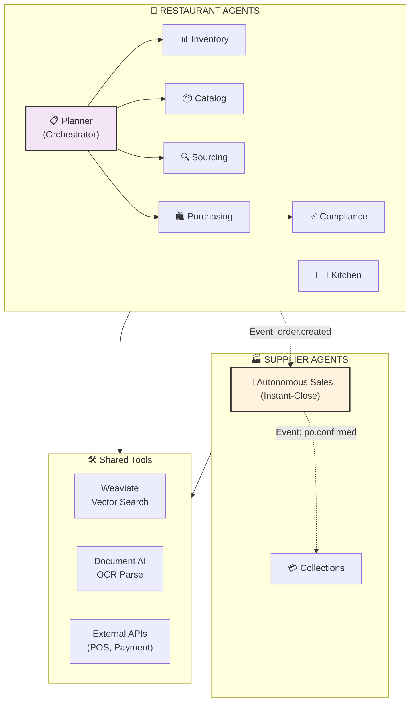

# F&B AI Platform — Agent Reference & Interactions Guide

> **Quick reference for all AI agents, their responsibilities, tool calls, and inter-agent communication patterns**

---

## Agent Mesh Overview



---

## Restaurant-Side Agents

### 1. 📋 Planner Agent (Orchestrator)

**Purpose**: Decompose high-level requests into specialized agent tasks

**Responsibilities**:
- Classify user intent (low stock? new catalog? price check?)
- Route to appropriate specialized agents
- Coordinate multi-step workflows
- Track state across agent calls

**Input**: User request or event trigger
```json
{
  "trigger_type": "low_stock_detected",
  "items": ["apples", "chicken", "flour"],
  "branch_id": "branch-001"
}
```

**Output**: Routed task plan
```json
{
  "steps": [
    {"agent": "inventory", "task": "fetch_current_levels"},
    {"agent": "catalog", "task": "normalize_names"},
    {"agent": "sourcing", "task": "compare_quotes"},
    {"agent": "purchasing", "task": "draft_cart"}
  ]
}
```

**Tool Calls**:
- `classify_intent()` — Detect intent from text/event
- `route_to_agent()` — Determine which agent(s) needed
- `coordinate_workflow()` — Manage agent sequence

**Human Interruption**: None (coordinator)

---

### 2. 📊 Inventory Agent

**Purpose**: Monitor stock levels, track consumption, trigger reorders

**Responsibilities**:
- Fetch current inventory from database
- Get par levels per SKU & location
- Calculate daily run-rate from POS
- Identify low-stock items
- Trigger reorder workflow

**Input**: Inventory event or scheduled check
```json
{
  "branch_id": "branch-001",
  "check_type": "scheduled", // or "low_stock_alert"
  "location": "dry_store"
}
```

**Output**: Inventory status + recommendations
```json
{
  "on_hand": {
    "apples_granny": 5.0,
    "chicken_breast": 12.0
  },
  "par_levels": {
    "apples_granny": 40.0,
    "chicken_breast": 50.0
  },
  "run_rate_per_day": {
    "apples_granny": 15.0,
    "chicken_breast": 8.0
  },
  "low_stock_items": ["apples_granny"],
  "days_remaining": {"apples_granny": 0.33}
}
```

**Tool Calls**:
- `fetch_inventory(branch_id, location)` — Get current stock
- `get_par_levels(sku_id)` — Target quantities
- `calculate_run_rate(sku_id, days_lookback)` — Consumption rate
- `deplete_stock(sku_id, qty, reason)` — Update on POS sale
- `check_expiry_dates(sku_id)` — Flag near-expiry items

**Human Interruption**: None (monitoring only)

**Subscribes To Events**:
- `inventory.adjusted` — Update stock from system adjustments
- `order.placed` — Deplete on delivery

---

### 3. 📦 Catalog / Normalization Agent

**Purpose**: Parse & normalize supplier SKUs for matching

**Responsibilities**:
- Parse pack sizes (e.g., "10 x 1kg" → count: 10, size: 1, unit: kg)
- Normalize product names (remove special chars, synonyms)
- Query vector DB for equivalent SKUs
- Extract attributes (origin, grade, organic, etc.)

**Input**: Raw SKU data
```json
{
  "supplier_id": "sup-001",
  "sku": "APPL-GS-10x1kg",
  "name": "Apples - Granny Smith (10×1kg box)",
  "pack": "10 x 1kg",
  "unit_price": 48.0,
  "currency": "AED"
}
```

**Output**: Normalized SKU with embeddings
```json
{
  "original_sku": "APPL-GS-10x1kg",
  "normalized_name": "apples granny smith",
  "pack_info": {
    "count": 10,
    "size": 1.0,
    "unit": "kilogram"
  },
  "total_weight_kg": 10.0,
  "price_per_kg": 4.8,
  "embedding": [0.123, 0.456, ...],
  "equiv_group": "apples_granny_smith_001",
  "confidence": 0.95
}
```

**Tool Calls**:
- `parse_pack(pack_text)` — Extract count, size, unit
- `normalize_name(product_name)` — Clean & standardize
- `generate_embedding(normalized_name)` — Vector representation
- `search_vector_db(embedding, threshold)` — Find similar SKUs
- `extract_attributes(description)` — Origin, grade, organic, etc.
- `merge_equivalents(sku_list)` — Group equivalent items

**Human Interruption**: Yes, if matching confidence <80%
- Admin reviews & confirms equivalencies
- Resolves conflicts between SKU matches

**Subscribes To Events**:
- `catalog.uploaded` — New supplier catalog
- `sku.manual_override` — Human correction

---

### 4. 🔍 Sourcing Agent

**Purpose**: Compare suppliers, rank by price/reliability

**Responsibilities**:
- Query normalized catalogs for a specific SKU
- Compare prices across suppliers
- Check lead times & MOQ
- Rank by composite score (price + reliability + lead time)
- Check supplier credit tier for current buyer

**Input**: Normalized SKU + quantity needed
```json
{
  "normalized_sku": "apples_granny_smith_001",
  "qty_needed_kg": 65.0,
  "branch_id": "branch-001",
  "buyer_tier": "A" // High-value customer
}
```

**Output**: Ranked supplier options
```json
{
  "options": [
    {
      "supplier_id": "sup-002",
      "supplier_name": "Global Foods",
      "sku": "APPL-GS-10x1kg",
      "price_per_kg": 4.8,
      "lead_time_days": 2,
      "moq_kg": 50.0,
      "rating": 4.8,
      "on_time_delivery_rate": 0.98,
      "score": 92.3
    },
    {
      "supplier_id": "sup-001",
      "supplier_name": "Fresh Produce Co",
      "price_per_kg": 5.2,
      "lead_time_days": 1,
      "rating": 4.6,
      "score": 88.1
    }
  ],
  "recommended": "sup-002" // Lowest cost + best rating
}
```

**Tool Calls**:
- `search_suppliers(normalized_sku)` — Find all suppliers of this item
- `fetch_pricing(supplier_id, sku_id)` — Current prices
- `check_inventory(supplier_id, sku_id, qty)` — Stock available
- `check_lead_time(supplier_id, destination)` — Delivery time
- `check_supplier_rating(supplier_id, buyer_tier)` — Reliability score
- `apply_volume_discount(supplier_id, qty)` — Tiered pricing

**Human Interruption**: No (recommendation only)

**Subscribes To Events**:
- `supplier_catalog.updated` — Price/inventory changes
- `supplier.rating_updated` — On-time delivery data

---

### 5. 🛍️ Purchasing Agent

**Purpose**: Draft smart carts with AI reasoning

**Responsibilities**:
- Calculate order quantity (need + safety buffer)
- Account for existing stock & lead time
- Create cart line items with reasoning
- Validate with Pydantic (type safety)
- Add explainability metadata

**Input**: Sourcing recommendations + current inventory
```json
{
  "sku": "apples_granny_smith_001",
  "on_hand_kg": 5.0,
  "par_level_kg": 40.0,
  "run_rate_kg_per_day": 15.0,
  "lead_time_days": 2,
  "supplier": {
    "id": "sup-002",
    "price_per_kg": 4.8,
    "moq_kg": 50.0
  }
}
```

**Output**: SuggestedCart (validated)
```json
{
  "id": "cart-draft-001",
  "branch_id": "branch-001",
  "items": [
    {
      "sku": "apples_granny_smith_001",
      "qty_kg": 65.0,
      "supplier_id": "sup-002",
      "price_per_unit": 4.8,
      "line_total": 312.0,
      "reasoning": "Par level: 40kg. On hand: 5kg. Need: 35kg + 2-day safety buffer (30kg) = 65kg. MOQ 50kg satisfied."
    }
  ],
  "total_amount": 312.0,
  "status": "draft",
  "created_at": "2026-02-11T10:15:00Z",
  "expires_at": "2026-02-12T10:15:00Z" // 24h validity
}
```

**Tool Calls**:
- `calculate_base_need(par, on_hand)` — How much to restore to par
- `calculate_safety_buffer(run_rate, lead_time)` — Extra stock for delays
- `calculate_total_qty(base_need, safety_buffer)` — Final order quantity
- `round_to_moq(qty, moq)` — Respect supplier minimums
- `create_cart_line(sku, qty, supplier, price)` — Add to cart
- `validate_schema(cart)` — Pydantic validation
- `generate_reasoning(inputs)` — Explain to human

**Human Interruption**: Yes, always
- Manager reviews cart
- Can approve, edit, or reject
- Edits trigger re-validation

**Subscribes To Events**:
- `inventory.low_stock` — Trigger cart generation
- `sourcing_completed` — Use rankings

---

### 6. ✅ Compliance Agent

**Purpose**: Validate invoices, 2-way/3-way matching, e-invoice generation

**Responsibilities**:
- Parse uploaded invoices (OCR)
- Match PO ↔ Invoice quantities/prices
- Match GRN received ↔ PO ordered ↔ Invoice billed
- Flag discrepancies
- Generate FTA-compliant e-invoices
- Record audit trail

**Input**: Invoice document + related orders/GRNs
```json
{
  "invoice_id": "inv-12345",
  "supplier_id": "sup-002",
  "po_id": "po-001",
  "grn_id": "grn-001",
  "invoice_file": "s3://invoices/inv-12345.pdf"
}
```

**Output**: Match result + compliance status
```json
{
  "match_type": "3way_match",
  "match_result": {
    "po_qty": 65.0,
    "grn_qty": 62.0,
    "invoice_qty": 65.0,
    "status": "exception",
    "exception_type": "short_delivery"
  },
  "flags": [
    {
      "type": "short_delivery",
      "detail": "GRN shows 62kg but invoice bills for 65kg",
      "action": "Flag for supplier credit memo"
    }
  ],
  "audit_entry": {
    "checked_by": "compliance_agent",
    "timestamp": "2026-02-11T12:00:00Z",
    "log_id": "audit-5678"
  }
}
```

**Tool Calls**:
- `parse_invoice_ocr(file_path)` — Extract from PDF/image
- `match_po_vs_invoice(po_id, invoice_data)` — 2-way check
- `fetch_grn(po_id)` — Get delivery receipt
- `match_3way(po, grn, invoice)` — Full reconciliation
- `flag_exception(type, details)` — Log discrepancy
- `generate_e_invoice(po_id, supplier_id)` — Create FTA XML
- `update_audit_log(entry)` — Immutable record

**Human Interruption**: Yes, for exceptions
- Finance reviews flagged invoices
- Approves discounts/credit memos
- Schedules payment

**Subscribes To Events**:
- `invoice.uploaded` — Trigger OCR & matching
- `grn.completed` — Update 3-way match

---

### 7. 👨‍🍳 Kitchen Copilot

**Purpose**: Generate daily prep plans from forecast & inventory

**Responsibilities**:
- Fetch sales forecast for next 24h
- Get current inventory & par levels
- Expand BOM (Bill of Materials) from recipes
- Prioritize near-expiry items
- Generate prep list with quantities

**Input**: Forecast + current inventory
```json
{
  "branch_id": "branch-001",
  "forecast_date": "2026-02-12",
  "expected_covers": 180,
  "menu_items_trending": [
    {"item": "Chicken Burger", "expected_qty": 35},
    {"item": "Caesar Salad", "expected_qty": 28}
  ]
}
```

**Output**: Daily prep plan
```json
{
  "prep_date": "2026-02-12",
  "forecast_covers": 180,
  "prep_plan": [
    {
      "ingredient": "Chicken Breast",
      "qty_to_prep": 15.0,
      "unit": "kg",
      "source": "Inventory (prioritize batch 234, expires 2026-02-12)",
      "recipe_items": ["Chicken Burger x35", "Chicken Salad x5"]
    },
    {
      "ingredient": "Lettuce",
      "qty_to_prep": 8.0,
      "unit": "kg",
      "source": "Fresh delivery due 08:00"
    }
  ],
  "waste_alerts": [
    "Mushrooms batch 456 expire in 6 hours. Use in prep or discard."
  ]
}
```

**Tool Calls**:
- `fetch_forecast(branch_id, date)` — Expected covers & menu
- `fetch_inventory(branch_id)` — Current stock + expiry
- `fetch_recipes(menu_items)` — BOM per menu item
- `expand_bom(recipes, expected_qty)` — Scale by forecast
- `prioritize_expiry(inventory)` — Use near-expiry first
- `generate_prep_list()` — Combine all inputs

**Human Interruption**: No (informational)

**Subscribes To Events**:
- `forecast.updated` — Revised sales forecast
- `inventory.adjusted` — Stock changes
- `delivery.received` — Fresh stock alert

---

## Supplier-Side Agents

### 8. 🎯 Autonomous Sales Agent (Instant-Close)

**Purpose**: Generate instant quotes, negotiate, close deals, upsell

**Responsibilities**:
- Respond to quote requests in <3 seconds
- Check margin guardrails (supplier-configured floor)
- Offer discounts within authority (no human needed)
- Identify upsell opportunities from chef's menu
- Generate binding quotes valid for 1 hour
- Create POs & auto-confirm (within guardrails)
- Draft e-invoices for instant delivery

**Input**: Quote request or predictive trigger
```json
{
  "trigger_type": "quote_request",
  "chef_id": "chef-001",
  "items": [
    {"sku": "salmon_fresh", "qty": 50.0, "unit": "kg"}
  ],
  "payment_history": {
    "tier": "A",
    "on_time_pay_rate": 0.98,
    "avg_order_value": 2500
  }
}
```

**Output**: Binding quote + upsell recommendations
```json
{
  "quote_id": "quote-001",
  "valid_until": "2026-02-11T11:00:00Z", // 1 hour
  "items": [
    {
      "sku": "salmon_fresh",
      "qty": 50.0,
      "list_price_per_kg": 60.0,
      "negotiated_price_per_kg": 55.0, // -8.3% discount
      "margin_pct": 22.0, // >15% floor ✓
      "line_total": 2750.0,
      "reasoning": "Chef A tier, 98% on-time payment. Authorized 20% discount authority."
    }
  ],
  "total": 2750.0,
  "upsell": {
    "recommended_items": [
      {
        "sku": "fryer_oil_premium",
        "reason": "Chef has deep fried items (menu analysis). Not in current cart.",
        "bundle_offer": "Add 3 tins Fryer Oil → 5% bundle discount on Salmon",
        "impact": "Salmon: $2612.50, Oil: $180, New Total: $2792.50 (margin: 24%)"
      }
    ]
  }
}
```

**Tool Calls**:
- `validate_authority(supplier_config, order_value)` — Can agent approve?
- `check_stock(sku, qty)` — In inventory?
- `calculate_margin(cost, price)` — Meets floor?
- `apply_discount_authority(customer_tier, discount_pct)` — Within limits?
- `draft_binding_quote(items, prices, validity)` — Create offer
- `analyze_menu_for_upsell(chef_id, cart)` — Find complement items
- `create_po_auto_confirm(quote)` — Convert to order (if accepted)
- `generate_e_invoice(po)` — FTA-compliant invoice
- `send_interactive_message(channel, offer)` — WhatsApp buttons

**Authority Stack** (supplier-configured guardrails):
```json
{
  "margin_floor_pct": 15,        // Hard floor
  "discount_authority_pct": 20,  // Max discount agent can give
  "escalation_threshold": 10000, // If > this, need human approval
  "credit_exposure_limit": 500000,
  "max_deal_value_auto_confirm": 5000
}
```

**Human Interruption**: Yes, if outside guardrails
- If deal value > escalation threshold
- If customer credit exposure exceeded
- If price < floor margin

**Subscribes To Events**:
- `quote_request.incoming` — Quote requests via API/WhatsApp
- `order.from_platform` — Predictive order from restaurant AI
- `inventory.expiring_soon` — Flash deal triggers

---

### 9. 💳 Collections Agent

**Purpose**: Smart payment reminders, collections, DSO optimization

**Responsibilities**:
- Track payment due dates
- Send escalating reminders (friendly → firm → collections)
- Generate payment statements
- Update DSO metrics
- Flag overdue accounts

**Input**: Invoice confirmed + payment terms
```json
{
  "invoice_id": "inv-001",
  "chef_id": "chef-001",
  "amount": 2750.0,
  "currency": "AED",
  "due_date": "2026-03-12",
  "payment_terms": "Net 30"
}
```

**Output**: Collection status + next action
```json
{
  "invoice_id": "inv-001",
  "payment_status": "unpaid",
  "days_overdue": 0,
  "next_reminder": "2026-02-18", // 1 week before due
  "reminders_sent": [],
  "message_template": "friendly_reminder"
}
```

**Tool Calls**:
- `schedule_payment_reminder(invoice_id, days_before_due)` — Upcoming reminder
- `send_payment_statement(chef_id)` — Summary + payment link
- `check_credit_exposure(supplier_id, chef_id)` — Current outstanding
- `escalate_if_overdue(invoice_id, days_overdue)` — Escalation logic
- `update_dso_metrics()` — Track collections performance
- `send_payment_link(invoice_id)` — 1-tap Telr payment

**Human Interruption**: Yes, for hard collections
- Sales rep handles major accounts
- Escalates if >60 days overdue

**Subscribes To Events**:
- `invoice.confirmed` — Start payment tracking
- `payment.received` — Mark as paid

---

## Agent Communication Patterns

### Pattern 1: Sequential Execution (Restaurant Cart)

```
Event: Low Stock Detected
    ↓
Planner: Route to Inventory Agent
    ↓
Inventory Agent: Fetch levels → Output (on_hand, par, run_rate)
    ↓
Planner: Route to Catalog Agent
    ↓
Catalog Agent: Parse pack, normalize name → Output (normalized_sku)
    ↓
Planner: Route to Sourcing Agent
    ↓
Sourcing Agent: Compare suppliers → Output (ranked options)
    ↓
Planner: Route to Purchasing Agent
    ↓
Purchasing Agent: Draft cart → Output (SuggestedCart)
    ↓
Human Approval: Manager review
    ↓
(if approved)
    ↓
Compliance Agent: Validate → Generate e-Invoice
```

### Pattern 2: Parallel Execution (Restaurant + Supplier)

```
Restaurant PO Created
    ↓
Event: order.created
    ├→ Compliance Agent: Start 2-way match (when invoice arrives)
    ├→ Inventory Agent: Deplete stock when delivery received
    └→ Autonomous Sales Agent: Auto-confirm PO (if within guardrails)
    
All agents:
    ├→ Log to audit trail
    ├→ Update dashboard metrics
    └→ Subscribe to related events
```

### Pattern 3: Event-Driven Broadcast

```
Event: POS Order Placed
    ├→ Inventory Agent: Deplete stock (recipe-based)
    ├→ Kitchen Copilot: Update prep forecast
    ├→ Autonomous Sales Agent: Check if stock dropping (reorder signal)
    └→ Analytics: Update consumption metrics
```

---

## Tool Registry

| Tool | Agent | Purpose |
|---|---|---|
| `fetch_inventory()` | Inventory | Get current stock levels |
| `calculate_run_rate()` | Inventory | Daily consumption rate |
| `parse_pack()` | Catalog | Extract count/size/unit |
| `generate_embedding()` | Catalog | Vector representation |
| `search_vector_db()` | Catalog | Find similar products |
| `search_suppliers()` | Sourcing | Find vendors for SKU |
| `check_lead_time()` | Sourcing | Delivery time estimate |
| `calculate_base_need()` | Purchasing | Need to restore to par |
| `create_cart_line()` | Purchasing | Add item to cart |
| `validate_schema()` | Purchasing | Pydantic check |
| `parse_invoice_ocr()` | Compliance | Extract from PDF |
| `match_3way()` | Compliance | PO vs GRN vs Invoice |
| `generate_e_invoice()` | Compliance | Create FTA XML |
| `fetch_forecast()` | Kitchen Copilot | Expected covers |
| `expand_bom()` | Kitchen Copilot | Scale recipes |
| `check_stock()` | Sales Agent | Inventory available? |
| `apply_discount_authority()` | Sales Agent | Within guardrails? |
| `draft_binding_quote()` | Sales Agent | Create offer |
| `send_interactive_message()` | Sales Agent | WhatsApp buttons |
| `send_payment_statement()` | Collections | Email/WhatsApp statement |

---

## State Persistence

All agents store their state in PostgreSQL:

```sql
-- Agent execution history
agent_execution_logs {
  id UUID,
  agent_name VARCHAR,      -- "purchasing_agent"
  execution_id UUID,       -- Unique per workflow run
  tool_name VARCHAR,       -- "create_cart_line"
  tool_input JSONB,
  tool_output JSONB,
  status ENUM,             -- "success", "failed", "pending"
  timestamp TIMESTAMP,
  user_id UUID             -- Who triggered it
}

-- LangGraph state
workflow_states {
  id UUID,
  workflow_id UUID,        -- SuggestedCart ID, etc.
  agent_name VARCHAR,
  state_data JSONB,        -- Complete state snapshot
  version INT,             -- For conflict resolution
  created_at TIMESTAMP,
  updated_at TIMESTAMP
}
```

This allows:
- **Resumable workflows** — Restart from last checkpoint
- **Audit trail** — Every agent action logged
- **Human-in-the-loop interrupts** — Save state, wait for approval
- **Debugging** — Replay full execution trace

---

## Monitoring & Observability

Each agent reports:
- **Execution time** — How long did tool call take?
- **Success/failure rate** — Did it work?
- **Tool call patterns** — Which tools used most?
- **State transitions** — How did state change?
- **User approvals** — When did human intervene?

Datadog dashboard shows:
- Per-agent latency (p50, p95, p99)
- Tool call success rates
- Most common error types
- Human approval times
- Agent utilization (% of time busy)

---

## Error Handling & Retry Logic

```python
# Tool call with backoff
@retry(max_attempts=3, backoff=exponential)
async def call_tool(tool_name: str, inputs: dict):
    try:
        result = await tool(inputs)
        log_success(agent_name, tool_name, result)
        return result
    except ToolTimeoutError:
        # Retry with exponential backoff
        await asyncio.sleep(2 ** attempt_number)
        raise
    except ToolAuthError:
        # Don't retry, escalate to human
        raise
    except Exception as e:
        log_error(agent_name, tool_name, e)
        raise

# In workflow
try:
    cart = await purchasing_agent.draft_cart(...)
except ValidationError:
    # Schema validation failed, escalate
    await escalate_to_manager(cart, error)
except ToolError:
    # External API failed, fallback or manual
    await fallback_to_manual_entry()
```

---

## Example: Complete AI Cart Generation (End-to-End)

```
1️⃣ LOW STOCK DETECTED
   Event: inventory.low_stock
   {items: ["apples"], branch_id: "branch-001"}

2️⃣ PLANNER AGENT
   Classifies: "Low stock reorder"
   Routes: [inventory → catalog → sourcing → purchasing]

3️⃣ INVENTORY AGENT
   Input: {"sku": "apples_granny", "branch_id": "branch-001"}
   Fetches: on_hand=5kg, par=40kg, run_rate=15kg/day, lead_time=2d
   Output: need_35kg + 30kg_buffer = 65kg_needed

4️⃣ CATALOG AGENT
   Input: "Apples - Granny Smith"
   Parses: 10 x 1kg pack
   Normalizes: "apples granny smith"
   Searches: Finds 3 equivalent SKUs across 3 suppliers
   Output: normalized_name="apples_granny_smith", equiv_group_id

5️⃣ SOURCING AGENT
   Compares:
   - Supplier A: $5.2/kg, 3-day lead time
   - Supplier B: $4.8/kg, 2-day lead time ⭐ 
   - Supplier C: $6.0/kg, same-day

   Output: ranked_options = [B (score 92), C (score 85), A (score 80)]

6️⃣ PURCHASING AGENT
   Receives: need=65kg, best_supplier=B, price=$4.8/kg
   Calculates: 65kg × $4.8 = $312
   Validates: Pydantic OK, all fields present
   Adds reasoning: "Par 40kg - 5kg on_hand = 35kg need. +30kg safety buffer for 2-day lead time."
   
   Output: SuggestedCart {
     items: [{
       sku: "apples_granny_smith",
       qty: 65,
       supplier: "B",
       price_per_unit: 4.8,
       line_total: 312,
       reasoning: "..."
     }],
     total_amount: 312,
     status: "draft"
   }

7️⃣ HUMAN APPROVAL
   Manager sees cart in app
   Reviews reasoning
   ✅ Clicks "Approve"

8️⃣ PO CREATION
   System creates PO
   Sends to Supplier B via Poppel + WhatsApp
   Logs audit entry

9️⃣ SUPPLIER SIDE
   Autonomous Sales Agent:
   - Receives PO
   - Checks stock: 500kg available ✅
   - Checks margin: 22% (>15% floor) ✅
   - Auto-confirms (no human needed)
   - Reserves 65kg
   - Generates e-Invoice (FTA-compliant)
   - Sends via WhatsApp + Email

🔟 DELIVERY & MATCHING
   GRN recorded when delivered
   Compliance Agent:
   - Matches PO (65kg) vs GRN (62kg received)
   - Flags: short delivery (3kg)
   - Sends to Finance for credit memo
   - Updates audit log

✅ COMPLETE
   Audit trail: 10+ steps logged
   All stakeholders notified
   Stock updated
   Invoice scheduled for payment
```

---

**Last Updated**: February 2026  
**Status**: Complete Agent Reference Guide
