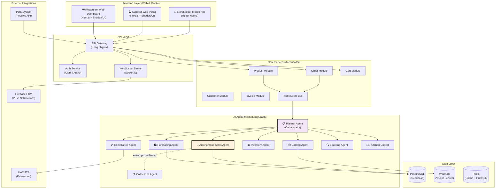

# System Architecture & Flows (Web-Only)

> **Authority:** Aligned with the Stakeholder Document and B2B Commerce Network positioning.
> **Interface:** Web Dashboard + Mobile App only. No WhatsApp API.

---

## Table of Contents

1. [High-Level System Architecture](#1-high-level-system-architecture)
2. [Multi-Agent Workflow](#2-multi-agent-workflow)
3. [ReAct Loop Pattern](#3-react-loop-pattern)
4. [Core Data Flows](#4-core-data-flows)
5. [Marketplace Flow](#5-marketplace-flow)

---

## 1. High-Level System Architecture



### Architecture Principles

| Principle | Implementation |
|:---|:---|
| **API-First** | All agent interactions via REST/WebSocket APIs — no chat-based channels |
| **Event-Driven** | Redis EventBus powers async communication between services and agents |
| **Real-Time** | Socket.io delivers live dashboard updates (quotes, order status, negotiations) |
| **Mobile Push** | Firebase FCM for GRN alerts, flash deal notifications, order confirmations |
| **Offline-First** | React Native mobile app supports offline GRN with sync-on-reconnect |

---

## 2. Multi-Agent Workflow (End-to-End Procurement)

```
User Request via Web Dashboard (e.g., "Generate cart for next 3 days")
         │
         ▼
    ┌─────────────────────────────────┐
    │  Planner Agent (ReAct)          │
    │  - Break down task into steps   │
    │  - Define success criteria      │
    └──────────┬──────────────────────┘
               │
               ├─ Step 1: Fetch current inventory & lead times
               │           │
               │           ▼
               │      ┌──────────────────┐
               │      │ Inventory Agent  │
               │      │ Calls:           │
               │      │ - get_stock()    │
               │      │ - get_lead_times │
               │      │ Result: {items with│
               │      │  par_levels,      │
               │      │  current_stock,   │
               │      │  run_rate}        │
               │      └──────────────────┘
               │
               ├─ Step 2: Normalize & match SKUs
               │           │
               │           ▼
               │      ┌──────────────────┐
               │      │ Catalog Agent    │
               │      │ Calls:           │
               │      │ - normalize_sku()│
               │      │ - find_equiv()   │
               │      │ Result: {norm_sku,│
               │      │  equiv_items}    │
               │      └──────────────────┘
               │
               ├─ Step 3: Compare suppliers & prices
               │           │
               │           ▼
               │      ┌──────────────────┐
               │      │ Sourcing Agent   │
               │      │ Calls:           │
               │      │ - compare_quotes │
               │      │ - check_history  │
               │      │ - apply_target   │
               │      │   _price_logic() │
               │      │ Result: {ranked  │
               │      │  suppliers, best │
               │      │  price per SKU}  │
               │      └──────────────────┘
               │
               ├─ Step 4: Build optimized cart
               │           │
               │           ▼
               │      ┌──────────────────┐
               │      │ Purchasing Agent │
               │      │ Calls:           │
               │      │ - build_cart()   │
               │      │ - check_MOQ()    │
               │      │ - optimize_      │
               │      │   delivery()     │
               │      │ Result: {draft   │
               │      │  cart, grouped   │
               │      │  by supplier}    │
               │      └──────────────────┘
               │
               ├─ Step 5: Validate with guardrails
               │           │
               │           ▼
               │      ┌──────────────────┐
               │      │ Pydantic Schemas │
               │      │ Validate:        │
               │      │ - qty > 0        │
               │      │ - supplier ok    │
               │      │ - reasons clear  │
               │      │ - budget within  │
               │      │   limits         │
               │      └──────────────────┘
               │
               ▼
    ┌─────────────────────────────────┐
    │  EMIT TO DASHBOARD              │
    │  - Push "Draft Cart Ready"      │
    │    notification badge           │
    │  - Chef reviews on Web UI       │
    │                                 │
    │           │                     │
    │           ▼                     │
    │  Manager Approval (Web UI)      │
    │  ✓ Approve → PO Created        │
    │  ✗ Reject  → Return for edit   │
    └─────────────────────────────────┘
```

---

## 3. ReAct Loop Pattern

All agents follow the **ReAct** (Reason + Act + Observe + Update) pattern:

```
┌────────────────────────────────────────────────────────┐
│  Agent receives task: "Find cheapest apples supplier"  │
└────────────────────────────────────────────────────────┘
                          │
                          ▼
          ┌───────────────────────────────┐
          │  REASON                       │
          │  - I need apple suppliers     │
          │  - Must consider: price,      │
          │    quality, delivery time     │
          │  - Check existing equivalents │
          └───────────────┬───────────────┘
                          │
                          ▼
          ┌───────────────────────────────┐
          │  ACT                          │
          │  - Tool: query_suppliers(     │
          │      category="apples")      │
          │  - Tool: get_price_history(   │
          │      sku="apple_*")          │
          │  - Tool: check_delivery_     │
          │      windows()               │
          └───────────────┬───────────────┘
                          │
                          ▼
          ┌───────────────────────────────┐
          │  OBSERVE                      │
          │  - Results from tools:        │
          │    Supplier A: $5.2/kg        │
          │    Supplier B: $4.8/kg (1d)   │
          │    Supplier C: $6.0/kg        │
          └───────────────┬───────────────┘
                          │
                          ▼
          ┌───────────────────────────────┐
          │  UPDATE                       │
          │  - Best price: Supplier B     │
          │  - But: 1-day lead time       │
          │  - Need by tomorrow? YES      │
          │  - Recommendation: Supplier B │
          │    (cheapest + meets deadline)│
          └───────────────┬───────────────┘
                          │
                          ▼
          ┌───────────────────────────────┐
          │  LOOP?                        │
          │  - Need refinement? NO        │
          │  - Return final suggestion    │
          └───────────────────────────────┘
```

---

## 4. Core Data Flows

### 4.1 POS → Normalization → AI Cart

```
┌──────────────────────┐
│   POS System         │
│  (e.g., Foodics)     │
│                      │          ┌──────────────────────────────────────┐
│  Webhook triggers:   │         │  CONSUMPTION ENGINE                  │
│  - sale.completed    │────────►│                                      │
│  - menu.updated      │         │  1. Map product_id → recipe BOM      │
│  - stock.adjusted    │         │  2. Calculate raw ingredient usage    │
│                      │         │  3. Update run-rate & par-level       │
└──────────────────────┘         │  4. Predict next reorder date         │
                                 └────────────────┬─────────────────────┘
                                                  │
                                                  ▼
                                 ┌──────────────────────────────────────┐
                                 │  AI CART GENERATOR                    │
                                 │                                      │
                                 │  For each ingredient:                │
                                 │   IF current_stock < par_level:     │
                                 │     qty = par_level - current_stock  │
                                 │     find best supplier (price,       │
                                 │       history, quality, delivery)    │
                                 │     add to draft cart                 │
                                 │                                      │
                                 │  Emit: "cart.draft_ready" event      │
                                 │  → Dashboard notification badge      │
                                 └──────────────────────────────────────┘
```

### 4.2 Supplier Catalog Upload → SKU Normalization

```
 CATALOG INGESTION PIPELINE
 ═══════════════════════════════════════════════════

 INPUT (Web Upload)              PROCESSING                    OUTPUT
 ──────────────                  ──────────                    ──────
 ┌──────────────┐
 │ Supplier CSV │─────┐
 └──────────────┘     │
 ┌──────────────┐     │    ┌──────────────────────┐    ┌─────────────────┐
 │ PDF Catalog  │─────┼───►│ PARSER ROUTER        │───►│ NORMALIZER      │
 └──────────────┘     │    │                      │    │ (LangGraph)     │
 ┌──────────────┐     │    │ CSV → Column mapper  │    │                 │
 │ ERP Export   │─────┘    │ PDF → AWS Textract   │    │ Step 1: Clean   │
 └──────────────┘          │                      │    │  - Remove noise │
                           └──────────────────────┘    │  - Fix encoding │
                                                       │  - Standardize  │
                                                       │    units        │
                                                       │                 │
                                                       │ Step 2: Extract │
                                                       │  - Product name │
                                                       │  - Brand/Origin │
                                                       │  - Unit/Weight  │
                                                       │  - Pack size    │
                                                       │                 │
                                                       │ Step 3: Embed   │
                                                       │  → OpenAI ada-2 │
                                                       │  → 1536-dim vec │
                                                       └────────┬────────┘
                                                                │
                                                                ▼
                                                       ┌─────────────────┐
                                                       │ WEAVIATE         │
                                                       │ Vector Search    │
                                                       │                 │
                                                       │ cosine > 0.92   │
                                                       │  → AUTO-MATCH   │
                                                       │ 0.80 < cos ≤    │
                                                       │ 0.92 → REVIEW   │
                                                       │ cos ≤ 0.80      │
                                                       │  → NEW SKU      │
                                                       └─────────────────┘
```

### 4.3 Order → GRN → Invoice Match (3-Way)

```
 3-WAY MATCHING FLOW
 ═══════════════════════════════════════════════════

                    ┌──────────────┐
                    │ Purchase     │
                    │ Order (PO)   │
                    │              │
                    │ Items:       │
                    │ - Flour 50kg │
                    │ - Oil 3 tin  │
                    │ Total: AED510│
                    └──────┬───────┘
                           │
              ┌────────────┴────────────────┐
              │                             │
              ▼                             ▼
    ┌──────────────┐              ┌──────────────┐
    │  GRN         │              │  Invoice     │
    │  (Mobile App)│              │  (PDF Upload)│
    │              │              │              │
    │  Received:   │              │  Billed:     │
    │  - Flour     │              │  - Flour     │
    │    48kg ⚠️   │              │    50kg      │
    │  - Oil 3 tin │              │  - Oil 3 tin │
    │  Photo: ✓    │              │  Total:      │
    └──────┬───────┘              │    AED 510   │
           │                      └──────┬───────┘
           │                             │
           └──────────┬──────────────────┘
                      │
                      ▼
           ┌──────────────────────┐
           │ COMPLIANCE AGENT     │
           │                      │
           │ Match Result:        │
           │ ┌──────────────────┐ │
           │ │ Flour: VARIANCE  │ │
           │ │ PO: 50kg         │ │
           │ │ GRN: 48kg        │ │
           │ │ Invoice: 50kg    │ │
           │ │ → Exception flag │ │
           │ └──────────────────┘ │
           │ ┌──────────────────┐ │
           │ │ Oil: MATCHED ✓   │ │
           │ └──────────────────┘ │
           │                      │
           │ Action:              │
           │ → Dashboard Alert    │
           │ → Sideover for       │
           │   manual resolution  │
           └──────────────────────┘
```

---

## 5. Marketplace Flow

### 5.1 Three-Sided Network Architecture

```
 MARKETPLACE NETWORK
 ═══════════════════════════════════════════════════

 ┌─────────────────┐      ┌─────────────────┐
 │   RESTAURANTS   │      │    SUPPLIERS     │
 │                 │      │                  │
 │  ┌───────────┐  │ API  │  ┌────────────┐ │
 │  │ Web       │◄─┼──────┼─►│ Web Portal │ │
 │  │ Dashboard │  │      │  │            │ │
 │  └───────────┘  │      │  └────────────┘ │
 │                 │      │                  │
 │  Browse catalog │      │  List products   │
 │  AI smart cart  │      │  Set guardrails  │
 │  Approve POs    │      │  Monitor AI agent│
 └────────┬────────┘      └────────┬─────────┘
          │                        │
          │    ┌───────────────┐   │
          │    │  AI AGENT     │   │
          │    │  MESH         │   │
          └───►│               │◄──┘
               │  Negotiate    │
               │  Match        │
               │  Attribute    │
               │  Invoice      │
               └───────┬───────┘
                       │
          ┌────────────┴────────────┐
          │      SALES REPS         │
          │                         │
          │  ┌───────────────────┐  │
          │  │ Territory Portal  │  │
          │  │ - Attribution     │  │
          │  │ - Commission      │  │
          │  │ - Takeover ctrl   │  │
          │  └───────────────────┘  │
          └─────────────────────────┘
```

### 5.2 Marketplace Transaction Flow

| Stage | Actor | Action | Platform Component |
|:---|:---|:---|:---|
| **List** | Supplier | Uploads catalog via CSV/PDF on Portal | Catalog Normalization Agent |
| **Outreach** | AI Agent | Matches products to restaurant menus | Purchasing Agent + Vector Search |
| **Quote** | AI Agent | Generates binding quote within margins | Autonomous Sales Agent |
| **Convert** | Restaurant | Approves quote on Dashboard | Order Module (MedusaJS) |
| **Repeat** | AI Agent | Learns patterns → auto-reorder carts | Purchasing Agent + Cron |
| **Upsell** | AI Agent | Spots cross-sell from menu analysis | Sales Agent + Menu Intelligence |
| **Commission** | System | Attributes revenue to rep's territory | Attribution Engine |
| **Settle** | System | Auto-generates FTA e-invoice + smart collections | Compliance Agent + Collections Agent |
