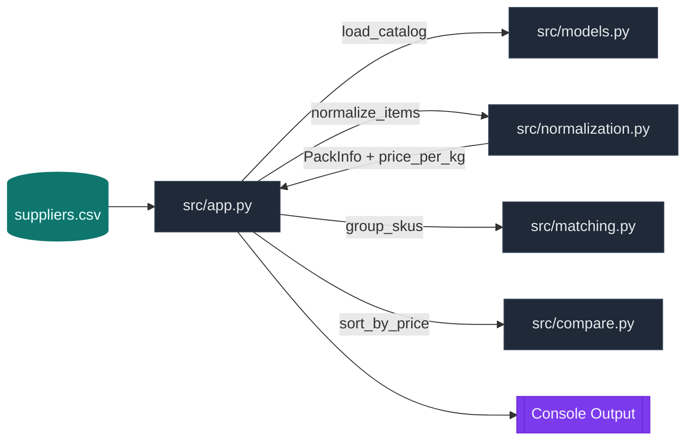
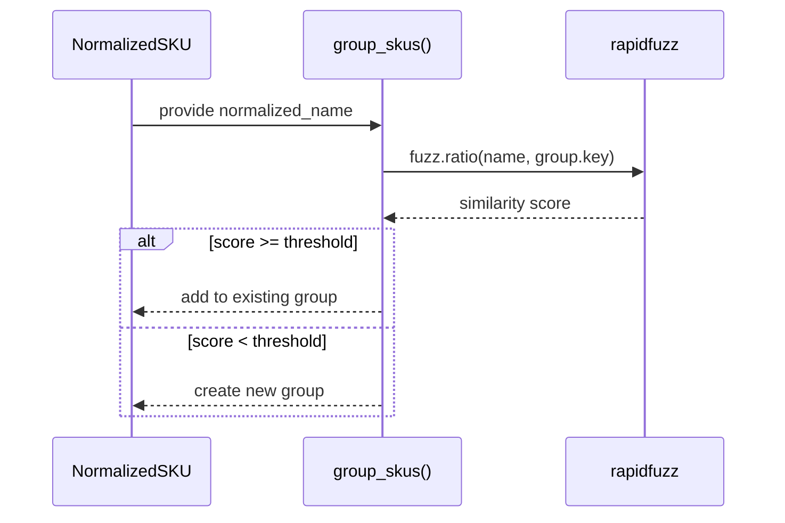
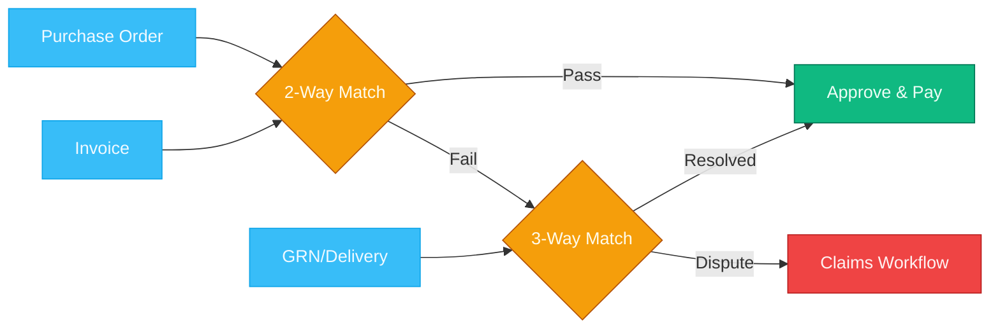

# Architecture Diagrams (Visual)

These diagrams summarize the current codebase and planned platform architecture. They are intended for presentations and onboarding.

---

## 1) MVP Runtime Flow (Current Repo)



---

## 2) Catalog Normalization Pipeline

```mermaid
flowchart LR
  A[Raw Supplier SKU]:::input --> B[parse_pack()]:::fn
  B --> C[pack_to_kg()]:::fn
  A --> D[normalize_name()]:::fn
  C --> E[price_per_kg]:::data
  D --> F[normalized_name]:::data
  E & F --> G[NormalizedSKU]:::output

  classDef input fill:#0ea5e9,stroke:#0284c7,color:#f0f9ff;
  classDef fn fill:#111827,stroke:#374151,color:#e5e7eb;
  classDef data fill:#14b8a6,stroke:#0f766e,color:#ecfeff;
  classDef output fill:#a855f7,stroke:#7e22ce,color:#f5f3ff;
```

---

## 3) SKU Matching (Fuzzy Grouping)



---

## 4) Multi-Agent Platform Architecture (Target)

```mermaid
flowchart TB
  subgraph Frontend[Frontend Layer]
    R[Restaurant App]:::ui
    S[Supplier Portal]:::ui
    A[Admin Dashboard]:::ui
  end

  subgraph Gateway[API Gateway & Auth]
    G[Auth, RBAC, Validation]:::core
  end

  subgraph Core[Commerce & Orchestration]
    M[MedusaJS Core]:::core
    L[LangGraph Multi‑Agent]:::ai
    E[Event Bus (Redis/BullMQ)]:::core
  end

  subgraph Agents[Agent Mesh]
    P[Planner]:::ai
    C[Catalog]:::ai
    So[Sourcing]:::ai
    Pu[Purchasing]:::ai
    Co[Compliance]:::ai
    I[Inventory]:::ai
    K[Kitchen Copilot]:::ai
    Sa[Autonomous Sales]:::ai
  end

  subgraph Data[Data & Storage]
    PG[(PostgreSQL)]:::data
    V[(Vector DB)]:::data
    S3[(Object Storage)]:::data
  end

  R --> G
  S --> G
  A --> G
  G --> M
  M <--> E
  M <--> L
  L --> Agents
  Agents --> PG
  Agents --> V
  Agents --> S3

  classDef ui fill:#0ea5e9,stroke:#0284c7,color:#f0f9ff;
  classDef core fill:#1f2937,stroke:#334155,color:#e5e7eb;
  classDef ai fill:#7c3aed,stroke:#6d28d9,color:#f5f3ff;
  classDef data fill:#14b8a6,stroke:#0f766e,color:#ecfeff;
```

---

## 5) Procurement Decision Flow (ReAct + Approval)

```mermaid
flowchart TD
  U[Manager Request: "Build 3‑day cart"]:::input --> P[Planner Agent]:::ai
  P --> I[Inventory Agent: fetch_inventory]:::ai
  P --> C[Catalog Agent: normalize + parse]:::ai
  P --> S[Sourcing Agent: compare_quotes]:::ai
  P --> Pu[Purchasing Agent: draft cart]:::ai
  Pu --> V[Pydantic Validation]:::core
  V --> A{Approval?}:::decision
  A -->|Approve| PO[Create PO + Audit Log]:::output
  A -->|Edit/Reject| R[Return to Planner]:::input

  classDef input fill:#0ea5e9,stroke:#0284c7,color:#f0f9ff;
  classDef ai fill:#7c3aed,stroke:#6d28d9,color:#f5f3ff;
  classDef core fill:#1f2937,stroke:#334155,color:#e5e7eb;
  classDef decision fill:#f59e0b,stroke:#b45309,color:#fffbeb;
  classDef output fill:#10b981,stroke:#047857,color:#ecfdf5;
```

---

## 6) Invoice Matching (2‑Way / 3‑Way)


