# F&B AI Purchasing & Sales Platform — Complete Architecture Diagrams

> **Version 2.0** | February 2026 | Comprehensive system architecture with all layers, agents, integrations, and data flows.

---

## Table of Contents

1. [System-Wide Architecture](#1-system-wide-architecture)
2. [Restaurant AI Agent Mesh](#2-restaurant-ai-agent-mesh)
3. [Supplier Autonomous Sales Agent](#3-supplier-autonomous-sales-agent)
4. [External Integrations & APIs](#4-external-integrations--apis)
5. [Agent-to-Agent Communication Flow](#5-agent-to-agent-communication-flow)
6. [Data Flow: E-Invoicing & Compliance](#6-data-flow-e-invoicing--compliance)
7. [Real-time Event-Driven Architecture](#7-real-time-event-driven-architecture)
8. [Dashboard & Observability](#8-dashboard--observability)

---

## 1. System-Wide Architecture

### 1.1 Complete Layered Platform

```mermaid
graph TB
    subgraph Client["🎨 Client Layer"]
        RApp["📱 Restaurant App<br/>(Next.js + React)"]
        SPortal["🏪 Supplier Portal<br/>(Next.js + React)"]
        AdminDash["⚙️ Admin Dashboard<br/>(Next.js + React)"]
        WhatsApp["💬 WhatsApp Integration<br/>(Interactive Buttons)"]
    end

    subgraph Gateway["🔐 API Gateway & Auth"]
        JWTAuth["JWT + RBAC Auth"]
        RateLimit["Rate Limiting"]
        ReqVal["Request Validation"]
    end

    subgraph MedusaLayer["🛒 MedusaJS 2.0 Core"]
        Commerce["B2B Commerce Engine<br/>(Orders, Inventory, Pricing)"]
        EventBus["⚡ Event Bus<br/>(Redis/BullMQ)"]
        CustomMods["🔧 Custom Modules<br/>(SKU, GRN, Invoice Matching)"]
    end

    subgraph AILayer["🤖 LangGraph AI Orchestration"]
        PlanAgent["📋 Planner Agent"]
        CatAgent["📦 Catalog Agent"]
        SrcAgent["🔍 Sourcing Agent"]
        PurAgent["🛍️ Purchasing Agent"]
        CompAgent["✅ Compliance Agent"]
        InvAgent["📊 Inventory Agent"]
        KitAgent["👨‍🍳 Kitchen Copilot"]
        SalesAgent["🎯 Autonomous Sales Agent"]
    end

    subgraph ExtAPI["🌐 External APIs & Services"]
        POSApi["🧮 POS APIs<br/>(Foodics, Oracle)"]
        PaymentGW["💳 Payment Gateway<br/>(Telr, 2Checkout)"]
        Poppel["📄 Poppel Network<br/>(E-Invoicing FTA)"]
        OCRServ["📸 OCR Service<br/>(AWS Textract)"]
        EmailSMS["📧 Email/SMS<br/>(Sendgrid, Twilio)"]
    end

    subgraph DataLayer["💾 Data & Storage"]
        PG["🗄️ PostgreSQL<br/>(Core + Custom)"]
        Weaviate["🔎 Weaviate Vector DB<br/>(SKU Embeddings)"]
        S3["☁️ AWS S3<br/>(Documents, Images)"]
        Redis["⚡ Redis Cache<br/>(Session, Queue)"]
    end

    subgraph Tools["🛠️ Agent Tools & Functions"]
        PriceTools["💰 Pricing Tools"]
        MatchTools["🔗 Matching Tools"]
        ValidTools["✔️ Validation Tools"]
        NotifTools["📢 Notification Tools"]
    end

    Client --> Gateway
    Gateway --> MedusaLayer
    Gateway --> AILayer
    MedusaLayer --> EventBus
    EventBus --> AILayer
    AILayer --> ExtAPI
    AILayer --> DataLayer
    AILayer --> Tools
    ExtAPI --> Tools
    DataLayer --> Tools
```

### 1.2 Communication Flow Overview

---

## 2. Restaurant AI Agent Mesh

### 2.1 Multi-Agent Orchestration (Restaurant Side)

### 2.2 Purchasing Agent Decision Tree

```mermaid
flowchart TD
    A["🛍️ PURCHASING AGENT INVOKED<br/>Low Stock: Apples (5kg)"] --> B{"Analyze<br/>Situation"}
    
    B --> B1["📊 Get Current State"]
    B1 --> B1a["• Par Level: 40kg"]
    B1 --> B1b["• On Hand: 5kg"]
    B1 --> B1c["• Run Rate: 15kg/day"]
    B1 --> B1d["• Lead Time: 2 days"]
    
    B --> B2["💰 Get Pricing"]
    B2 --> B2a["Supplier A: $5.2/kg"]
    B2 --> B2b["Supplier B: $4.8/kg ⭐"]
    B2 --> B2c["Supplier C: $6.0/kg"]
    
    B --> B3["🔍 Check Constraints"]
    B3 --> B3a["✅ Budget: OK"]
    B3 --> B3b["✅ Supplier Credit: OK"]
    B3 --> B3c["✅ Stock Location: Available"]
    
    B1 & B2 & B3 --> C["🧮 Calculate Order Qty"]
    C --> C1["Need: (40 - 5) = 35kg"]
    C1 --> C2["+ Safety Buffer (2 days × 15kg) = 30kg"]
    C2 --> C3["Total to Order: 65kg"]
    
    C3 --> D["🏪 Check Supplier MOQ"]
    D --> D1{"Supplier B<br/>MOQ: 50kg"}
    D1 -->|"✅ 65kg ≥ 50kg"| E["✅ Feasible"]
    D1 -->|"❌ Below MOQ"| F["Switch to Supplier A<br/>MOQ: 25kg"]
    
    E --> G["💰 Calculate Cost"]
    G --> G1["65kg × $4.8/kg = $312"]
    
    F --> G2["65kg × $5.2/kg = $338"]
    
    G1 --> H["📝 Draft Cart Item"]
    G2 --> H
    
    H --> H1["SuggestedCartItem {<br/>  normalized_sku: 'apples_granny_smith',<br/>  qty: 65,<br/>  supplier: 'B',<br/>  price_per_unit: 4.8,<br/>  reasoning: 'Low par → budget order for 2-day safety'<br/>}"]
    
    H1 --> I["✔️ Validate w/ Pydantic"]
    I --> I1{Validation<br/>Pass?}
    
    I1 -->|"✅ Pass"| J["✅ Add to SuggestedCart"]
    I1 -->|"❌ Fail"| K["⚠️ Log Error & Escalate"]
    
    style A fill:#e1f5fe
    style B fill:#f3e5f5
    style C fill:#fff3e0
    style E fill:#c8e6c9
    style G1 fill:#c8e6c9
    style J fill:#a5d6a7
```

---

## 3. Supplier Autonomous Sales Agent

### 3.1 Sales Agent: The Instant-Close Engine

```mermaid
graph TD
    Trigger["🔔 TRIGGER EVENTS"]
    
    Trigger --> E1["📦 Quote Request from Chef<br/>via WhatsApp/API"]
    Trigger --> E2["🎯 Planned Order Prediction<br/>Chef hasn't ordered today"]
    Trigger --> E3["🔥 Flash Deal Opportunity<br/>Stock expiring in 72h"]
    Trigger --> E4["📊 POS Data Signal<br/>Chef selling item not ordered"]
    
    E1 --> SalesAgent["🎯 AUTONOMOUS SALES AGENT"]
    E2 --> SalesAgent
    E3 --> SalesAgent
    E4 --> SalesAgent
    
    SalesAgent --> Perception["👁️ PERCEPTION LAYER"]
    
    Perception --> P1["Intent Classification<br/>(Urgent vs Planned)"]
    Perception --> P2["Sentiment Analysis<br/>(Price-sensitive? Loyal?)"]
    Perception --> P3["Menu Parsing<br/>(What items does chef sell?)"]
    Perception --> P4["POS Depletion Signal<br/>(What's low on inventory?)"]
    
    P1 & P2 & P3 & P4 --> Decision["⚙️ DECISION ENGINE"]
    
    Decision --> D1{"Message Type?"}
    
    D1 -->|"Quote Request"| D2["Price Floor Check<br/>COGS + Min Margin %"]
    D1 -->|"Predictive Order"| D3["Check Stock & Lead Time"]
    D1 -->|"Flash Deal"| D4["Identify Upsell Items"]
    
    D2 --> D2a["Set Target Margin<br/>based on Chef Tier"]
    D2a --> D2b["Apply Authority Stack<br/>to offer discount"]
    D2b --> Offer["💰 OFFER GENERATED<br/>AED 55/kg (vs list AED 60)<br/>Valid 1 hour"]
    
    D3 --> D3a["Draft Usual Order<br/>50kg Flour"]
    D3a --> D3b["Check for Substitutes<br/>Brand A out → Brand B"]
    D3b --> Message["📝 DRAFT MESSAGE<br/>'Your usual Tuesday order,<br/>with brand swap (cheaper!)'"]
    
    D4 --> D4a["Vector Search Menu<br/>Chef has Deep Fryer items"]
    D4a --> D4b["Find Upsell:<br/>Premium Fryer Oil"]
    D4b --> D4c["Bundle Pricing:<br/>Oil + Mushrooms = 15% off"]
    D4c --> Bundle["🎁 BUNDLE OFFER"]
    
    Offer --> Action["📢 ACTION LAYER"]
    Message --> Action
    Bundle --> Action
    
    Action --> A1["Format Message<br/>for WhatsApp Interactive"]
    Action --> A2["Add Action Buttons<br/>Accept/Counter/Skip"]
    Action --> A3["Set Expiry/Valid Duration"]
    
    A1 & A2 & A3 --> Send["📤 Send via WhatsApp"]
    
    Send --> ChefResp["👨‍🍳 Chef Response"]
    
    ChefResp --> R1["✅ Accept"]
    ChefResp --> R2["💬 Counter Offer"]
    ChefResp --> R3["⏭️ Skip"]
    
    R1 --> PO["📄 CREATE PO<br/>Reserve Inventory<br/>Generate E-Invoice"]
    R2 --> Negotiate["🤝 Re-negotiate<br/>Check guardrails<br/>within authority?"]
    R3 --> Log["📝 Log Decline"]
    
    Negotiate -->|"Within Authority"| PONew["✅ Auto-confirm"]
    Negotiate -->|"Outside Authority"| Escalate["🚀 Escalate to Human"]
    
    PONew --> PO
    PO --> Invoice["📋 Auto E-Invoice<br/>FTA Compliant<br/>XML + PDF"]
    Invoice --> Notify["📧 Send to Chef<br/>+ Payment Link"]
    
    style Trigger fill:#e8f5e9
    style SalesAgent fill:#f3e5f5
    style Perception fill:#fff3e0
    style Decision fill:#e0f2f1
    style Offer fill:#c8e6c9
    style Message fill:#c8e6c9
    style Bundle fill:#c8e6c9
    style Action fill:#ffe0b2
    style Send fill:#ffccbc
    style PO fill:#a5d6a7
    style Invoice fill:#81c784
```

### 3.2 Basket-Aware Upsell Logic

```mermaid
graph LR
    A["🛒 Chef Adds:<br/>Premium Steak (Low Margin)"] --> B["🔍 Upsell Analysis"]
    
    B --> B1["Scan Purchase History<br/>Chef bought Fryer Oil<br/>last quarter"]
    B --> B2["Analyze Menu<br/>Deep fried items<br/>trending"]
    B --> B3["Check Inventory<br/>Premium Fryer Oil<br/>High Margin"]
    
    B1 & B2 & B3 --> C["🧠 Upsell Decision"]
    
    C --> C1["Original Cart:<br/>Steak 50kg @ $140/kg<br/>= $7,000"]
    C1 --> C2["Margin: 8%<br/>= $560"]
    
    C --> C3["Add Oil 3tin @<br/>$60/tin"]
    C3 --> C4["Oil Margin: 45%<br/>= $81"]
    
    C2 & C4 --> C5["Bundle Margin:<br/>($560 + $81) / ($7,000 + $180)<br/>= 9.2% ✅ Better!"]
    
    C5 --> D["💬 Draft Offer"]
    D --> D1["'I can't discount Steak alone.<br/>But if you add Premium Oil<br/>(you usually buy),<br/>I'll apply 5% Bundle Discount.<br/>New Steak Price: AED 133/kg'"]
    
    D1 --> E["🎯 Chef's Choice"]
    E --> E1["✅ Accept Bundle"]
    E --> E2["⏭️ Steak Only"]
    
    E1 --> F["🏆 UPSELL WIN<br/>Cart Value: +$180<br/>Margin Protected: +9.2%"]
    E2 --> G["📝 Log Decline<br/>Supply insights:<br/>Chef price-sensitive<br/>on Steak"]
    
    style A fill:#ffecb3
    style B fill:#fff9c4
    style C fill:#fff59d
    style D fill:#fff176
    style E1 fill:#c8e6c9
    style F fill:#a5d6a7
```

---

## 4. External Integrations & APIs

### 4.1 Complete API Ecosystem

### 4.2 POS Data Synchronization

### 4.3 E-Invoicing Flow (Poppel Network)

```mermaid
graph LR
    A["📄 Deal Closed<br/>PO Confirmed"] --> B["🎯 Poppel Request<br/>Generate E-Invoice"]
    
    B --> C["📋 Invoice Payload<br/>{<br/>  supplier_tax_id,<br/>  customer_tax_id,<br/>  line_items,<br/>  total_amount,<br/>  currency: AED<br/>}"]
    
    C --> D["🔐 Poppel Sign<br/>Private Key Signing<br/>(ZATCA Compliance)"]
    
    D --> E["📤 Poppel Submit<br/>XML + PDF<br/>FTA Compliance"]
    
    E --> F["✅ Poppel Response<br/>E-Invoice No<br/>QR Code<br/>Compliance Status"]
    
    F --> G["📧 Deliver to Customer<br/>Email: PDF + QR<br/>WhatsApp: Link + Barcode"]
    
    G --> H["💳 Add Payment Link<br/>Telr Integration<br/>1-Tap Payment"]
    
    H --> I["✅ Complete<br/>FTA Compliant Invoice<br/>Payment Ready"]
    
    style A fill:#e3f2fd
    style C fill:#f3e5f5
    style D fill:#fff3e0
    style E fill:#e8f5e9
    style F fill:#f1f8e9
    style H fill:#ffe0b2
    style I fill:#c8e6c9
```

---

## 5. Agent-to-Agent Communication Flow

### 5.1 Procurement Agent ↔ Autonomous Sales Agent

```mermaid
graph TD
    subgraph RestaurantSide["🏪 RESTAURANT SIDE"]
        RInv["📊 Inventory: Low<br/>Apples 5kg"]
        RAgent["🛍️ Purchasing Agent<br/>Draft cart for<br/>65kg apples"]
        RCart["📋 Suggested Cart<br/>Ready for approval"]
    end
    
    subgraph SupplierSide["🏭 SUPPLIER SIDE"]
        SInv["📦 Inventory Check<br/>500kg in stock"]
        SAgent["🎯 Sales Agent<br/>Validate order"]
        SPrice["💰 Price Check<br/>Within margins"]
    end
    
    RInv --> RAgent
    RAgent --> RCart
    
    RCart --> OrderCreated["📄 ORDER CREATED<br/>{<br/>  supplier_id: 'B',<br/>  sku: 'apples_granny',<br/>  qty: 65kg,<br/>  price_per_unit: $4.8,<br/>  customer_credit_tier: 'A',<br/>  total: $312<br/>}"]
    
    OrderCreated --> |"Order event via API"| SInv
    
    SInv --> SAgent
    SAgent --> SPrice
    
    SPrice --> Validation{"Validate:<br/>• Stock ✅<br/>• Margin (15% floor) ✅<br/>• Credit Tier ✅"}
    
    Validation -->|"Auto-Confirm<br/>Within Guardrails"| AutoPO["✅ AUTO-CONFIRM PO<br/>Margin: 22%"]
    Validation -->|"Outside Guardrails<br/>Escalate"| EscalatePO["🚀 ESCALATE<br/>to Human Sales Rep"]
    
    AutoPO --> Upsell["🎁 UPSELL CHECK:<br/>Chef has Deep Fryer items<br/>but no oil in cart?"]
    
    Upsell --> UpsellMessage["💬 Send Upsell:<br/>'Add Oil for<br/>5% Bundle Discount?'"]
    
    UpsellMessage --> |"Chef accepts"| EnhancedCart["🛒 ENHANCED CART<br/>Apples + Oil<br/>Total: $372<br/>Margin: 24%"]
    
    EnhancedCart --> Invoice["📋 E-INVOICE<br/>FTA-Compliant<br/>Poppel Network"]
    
    Invoice --> |"Link back to Restaurant"| Notify["📧 Delivery Notification"]
    
    Notify --> RCart
    
    style RestaurantSide fill:#e3f2fd
    style SupplierSide fill:#e8f5e9
    style AutoPO fill:#a5d6a7
    style EnhancedCart fill:#81c784
```

### 5.2 Cross-Agent Message Queue (Event-Driven)

```mermaid
graph LR
    A["📥 Event Bus<br/>(Redis/BullMQ)"] --> B["Events Published"]
    
    B --> B1["order.created"]
    B --> B2["invoice.uploaded"]
    B --> B3["grn.completed"]
    B --> B4["inventory.low_stock"]
    B --> B5["payment.due"]
    
    B1 --> C["🔔 Subscribed Agents"]
    B1 --> C1["Compliance Agent"]
    B1 --> C2["Inventory Agent"]
    B1 --> C3["Autonomous Sales Agent"]
    
    B2 --> D["Invoice Matching Agent"]
    
    B3 --> E["3-Way Match Agent"]
    
    B4 --> F["Purchasing Agent<br/>Draft Cart"]
    
    B5 --> G["Smart Collections<br/>Agent"]
    
    C1 & C2 & C3 --> H["Process & Respond"]
    
    H --> H1["Log Actions<br/>to Audit Trail"]
    H --> H2["Update State Graph"]
    H --> H3["Notify Users<br/>if needed"]
```

---

## 6. Data Flow: E-Invoicing & Compliance

### 6.1 Invoice Lifecycle (2-Way / 3-Way Match)

```mermaid
graph TD
    A["📄 Invoice Received<br/>Supplier uploads PDF"] --> B["📸 OCR Extraction<br/>AWS Textract"]
    
    B --> C["🧠 LLM Processing<br/>GPT-4 Parses:<br/>- Line items<br/>- Quantities<br/>- Prices<br/>- Dates"]
    
    C --> D["📝 Normalized Invoice<br/>{<br/>  invoice_no,<br/>  supplier_id,<br/>  date,<br/>  items: [...],<br/>  total_amount<br/>}"]
    
    D --> E["🔍 2-WAY MATCH<br/>Compare:<br/>PO = Invoice?"]
    
    E -->|"✅ PO Qty = Invoice Qty"| E1["✅ 2-Way Match PASS"]
    E -->|"❌ Mismatch"| E2["Check GRN"]
    
    E1 --> F["💳 Approve Payment<br/>Generate Payment Link"]
    
    E2 --> G["🔍 3-WAY MATCH<br/>PO vs GRN vs Invoice"]
    
    G --> G1["Compare all 3:<br/>- PO: 65kg @ $312<br/>- GRN: 62kg (3kg short)<br/>- Invoice: 65kg @ $320"]
    
    G1 --> G2{"Resolution:"}
    
    G2 -->|"Short Delivery"| G3["Flag Shortage:<br/>Supplier owes credit<br/>for 3kg"]
    G2 -->|"Overcharge"| G4["Flag Overcharge:<br/>Invoice $320 vs PO $312"]
    
    G3 --> H["📧 Supplier Contact<br/>Request Credit Memo"]
    G4 --> H
    
    H --> I["🤝 Dispute Resolution<br/>Claim Type:<br/>- Short Delivery<br/>- Quality Issue<br/>- Overcharge"]
    
    I --> J["✅ Resolved<br/>Adjusted Invoice<br/>Send Payment"]
    
    J --> K["💾 Audit Log<br/>All steps recorded<br/>with timestamps<br/>& approvers"]
    
    style A fill:#fff3e0
    style E1 fill:#c8e6c9
    style G fill:#fff9c4
    style J fill:#a5d6a7
    style K fill:#81c784
```

### 6.2 Audit Trail & Compliance

```mermaid
graph LR
    A["🛍️ AI Action<br/>Purchasing Agent<br/>Suggests Cart"] --> B["📝 Audit Log Entry"]
    
    B --> C["Captured:<br/>• agent_name: 'purchasing_agent'<br/>• action: 'suggest_cart'<br/>• tool_calls: [...]<br/>• tool_outputs: [...]<br/>• timestamp<br/>• user_approval: pending"]
    
    C --> D["🔒 Immutable Storage<br/>PostgreSQL<br/>audit_logs table"]
    
    D --> E["User Action:<br/>Manager approves"]
    
    E --> F["Update Log:<br/>user_approval: 'approved'<br/>approved_by: user_id<br/>approved_at: timestamp"]
    
    F --> G["🔐 Compliance Check<br/>UAE Finance Reqs:<br/>• All transactions logged ✅<br/>• User approval tracked ✅<br/>• Immutable record ✅<br/>• Timestamp verified ✅"]
    
    G --> H["✅ Audit Ready<br/>For regulators<br/>& accountants"]
    
    style A fill:#e3f2fd
    style B fill:#f3e5f5
    style D fill:#fff3e0
    style H fill:#c8e6c9
```

---

## 7. Real-time Event-Driven Architecture

### 7.1 Event Flow Diagram

```mermaid
graph TB
    subgraph Sources["📤 Event Sources"]
        S1["POS: order.created"]
        S2["Medusa: inventory.adjusted"]
        S3["External: payment.received"]
        S4["AI: grn.completed"]
        S5["UI: user.approved_cart"]
    end
    
    Sources --> EB["⚡ EVENT BUS<br/>(Redis Streams)"]
    
    EB --> Consumers["🔔 Consumers/Subscribers"]
    
    Consumers --> C1["Inventory Agent:<br/>listen: inventory.adjusted<br/>action: check_par_levels"]
    Consumers --> C2["Compliance Agent:<br/>listen: invoice.uploaded<br/>action: two_way_match"]
    Consumers --> C3["Sales Agent:<br/>listen: order.created<br/>action: confirm_and_upsell"]
    Consumers --> C4["Collections Agent:<br/>listen: invoice.confirmed<br/>action: schedule_payment_reminder"]
    Consumers --> C5["Analytics:<br/>listen: ALL events<br/>action: update_dashboard"]
    
    C1 --> Tasks["⚙️ Task Processing"]
    C2 --> Tasks
    C3 --> Tasks
    C4 --> Tasks
    C5 --> Tasks
    
    Tasks --> Outcome["📝 Outcomes"]
    
    Outcome --> O1["New orders entered"]
    Outcome --> O2["Alerts triggered"]
    Outcome --> O3["Upsells offered"]
    Outcome --> O4["Payments scheduled"]
    Outcome --> O5["Dashboards updated"]
    
    style EB fill:#1565c0,color:#fff
    style Sources fill:#f3e5f5
    style Consumers fill:#fff3e0
    style Tasks fill:#e8f5e9
    style Outcome fill:#c8e6c9
```

### 7.2 Real-Time Inventory Monitoring

```mermaid
graph LR
    A["⏰ Cron Job<br/>Every 5 minutes"] --> B["📊 Fetch Inventory<br/>from DB"]
    
    B --> C["🔍 Compare<br/>qty_on_hand<br/>vs par_level"]
    
    C --> D{Any items<br/>below<br/>par?}
    
    D -->|"Yes"| E["🚨 TRIGGER<br/>LOW STOCK EVENT"]
    D -->|"No"| F["✅ All OK<br/>Log checkpoint"]
    
    E --> G["🛍️ Purchasing Agent<br/>Draft Reorder Cart"]
    
    G --> H["📧 Notify Manager<br/>Push notification<br/>Dashboard alert"]
    
    H --> I["⏸️ WAIT for<br/>Manager Approval"]
    
    I --> J{Manager<br/>Action?}
    
    J -->|"✅ Approve"| K["📄 Create PO<br/>Send to Supplier"]
    J -->|"✏️ Edit"| L["Modify & Resubmit"]
    J -->|"❌ Reject"| M["📝 Log Rejection<br/>Manual order later"]
    
    K --> N["✅ Complete"]
    L --> K
    M --> N
    
    style E fill:#ff6b6b
    style G fill:#f3e5f5
    style I fill:#ffd93d
    style N fill:#c8e6c9
```

---

## 8. Dashboard & Observability

### 8.1 Restaurant Manager Dashboard

```mermaid
graph TB
    subgraph Widgets["📊 Dashboard Widgets"]
        W1["🎯 AI Cart Status<br/>- Draft pending: 1<br/>- Approved today: 3<br/>- Next: Auto-gen in 2h"]
        
        W2["📦 Inventory Health<br/>- On par: 23/30 items<br/>- Low stock: 5 items<br/>- Expiring soon: 2 items"]
        
        W3["💰 Food Cost This Month<br/>- Target: ≤30%<br/>- Current: 28.5% ✅<br/>- Savings vs manual: +$1,200"]
        
        W4["📄 Invoice Status<br/>- Matched: 12/13<br/>- 1 exception (waiting GRN)"]
        
        W5["🚨 Alerts<br/>- Apples low (5kg)<br/>- Payment due tomorrow<br/>- GRN pending review"]
        
        W6["📈 AI Performance<br/>- Time saved: 23.5 hrs/mo<br/>- Price accuracy: 99.2%<br/>- Upsell rate: 12%"]
    end
    
    subgraph Actions["⚙️ Quick Actions"]
        A1["✅ Approve AI Cart"]
        A2["✏️ Edit Cart Items"]
        A3["📧 Email Invoice"]
        A4["📞 Contact Supplier"]
    end
    
    Widgets --> Dashboard["🎛️ Restaurant Dashboard<br/>(Next.js)"]
    Dashboard --> Actions
    
    style Dashboard fill:#1565c0,color:#fff
    style Widgets fill:#f3e5f5
    style Actions fill:#fff3e0
```

### 8.2 Supplier Performance Dashboard

```mermaid
graph TB
    subgraph Metrics["📊 KPIs Tracked"]
        M1["💹 Revenue This Week<br/>AED 45,200<br/>↑ 12% vs last week"]
        
        M2["🎯 AI Agent Performance<br/>- Response time: 2.1s avg<br/>- Win rate: 35%<br/>- Upsell conversion: 18%"]
        
        M3["🔥 Flash Deal Results<br/>- Items liquidated: 120kg<br/>- Write-off saved: AED 3,200<br/>- Time to sell: 4.2h avg"]
        
        M4["💳 Collections Status<br/>- DSO: 22 days (↓ from 45)<br/>- Overdue: AED 2,500<br/>- Escalation alerts: 3"]
        
        M5["📦 Order Accuracy<br/>- Delivery on-time: 98%<br/>- Full delivery: 99.2%<br/>- Invoice match: 100%"]
        
        M6["🤖 AI vs Human Reps<br/>- AI revenue: AED 45k<br/>- Top rep revenue: AED 28k<br/>- AI efficiency: 2.2x"]
    end
    
    subgraph Controls["⚙️ Guardrails Config"]
        C1["💰 Min Margin %: 15%"]
        C2["🎯 Max Discount Auth: 20%"]
        C3["💼 Credit Exposure Limit<br/>AED 500k"]
        C4["🔥 Flash Deal Budget:<br/>AED 10k/week"]
    end
    
    Metrics --> Dashboard["🎛️ Supplier Dashboard<br/>(Next.js)"]
    Dashboard --> Controls
    
    style Dashboard fill:#1565c0,color:#fff
    style Metrics fill:#e8f5e9
    style Controls fill:#fff3e0
```

### 8.3 Admin Monitoring Dashboard

```mermaid
graph TB
    subgraph Health["🏥 System Health"]
        H1["✅ API Response Time: 142ms"]
        H2["✅ DB Connection Pool: 45/50"]
        H3["✅ LangGraph Agents: All Running"]
        H4["✅ Event Queue Lag: 0.2s"]
        H5["⚠️ OCR Queue: 12 pending"]
    end
    
    subgraph Compliance["🔐 Compliance Audit"]
        CP1["✅ Audit Log Entries: 45,231"]
        CP2["✅ E-Invoices Generated: 892"]
        CP3["✅ FTA Compliance: 100%"]
        CP4["✅ PII Encryption: Enabled"]
    end
    
    subgraph Usage["📊 Platform Usage"]
        U1["Users Active Today: 324"]
        U2["Orders Processed: 1,247"]
        U3["Agents Executed: 3,892"]
        U4["API Calls: 128,456"]
    end
    
    subgraph Errors["⚠️ Error Tracking"]
        E1["Failed OCRs: 2<br/>(Retrying)"]
        E2["Invalid Catalogs: 1<br/>(Pending review)"]
        E3["Payment Errors: 0"]
    end
    
    Health --> AdminDash["⚙️ Admin Console<br/>(Datadog/New Relic)"]
    Compliance --> AdminDash
    Usage --> AdminDash
    Errors --> AdminDash
    
    style AdminDash fill:#1565c0,color:#fff
    style Health fill:#e8f5e9
    style Compliance fill:#a5d6a7
    style Usage fill:#fff3e0
    style Errors fill:#ffccbc
```

---

## Summary: Complete Data Flow Schematic

