# F&B AI Platform — Deployment & Infrastructure Architecture

> **Cloud-Native, Scalable Deployment Strategy** | AWS + GCP + 3rd-party Services

---

## 1. Cloud Infrastructure Overview

---

## 2. Application Deployment Architecture

### 2.1 Containerized Services

### 2.2 Service Architecture (Microservices)

```mermaid
graph TB
    subgraph Services["🔧 Microservices"]
        API["API Service<br/>(Express + GraphQL)<br/>Port: 3000"]
        Admin["Admin Service<br/>(Next.js Admin)<br/>Port: 3001"]
        Webhook["Webhook Service<br/>(POS/3rd-party)<br/>Port: 3002"]
        Worker["Background Worker<br/>(Bull Queues)<br/>Port: 3003"]
    end
    
    subgraph Networking["🌐 Networking"]
        ALB["Application<br/>Load Balancer"]
        DNS["Route 53<br/>(DNS)"]
        WAF["AWS WAF<br/>(Security)"]
    end
    
    subgraph Cache["⚡ Caching Layer"]
        Redis["Redis Cloud"]
    end
    
    subgraph Data["💾 Data Layer"]
        RDS["PostgreSQL<br/>Primary"]
        RDSReplica["PostgreSQL<br/>Read Replica"]
    end
    
    DNS --> WAF
    WAF --> ALB
    ALB --> Services
    Services --> Redis
    Services --> RDS
    Services --> RDSReplica
    
    style Services fill:#f3e5f5
    style Networking fill:#e8f5e9
    style Cache fill:#fff3e0
    style Data fill:#e0f2f1
```

---

## 3. Database Architecture

### 3.1 PostgreSQL Clustering

### 3.2 Vector DB (Weaviate) Architecture

```mermaid
graph TB
    subgraph Weaviate["🔎 Weaviate Cluster"]
        Node1["Node 1<br/>(Leader)"]
        Node2["Node 2<br/>(Shard 1)"]
        Node3["Node 3<br/>(Shard 2)"]
    end
    
    subgraph Classes["📚 Data Classes"]
        SKUs["NormalizedSKU<br/>Class"]
        Suppliers["SupplierCatalog<br/>Class"]
        Policies["Policies<br/>Class"]
    end
    
    subgraph Embeddings["🧠 Vector Embeddings"]
        OpenAI["OpenAI<br/>text-embedding-ada-002<br/>(1536-dim)"]
    end
    
    Node1 -->|"Coordinates"| Node2
    Node1 -->|"Coordinates"| Node3
    Node1 --> Classes
    Node2 --> Classes
    Node3 --> Classes
    Classes --> Embeddings
    
    style Weaviate fill:#f3e5f5
    style Classes fill:#e0f2f1
    style Embeddings fill:#fff3e0
```

---

## 4. LangGraph Agent Execution Environment

### 4.1 Agent Orchestration on Kubernetes

### 4.2 Agent Scaling Strategy

```mermaid
graph LR
    A["📥 Incoming AI Tasks<br/>from Event Bus"] --> B["🔄 Load Balancer"]
    
    B --> C["📊 Monitor Task Queue<br/>Current: 150 tasks<br/>Avg latency: 2.1s"]
    
    C --> D{Scale<br/>Decision}
    
    D -->|"Queue depth > 500"| E["⬆️ Scale UP<br/>Deploy +2 pod replicas<br/>Total: 5 pods"]
    D -->|"Queue depth < 100"| F["⬇️ Scale DOWN<br/>Remove 1 pod replica<br/>Total: 2 pods"]
    D -->|"OK (100-500)"| G["➡️ No change<br/>Maintain 3 pods"]
    
    E --> H["✅ Load Balanced"]
    F --> H
    G --> H
    
    H --> I["🎯 Agent Tasks<br/>Processing in parallel"]
    
    style C fill:#fff3e0
    style D fill:#ffd93d
    style H fill:#c8e6c9
```

---

## 5. Security & Compliance Architecture

### 5.1 Network Security

### 5.2 Data Encryption & Compliance

```mermaid
graph LR
    A["💾 Data at Rest<br/>(Encryption)"]
    B["🔐 Data in Transit<br/>(TLS)"]
    C["🔑 Key Management<br/>(AWS KMS)"]
    
    A --> A1["S3 Bucket:<br/>Server-Side Encryption"]
    A --> A2["RDS:<br/>Encrypted Snapshots"]
    A --> A3["Redis:<br/>In-Transit Encryption"]
    
    B --> B1["HTTPS/TLS 1.3<br/>All APIs"]
    B --> B2["Database Connections:<br/>SSL/TLS"]
    B --> B3["Message Queue:<br/>SSL/TLS"]
    
    C --> C1["Customer Master Keys<br/>(CMK)"]
    C --> C2["Key Rotation:<br/>Annual"]
    C --> C3["Audit Trail:<br/>CloudTrail"]
    
    style A fill:#d32f2f,color:#fff
    style B fill:#1976d2,color:#fff
    style C fill:#7b1fa2,color:#fff
```

### 5.3 Compliance & Audit

```mermaid
graph TB
    subgraph Standards["📋 Compliance Standards"]
        UAE["🇦🇪 UAE E-Invoicing<br/>(FTA/ZATCA)"]
        GDPR["🌍 GDPR<br/>(if EU data)"]
        PCI["💳 PCI DSS<br/>(Payment Handling)"]
        SOC["🔐 SOC 2 Type II"]
    end
    
    subgraph Audit["🔍 Audit & Logging"]
        CloudTrail["AWS CloudTrail<br/>(API Logging)"]
        AuditLog["Application Audit Log<br/>(PostgreSQL)"]
        DatadogLog["Datadog Log Aggregation<br/>(3-year retention)"]
    end
    
    subgraph Security["🛡️ Security Controls"]
        RBAC["Role-Based Access<br/>Control"]
        MFA["Multi-Factor Auth<br/>(Okta/Auth0)"]
        WAF["Web Application<br/>Firewall"]
    end
    
    Standards --> Audit
    Audit --> Security
    
    style Standards fill:#fff3e0
    style Audit fill:#f3e5f5
    style Security fill:#e8f5e9
```

---

## 6. Monitoring & Observability Stack

### 6.1 Monitoring Architecture

```mermaid
graph TB
    subgraph Sources["📊 Data Sources"]
        APP["Application Logs"]
        DB["Database Metrics"]
        INFRA["Infrastructure Metrics"]
        USER["User Analytics"]
    end
    
    subgraph Collection["📤 Collection"]
        DatadogAgent["Datadog Agent<br/>(Container)"]
        APM["Datadog APM<br/>(Traces)"]
    end
    
    subgraph Platform["🎯 Datadog Platform"]
        Dashboards["Dashboards"]
        Alerts["Alerting"]
        Analytics["Analytics"]
    end
    
    subgraph Actions["⚙️ Actions"]
        Slack["Slack Notifications"]
        PagerDuty["PagerDuty<br/>(On-call)"]
        Logs["Log Retention<br/>(3 years)"]
    end
    
    Sources --> Collection
    Collection --> Platform
    Platform --> Actions
    
    style Platform fill:#1565c0,color:#fff
```

### 6.2 Key Metrics Tracked

```mermaid
graph LR
    subgraph Performance["⚡ Performance"]
        APM["API Response Time"]
        DBLat["DB Query Latency"]
        QueueLag["Event Queue Lag"]
    end
    
    subgraph Availability["🟢 Availability"]
        Uptime["Service Uptime %"]
        ErrorRate["Error Rate %"]
        HTTPStatus["HTTP Status Codes"]
    end
    
    subgraph Business["💰 Business Metrics"]
        Orders["Orders Processed/day"]
        Revenue["Revenue Generated"]
        UserActiv["Active Users"]
    end
    
    subgraph Cost["💵 Cost Optimization"]
        CPUUse["CPU Utilization"]
        Memory["Memory Usage"]
        DataTrans["Data Transfer"]
    end
    
    subgraph AI["🤖 Agent Metrics"]
        AgentExec["Agent Executions"]
        ToolCalls["Tool Calls/Agent"]
        DecisionTime["Decision Latency"]
    end
    
    style Performance fill:#fff3e0
    style Availability fill:#e8f5e9
    style Business fill:#f3e5f5
    style Cost fill:#e0f2f1
    style AI fill:#c8e6c9
```

---

## 7. Disaster Recovery & High Availability

### 7.1 DR Strategy

### 7.2 Backup Strategy

```mermaid
graph LR
    A["💾 Continuous Backup"]
    B["📦 Archive"]
    C["🔒 Long-term Storage"]
    
    A --> A1["Every 6 hours:<br/>PostgreSQL snapshot"]
    A --> A2["S3 version control:<br/>auto-enabled"]
    A --> A3["Point-in-time recovery:<br/>7 days"]
    
    A1 & A2 & A3 --> B
    
    B --> B1["Monthly archive<br/>to Glacier"]
    B --> B2["1-year retention"]
    B --> B3["30-min RTO guarantee"]
    
    B1 & B2 & B3 --> C
    
    C --> C1["Cross-region<br/>replication"]
    C --> C2["Tested restores:<br/>Quarterly"]
    
    style A fill:#c8e6c9
    style B fill:#a5d6a7
    style C fill:#81c784
```

---

## 8. Development & Staging Environments

### 8.1 Environment Promotion

---

## 9. Complete Deployment Schematic

```mermaid
graph TB
    A["🏗️ DEPLOYMENT PIPELINE"]
    
    A --> B["1. Code Push<br/>(GitHub)"]
    B --> C["2. CI/CD<br/>(GitHub Actions)"]
    C --> D["3. Build<br/>(Docker)"]
    D --> E["4. Registry<br/>(ECR)"]
    E --> F["5. Deploy<br/>(ECS/Fargate)"]
    F --> G["6. Load Balanced<br/>(ALB)"]
    G --> H["7. Monitored<br/>(Datadog)"]
    
    I["📊 Scaling<br/>(Auto)"]
    J["🔐 Security<br/>(WAF + SSL)"]
    K["💾 Data<br/>(RDS + S3)"]
    L["🔎 Search<br/>(Weaviate)"]
    M["⚡ Cache<br/>(Redis)"]
    N["🤖 Agents<br/>(LangGraph)"]
    
    H --> I
    H --> J
    H --> K
    H --> L
    H --> M
    H --> N
    
    style A fill:#1565c0,color:#fff
    style B fill:#e3f2fd
    style C fill:#bbdefb
    style D fill:#90caf9
    style E fill:#64b5f6
    style F fill:#42a5f5
    style G fill:#2196f3
    style H fill:#1e88e5
```

