---

# 💬 Omnichannel F&B Platform  
## WhatsApp-First with Web & Mobile Intelligence

> **Strategy**: WhatsApp for B2B transactions • Web for analytics & management • Mobile for on-the-go access  
> **Status**: Architecture & Strategy Document

---

<details open>
<summary>📑 Quick Navigation</summary>

- [🎯 The Vision](#-the-vision--three-channels-one-platform)
- [🏗️ Architecture Overview](#%EF%B8%8F-omnichannel-architecture)
- [💬 WhatsApp Layer](#-whatsapp-b2b-layer)
- [🖥️ Web Dashboard](#-web-dashboard--restaurant--supplier)
- [📱 Mobile App](#-mobile-app)
- [🤖 Agent Workflows](#-agent-interactions-via-whatsapp)
- [🔄 Real-Time Sync](#-data-synchronization)
- [👥 Complete Journeys](#-end-to-end-user-journeys)

</details>

---

## 🎯 The Vision: Three Channels, One Platform

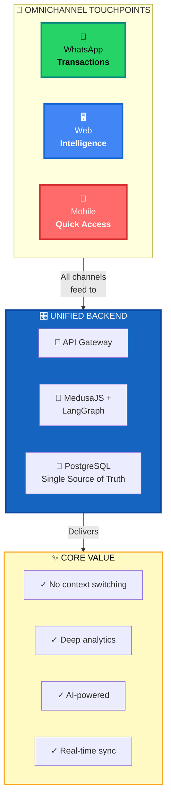

---

### ⚡ Core Principles

| Principle | What It Means |
|---|---|
| **💬 WhatsApp-First** | All B2B transactions (quotes, orders, negotiation) happen in WhatsApp |
| **🖥️ Web for Intelligence** | Dashboards, reports, analytics, deep insights for decision-makers |
| **📱 Mobile for Convenience** | Quick approvals, status checks, inventory management on-the-go |
| **🔗 Unified Data** | All channels read/write to same backend—no data silos |
| **🔄 Seamless Experience** | Start on WhatsApp → continue on Web → finish on Mobile (any order) |

---

## 🏗️ Omnichannel Architecture

### 📡 Three-Channel Layer Stack

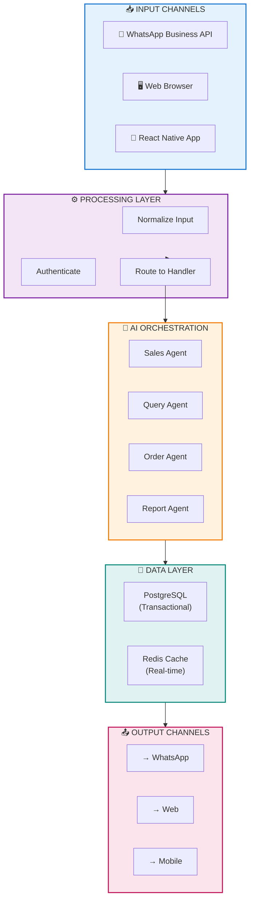

---

## 💬 WhatsApp B2B Layer

### 🎯 WhatsApp Message Flow

**From Chef to Quote in <3 Seconds**

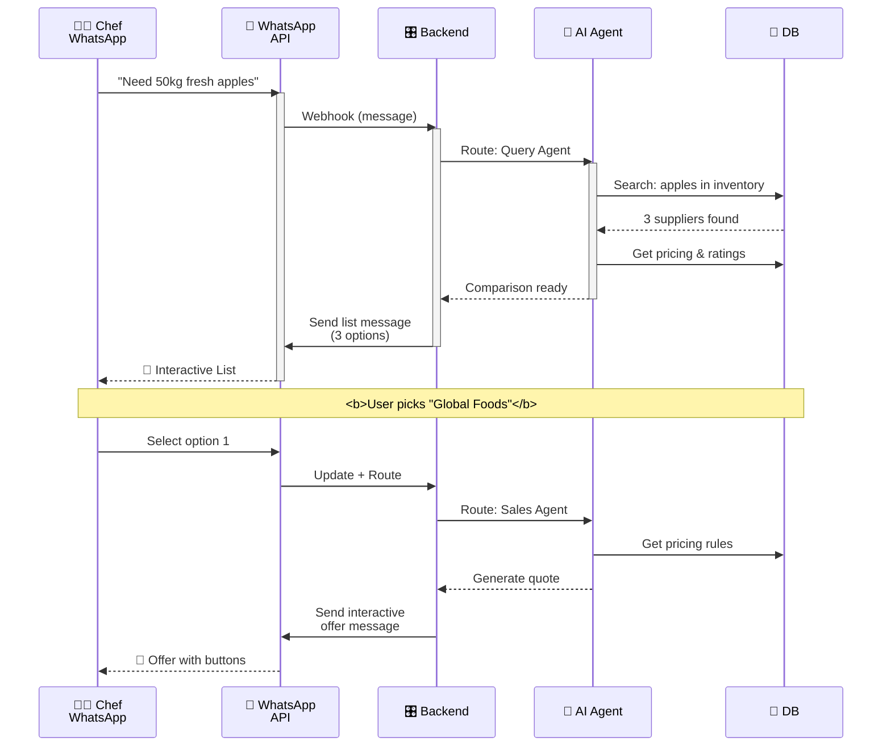

### 📨 WhatsApp Message Types

```
┌──────────────────────────────────────────────────────────┐
│ 🎁 PROMOTIONAL MESSAGES (Supplier → Restaurant)         │
├──────────────────────────────────────────────────────────┤
│ • New product launch announcements                        │
│ • Flash deals with countdown timers                       │
│ • Bulk discounts for bulk orders                          │
│ • Seasonal offers & clearance sales                       │
│ Format: Interactive list or button messages              │
└──────────────────────────────────────────────────────────┘

┌──────────────────────────────────────────────────────────┐
│ ❓ QUERY MESSAGES (Restaurant → Supplier)               │
├──────────────────────────────────────────────────────────┤
│ • "What's available today?"                              │
│ • "Best price for 50kg apples?"                          │
│ • "Lead time on fresh chicken?"                          │
│ • "Can you deliver to X location?"                       │
│ Format: Natural language (AI parses intent)             │
└──────────────────────────────────────────────────────────┘

┌──────────────────────────────────────────────────────────┐
│ ✅ QUOTE MESSAGES (Supplier → Restaurant)               │
├──────────────────────────────────────────────────────────┤
│ • Binding offer with price & quantity                    │
│ • Valid for 1 hour (countdown shown)                     │
│ • Margin guardrails applied ✓                            │
│ • Upsell suggestions included                            │
│ Format: Interactive buttons: [Accept] [Counter] [Skip]  │
└──────────────────────────────────────────────────────────┘

┌──────────────────────────────────────────────────────────┐
│ 📦 ORDER & DELIVERY UPDATES (Both directions)            │
├──────────────────────────────────────────────────────────┤
│ • Order confirmed with PO #                              │
│ • Out for delivery (ETA)                                 │
│ • Delivered (GRN link attached)                          │
│ • E-Invoice & payment link                               │
│ Format: Text + links + action buttons                    │
└──────────────────────────────────────────────────────────┘
```

---

## 🖥️ Web Dashboard: Restaurant & Supplier

---

## Mobile App

### Mobile-First Experience

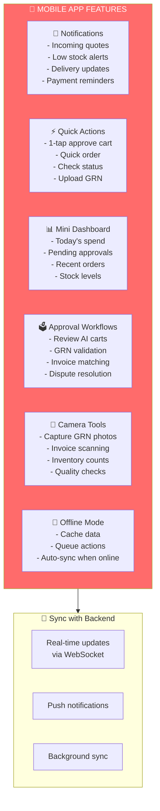

### Sample Mobile Screens

```
┌─────────────────────────┐
│  RESTAURANT APP         │
├─────────────────────────┤
│  🔔 3 New Quotes        │
│                         │
│  ┌─────────────────┐   │
│  │ Global Foods    │   │
│  │ Apples 50kg     │   │
│  │ $4.8/kg ⭐      │   │
│  │ [Accept] [View]│   │
│  └─────────────────┘   │
│                         │
│  ┌─────────────────┐   │
│  │ Fresh Produce   │   │
│  │ Chicken 100kg   │   │
│  │ $5.2/kg         │   │
│  │ [Accept] [View]│   │
│  └─────────────────┘   │
│                         │
│ 📊 Today: AED 3,240     │
│ ⚠️ Milk: 2kg (Par: 10kg)│
└─────────────────────────┘

┌─────────────────────────┐
│  SUPPLIER APP           │
├─────────────────────────┤
│  💬 5 Active Chefs      │
│                         │
│  ┌─────────────────┐   │
│  │ Chef Rashid     │   │
│  │ "Best price on  │   │
│  │  vegetables?"   │   │
│  │ [Send Offer]    │   │
│  └─────────────────┘   │
│                         │
│  🔥 Flash Deal:         │
│  Mushrooms expiring     │
│  200kg @ 50% off        │
│  [Send to 8 chefs]      │
│                         │
│ 📊 Today: AED 12,500    │
│ ✅ 12 orders processed  │
└─────────────────────────┘
```

---

## Agent Interactions via WhatsApp

### Restaurant-Side: Procurement Agent on WhatsApp

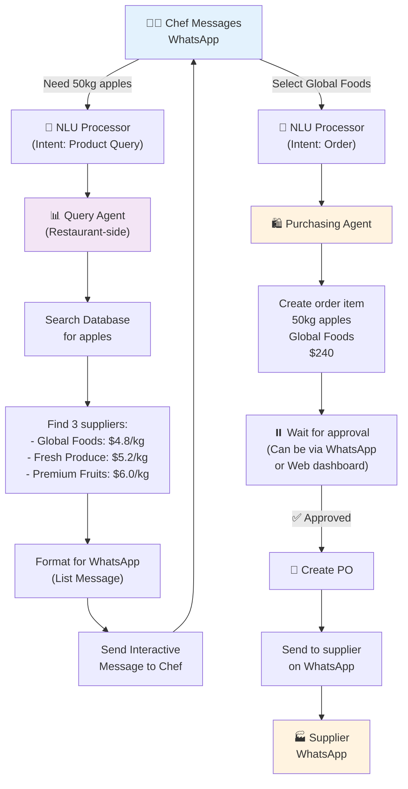

### Supplier-Side: Autonomous Sales Agent on WhatsApp

```mermaid
graph TD
    ChefMsg["👨‍🍳 Chef Messages<br/>WhatsApp<br/>'Price for 50kg apples?'"]
    
    ChefMsg --> NLU["🧠 NLU Processor<br/>(Intent: Quote Request)"]
    
    NLU --> SalesAgent["🎯 Autonomous Sales Agent<br/>(Supplier-side)"]
    
    SalesAgent --> CheckStock["Check inventory<br/>Apples: 500kg available ✅"]
    
    CheckStock --> CalcPrice["Calculate price<br/>- Cost: $3.5/kg<br/>- Target margin: 25%<br/>- List: $5/kg<br/>- Authorize: 10% discount"]
    
    CalcPrice --> Margin["Apply authority<br/>Price: $4.5/kg<br/>Margin: 28.6% ✅"]
    
    Margin --> CheckMenu["Analyze chef menu<br/>Has deep-fried items?<br/>Check if missing Oil ✅"]
    
    CheckMenu --> Upsell["Prepare upsell<br/>'Add Premium Oil<br/>for 5% bundle discount?'"]
    
    Upsell --> Format["Format as WhatsApp<br/>Interactive Message<br/>- Quote box<br/>- Upsell suggestion<br/>- [ Accept ] [ Counter ]"]
    
    Format --> Send["Send message<br/>to Chef"]
    
    Send --> ChefReply["👨‍🍳 Chef responds<br/>'Accept with oil!'"]
    
    ChefReply --> ProcessOrder["Process order<br/>- Create PO<br/>- Reserve stock<br/>- Generate E-Invoice"]
    
    ProcessOrder --> Invoice["Send E-Invoice<br/>(FTA-compliant XML+PDF)<br/>+ Payment link<br/>via WhatsApp"]
    
    Invoice --> Complete["✅ Order Complete<br/>Delivery scheduled"]
    
    style SalesAgent fill:#fff3e0
    style Margin fill:#c8e6c9
    style Upsell fill:#ffccbc
    style ChefReply fill:#c8e6c9
```

---

## Data Synchronization

### Real-Time Sync Across Channels

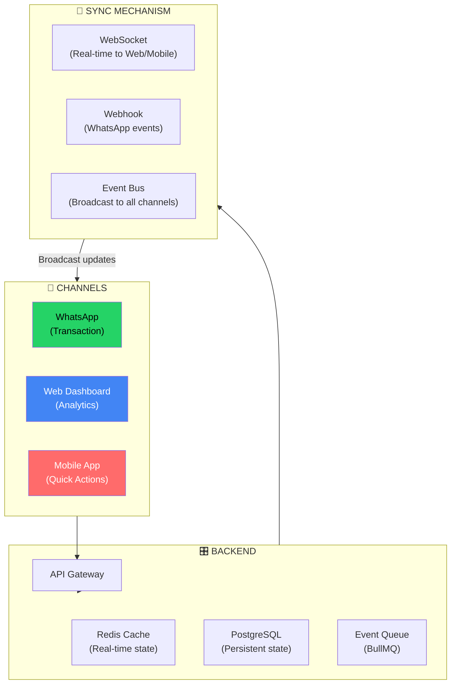

### Example: Order Placed

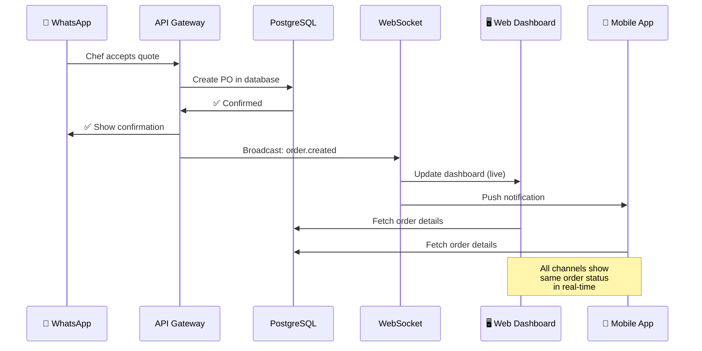

---

## Complete User Journeys

### Journey 1: Chef Finding Best Supplier (WhatsApp-First)

```mermaid
graph TD
    Step1["🏪 Restaurant<br/>Chef thinks: Need 50kg apples"]
    
    Step2["📱 Opens WhatsApp<br/>(Never leaves the app)"]
    
    Step3["💬 Messages supplier bot<br/>'Need 50kg apples, best price?'"]
    
    Step4["🤖 AI processes<br/>- Query Agent searches<br/>- Finds 3 suppliers<br/>- Gets pricing<br/>- Ranks by score"]
    
    Step5["📨 Receives<br/>List message with 3 options<br/>- Global Foods: $4.8/kg ⭐<br/>- Fresh Produce: $5.2/kg<br/>- Premium: $6.0/kg"]
    
    Step6["✋ Chef taps<br/>'Global Foods'"]
    
    Step7["📤 Sales Agent<br/>generates instant quote<br/>'50kg @ $4.8/kg = $240<br/>Valid 1 hour'"]
    
    Step8["🎁 Upsell suggestion<br/>'Add 3 tins Fryer Oil<br/>for 5% discount?'"]
    
    Step9["✅ Chef taps accept"]
    
    Step10["📦 Order created<br/>- PO #1234 generated<br/>- Stock reserved<br/>- E-Invoice created"]
    
    Step11["💳 Invoice link sent<br/>via WhatsApp<br/>1-tap payment via Telr"]
    
    Step12["✅ Payment confirmed<br/>'Order confirmed!<br/>Delivery in 2 hours'"]
    
    Step13["🖥️ Meanwhile: Dashboard<br/>(Real-time updates)<br/>- Order shows in web<br/>- Pushed to mobile app<br/>- Inventory updated"]
    
    style Step2 fill:#25d366,color:#000
    style Step3 fill:#25d366,color:#000
    style Step7 fill:#fff3e0
    style Step9 fill:#c8e6c9
    style Step13 fill:#4285f4,color:#fff
```

### Journey 2: Supplier Promoting Flash Deal

```mermaid
graph TD
    Step1["🏭 Warehouse<br/>Mushrooms expiring in 72h<br/>200kg in stock"]
    
    Step2["💼 Sales rep opens<br/>Supplier dashboard<br/>or WhatsApp bot"]
    
    Step3["🔥 Creates flash deal<br/>- Item: Mushrooms<br/>- Price: $15/kg (50% off)<br/>- Valid: 2 hours<br/>- Qty: 100kg budget"]
    
    Step4["🎯 AI identifies chefs<br/>- Searched: restaurants with<br/>  mushroom-based dishes<br/>- 15 matching chefs found<br/>- Sorted by: menu relevance"]
    
    Step5["📤 Sends interactive<br/>WhatsApp messages<br/>to 15 chefs:<br/>'⏰ FLASH DEAL ⏰<br/>Mushrooms 200kg<br/>@$15/kg (2hrs only)<br/>[ Order Now ]'"]
    
    Step6["👨‍🍳 Chefs start<br/>tapping 'Order Now'"]
    
    Step7["📊 Dashboard shows<br/>Real-time:
- 3 orders placed (60kg sold)
- 12 notifications sent
- 5 chefs viewing
- Conversion: 25%"]
    
    Step8["✅ 100kg sold<br/>in 45 minutes<br/>- Revenue: $1,500<br/>- Waste avoided"]
    
    Step9["📈 AI learns<br/>- This time, messaging worked<br/>- These 3 chefs responded fast<br/>- Morning timing better<br/>- Use for future deals"]
    
    style Step1 fill:#ffccbc
    style Step4 fill:#fff3e0
    style Step5 fill:#25d366,color:#000
    style Step7 fill:#4285f4,color:#fff
    style Step8 fill:#c8e6c9
```

---

## Technical Architecture: WhatsApp + Web/Mobile

### Integration Points

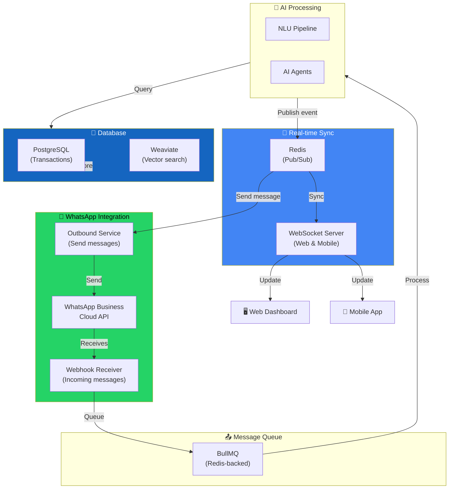

### Message Processing Pipeline

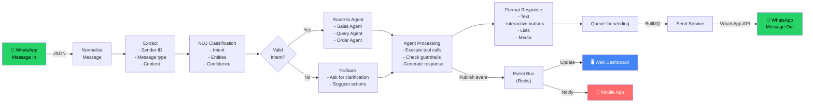

---

## Benefits of Omnichannel Approach

### For Restaurants

```
✅ CONVENIENCE
├─ Never leave WhatsApp for transactions
├─ Quick quote requests (2-3 messages)
├─ 1-tap order acceptance
└─ Mobile push for urgent items

✅ INTELLIGENCE
├─ Web dashboard shows full analytics
├─ Historical pricing trends
├─ Supplier performance metrics
├─ AI recommendations always available

✅ SPEED
├─ Quote response: <3 seconds
├─ Order processing: <5 minutes
├─ No manual entry needed
└─ Automated approvals

✅ CONTROL
├─ Approve/reject on mobile
├─ Edit carts on web
├─ Review on WhatsApp
└─ All channels synced
```

### For Suppliers

```
✅ 24/7 SALES
├─ AI agent handles most requests
├─ No response time delays
├─ Works nights/weekends
└─ Never miss a sale

✅ INSIGHT
├─ Web dashboard tracks chefs
├─ Analytics on what sells
├─ Identify buying patterns
├─ Market intelligence

✅ EFFICIENCY
├─ Automate quote generation
├─ Batch process orders
├─ Smart liquidation of stock
└─ Reduce manual work 90%

✅ GROWTH
├─ Reach more chefs via automation
├─ AI upsells increase basket size
├─ Flash deals liquidate inventory
└─ Collections automation improves DSO
```

---

## Implementation Roadmap

### Phase 1: Foundation (Month 1-2)
```
✅ WhatsApp Business API integration
✅ Basic message routing & NLU
✅ Simple quote template
✅ Manual approvals
```

### Phase 2: AI Enhancement (Month 3-4)
```
✅ LangGraph agents
✅ Autonomous quote generation
✅ Inventory checking
✅ Auto E-Invoice generation
```

### Phase 3: Web Dashboard (Month 5-6)
```
✅ Restaurant dashboard
✅ Supplier dashboard
✅ Real-time sync via WebSocket
✅ Analytics & reporting
```

### Phase 4: Mobile App (Month 7-8)
```
✅ React Native app (iOS + Android)
✅ Push notifications
✅ Offline mode
✅ Quick actions
```

### Phase 5: Optimization (Month 9+)
```
✅ AI learning & personalization
✅ Advanced analytics
✅ Compliance & audit
✅ Regional expansion
```

---

## Competitive Advantages

| Feature | Traditional Platforms | Our Omnichannel |
|---|---|---|
| **B2B UX** | Web-first (slow) | WhatsApp-first (instant) |
| **Quote Time** | 2-4 hours (human) | <3 seconds (AI) |
| **Transactions** | Manual entry | 1-tap acceptance |
| **Intelligence** | Basic | Real-time analytics |
| **Supplier Reach** | Limited by sales reps | Unlimited via AI |
| **Liquidation** | Manual broadcasts | Targeted AI offers |
| **Collections** | Manual follow-up | Automated escalation |
| **User Stickiness** | Browser tab | Always-on messaging app |

---

## Summary

This **Omnichannel WhatsApp-First Architecture** delivers:

- 🎯 **Frictionless B2B Transactions**: WhatsApp for buying/selling
- 📊 **Deep Intelligence**: Web for analytics, dashboards, insights
- 📱 **Mobile Convenience**: Quick actions, approvals, updates
- 🤖 **AI Everywhere**: Instant quotes, smart negotiations, liquidation
- 🔄 **Real-Time Sync**: All channels always in sync
- 💰 **Business Value**: Faster orders, better margins, stronger supplier relationships

**Result**: The most user-friendly B2B platform for F&B procurement in the region.

